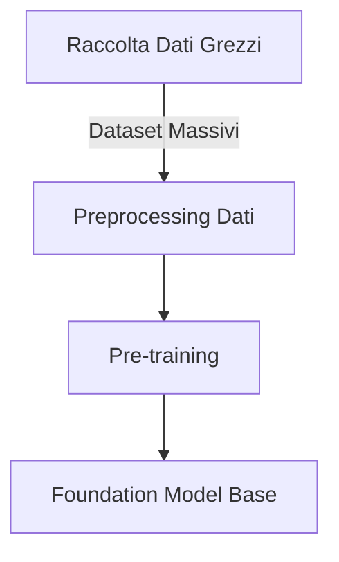
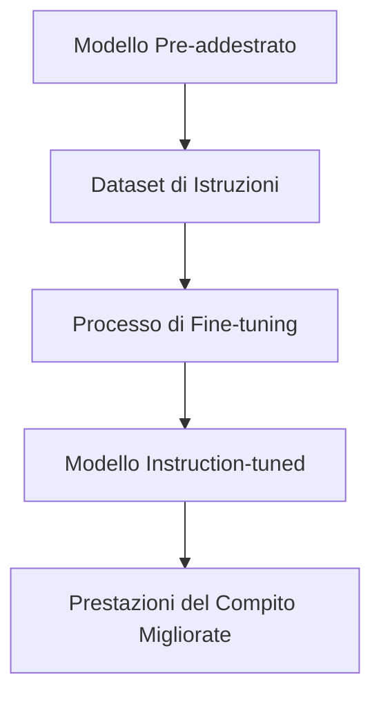
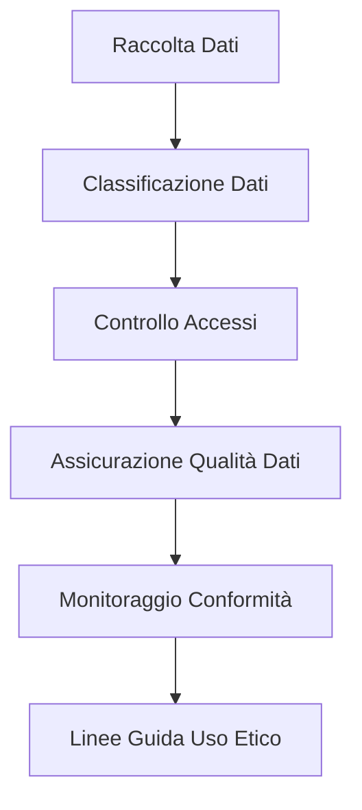

## 3.3 Il Processo di Training e Fine-Tuning per i Foundation Model

I foundation model rappresentano una classe potente di sistemi di IA che possono trasformare le capacità organizzative quando implementati correttamente. Il processo di training e fine-tuning di questi modelli richiede conoscenze e tecniche specifiche che influenzano significativamente la loro efficacia nelle applicazioni aziendali. Padroneggiare questi processi consente alle organizzazioni di personalizzare i modelli per le loro esigenze uniche massimizzando il ritorno sugli investimenti in IA. Questo sottocapitolo esamina i componenti essenziali del training dei foundation model, esplora varie metodologie di fine-tuning e delinea le migliori pratiche per la preparazione dei dati—conoscenze critiche per il successo sia nell'esame AWS Certified AI Practitioner che nelle implementazioni di IA del mondo reale.

### Elementi Chiave del Training di un Foundation Model

Il training dei foundation model richiede risorse computazionali sostanziali e competenze specializzate. Comprendere questo processo aiuta i professionisti aziendali a prendere decisioni informate sulla strategia di implementazione dell'IA e l'allocazione delle risorse.

#### Pre-training

Il pre-training è la fase iniziale dove il foundation model acquisisce conoscenza generale e comprensione del linguaggio da vaste quantità di dati non etichettati. Questo crea un modello base versatile capace di eseguire una vasta gamma di compiti.[^801]

*Figura 3.3.1: Processo di Pre-training per i Foundation Model*

Questo diagramma illustra il processo di pre-training, iniziando dalla raccolta di dati grezzi e terminando con un foundation model base. Il processo coinvolge la raccolta di dataset massivi, il preprocessing dei dati e quindi condurre il pre-training per creare un modello base versatile.

Il pre-training tipicamente coinvolge:

- **Apprendimento auto-supervisionato** su dataset diversi
- Mascheramento o predizione di parti dei dati di input
- Apprendimento di *rappresentazioni contestuali* dei dati

Per le applicazioni aziendali, modelli pre-addestrati come quelli disponibili attraverso **Amazon Bedrock** offrono un punto di partenza potente, risparmiando tempo significativo e risorse computazionali.[^802]

#### Fine-tuning

Il fine-tuning adatta il modello pre-addestrato a compiti o domini specifici, migliorando le sue prestazioni per particolari applicazioni aziendali.[^803]

- Dati specifici del compito sono utilizzati per regolare i parametri del modello
- Il processo è più efficiente del training da zero
- Consente personalizzazione senza perdere conoscenza generale

#### Pre-training Continuo

Il pre-training continuo mantiene il modello aggiornato con nuove informazioni e pattern linguistici in evoluzione.[^804]

- Aggiornamenti regolari con dati freschi
- Mantiene la rilevanza del modello in ambienti dinamici
- Cruciale per settori con terminologia o conoscenza che cambia rapidamente

Per le aziende, comprendere questi elementi è cruciale per:

- Selezionare modelli pre-addestrati appropriati
- Decidere strategie di fine-tuning
- Pianificare manutenzione e miglioramento continui del modello

Sfruttando servizi come **Amazon SageMaker**, le organizzazioni possono snellire questi processi, rendendo le capacità avanzate di IA più accessibili e gestibili.[^805]

### Metodi per il Fine-Tuning di un Foundation Model

Il fine-tuning trasforma foundation model generici in strumenti specializzati che affrontano specifiche esigenze aziendali. Questo passo cruciale consente alle organizzazioni di sfruttare capacità pre-addestrate personalizzando per i loro requisiti unici. Ecco gli approcci chiave di fine-tuning:

#### Instruction Tuning

L'instruction tuning effettua il fine-tuning di un modello su dataset contenenti istruzioni e i loro output corrispondenti. Questo metodo migliora significativamente la capacità di un modello di seguire direttive specifiche.[^806]

*Figura 3.3.2: Processo di Instruction Tuning*

Questo diagramma mostra il processo di instruction tuning, iniziando con un modello pre-addestrato e utilizzando un dataset di istruzioni per creare un modello instruction-tuned che performa meglio su compiti specifici.

Benefici per le aziende:
- Migliora la capacità del modello di comprendere ed eseguire istruzioni specifiche
- Migliora le prestazioni su applicazioni orientate ai compiti
- Utile per chatbot di servizio clienti o sistemi di completamento automatico dei compiti

#### Adattamento di Modelli per Domini Specifici

**L'adattamento del dominio** coinvolge il fine-tuning di un modello su dati da un campo o settore specifico, consentendogli di comprendere e generare contenuti specifici del dominio più accuratamente.[^807]

Considerazioni chiave:
- Richiede dataset curati rappresentativi del dominio target
- Può migliorare significativamente le prestazioni in aree specializzate
- Particolarmente prezioso per settori con terminologia o concetti unici

Esempio: Un'azienda di servizi finanziari potrebbe adattare un foundation model per comprendere strumenti finanziari complessi e regolamentazioni, migliorando le sue prestazioni in compiti come valutazione del rischio o conformità normativa.

#### Transfer Learning

Il **transfer learning** sfrutta la conoscenza acquisita da un compito per migliorare le prestazioni su un compito correlato. Questo metodo è particolarmente utile quando i dati etichettati per il compito target sono limitati.[^808]

Passi nel transfer learning:
1. Iniziare con un modello pre-addestrato
2. Sostituire il/i layer finale/i con nuovi adatti al compito target
3. Effettuare fine-tuning del modello sul dataset del nuovo compito

Applicazioni aziendali:
- Sviluppo rapido di modelli per compiti nuovi e correlati
- Uso efficiente di dati limitati specifici del dominio
- Tempo accelerato per il lancio sul mercato di prodotti o servizi alimentati dall'IA

#### Pre-training Continuo

Il pre-training continuo coinvolge aggiornamenti continui al modello utilizzando nuovi dati, garantendo che rimanga attuale e rilevante.[^809]

Benefici:
- Mantiene il modello aggiornato con linguaggio e conoscenza in evoluzione
- Si adatta ad ambienti aziendali e tendenze di mercato che cambiano
- Mantiene le prestazioni del modello nel tempo

Strategie di implementazione:
- Aggiornamenti regolari con dati freschi e rilevanti
- Monitoraggio delle prestazioni del modello per identificare quando sono necessari aggiornamenti
- Bilanciamento del nuovo apprendimento con la ritenzione della conoscenza esistente

Per le aziende che sfruttano i servizi AWS, **Amazon SageMaker** fornisce strumenti robusti per implementare questi metodi di fine-tuning. Offre infrastruttura scalabile per training e deployment, insieme a funzionalità come **SageMaker Experiments** per tracciare e confrontare diversi approcci di fine-tuning.[^810]

Tabella 3.3.1: Confronto dei Metodi di Fine-Tuning

| Metodo | Caso d'Uso Primario | Requisiti di Dati | Applicazione Aziendale Tipica |
|--------|------------------|--------------------|-----------------------------|
| Instruction Tuning | Miglioramenti specifici del compito | Coppie task-istruzione | Automazione servizio clienti |
| Adattamento del Dominio | Applicazioni specifiche del settore | Grandi dataset specifici del dominio | Generazione contenuti specializzati |
| Transfer Learning | Nuovi compiti con dati limitati | Piccolo dataset specifico del compito | Prototipazione rapida di nuove funzionalità IA |
| Pre-training Continuo | Mantenimento della rilevanza del modello | Flusso continuo di nuovi dati | Analisi di mercato in tempo reale |

Comprendendo e utilizzando efficacemente questi metodi di fine-tuning, le aziende possono migliorare significativamente le prestazioni e l'applicabilità dei foundation model alle loro esigenze specifiche, guidando innovazione e vantaggio competitivo nei rispettivi settori.

### Preparazione dei Dati per il Fine-Tuning di un Foundation Model

La qualità e preparazione dei dati determinano direttamente il successo del fine-tuning dei foundation model. Dataset preparati correttamente garantiscono che i modelli apprendano efficacemente e producano output affidabili che soddisfano i requisiti specifici della vostra organizzazione.

#### Curation dei Dati

**La curation dei dati** coinvolge la selezione, organizzazione e manutenzione di dataset utilizzati per il fine-tuning. Questo processo è critico per garantire la qualità e rilevanza dei dati.[^811]

Aspetti chiave della curation dei dati:
- *Rilevanza*: Garantire che i dati si allineino con il dominio o compito target
- *Qualità*: Rimuovere errori, duplicati e informazioni irrilevanti
- *Diversità*: Includere una vasta gamma di esempi per migliorare la generalizzazione del modello
- *Attualità*: Incorporare informazioni aggiornate per rilevanza corrente

Impatto aziendale:
- Migliora l'accuratezza e affidabilità del modello
- Riduce il bias negli output del modello
- Migliora la capacità del modello di gestire scenari del mondo reale

#### Data Governance

Implementare pratiche robuste di **data governance** è essenziale per mantenere integrità, sicurezza e conformità dei dati durante tutto il processo di fine-tuning.

*Figura 3.3.3: Framework di Data Governance per il Fine-Tuning di Modelli IA*

Questo diagramma delinea un framework completo di data governance per il fine-tuning di modelli IA, evidenziando i passi chiave dalla raccolta dati al garantire linee guida di uso etico.

Componenti chiave della data governance:
- Privacy dei dati: Garantire conformità con regolamentazioni come GDPR o CCPA
- Sicurezza: Implementare misure per proteggere informazioni sensibili
- Versionamento: Mantenere registrazioni chiare delle versioni di dataset utilizzate nel fine-tuning
- Auditabilità: Abilitare tracciamento della lineage e utilizzo dei dati

Servizi AWS come **Amazon Macie** e **AWS Glue** possono assistere nell'implementazione di pratiche robuste di data governance, aiutando le aziende a mantenere conformità e integrità dei dati durante tutto il processo di sviluppo IA.[^812]

#### Dimensione e Composizione del Dataset

La dimensione e composizione del dataset di fine-tuning influenzano significativamente le prestazioni del modello e le capacità di generalizzazione.[^813]

Considerazioni per la dimensione del dataset:
- Dataset più grandi generalmente portano a prestazioni migliori, ma con rendimenti decrescenti
- Bilanciamento tra dimensione del dataset e risorse computazionali richieste
- La qualità spesso supera la quantità — un dataset più piccolo e di alta qualità può superare uno più grande e rumoroso

Fattori di composizione:
- *Bilanciamento delle classi*: Garantire rappresentazione uguale di diverse categorie o risultati
- *Copertura del compito*: Includere esempi che coprono l'intera gamma di compiti previsti
- *Casi limite*: Incorporare esempi inusuali o sfidanti per migliorare la robustezza

#### Etichettatura dei Dati

Per compiti di fine-tuning supervisionato, **l'etichettatura accurata dei dati** è cruciale. Questo processo coinvolge l'annotazione dei dati con gli output o categorie corretti.[^814]

Strategie di etichettatura:
- Etichettatura manuale da parte di esperti del dominio
- Crowdsourcing per compiti di etichettatura su larga scala
- Etichettatura semi-automatica utilizzando modelli o regole esistenti

AWS offre servizi come **Amazon SageMaker Ground Truth** per snellire e scalare i processi di etichettatura dei dati, rendendo più facile per le aziende preparare dataset di alta qualità per il fine-tuning.[^815]

#### Rappresentatività dei Dati

Garantire che il vostro dataset di fine-tuning rappresenti accuratamente gli scenari del mondo reale che il vostro modello incontrerà è critico per le sue prestazioni pratiche.[^816]

Aspetti chiave:
- *Diversità demografica*: Includere dati da vari gruppi di utenti o segmenti di mercato
- *Copertura temporale*: Garantire che i dati coprano periodi temporali rilevanti
- *Completezza degli scenari*: Coprire tutti i potenziali casi d'uso o situazioni

Impatto aziendale:
- Migliora l'equità del modello e riduce il bias
- Migliora le prestazioni del modello attraverso scenari diversi del mondo reale
- Aumenta la fiducia e adozione degli utenti di soluzioni alimentate dall'IA

#### Reinforcement Learning from Human Feedback (RLHF)

**RLHF** è una tecnica avanzata che incorpora preferenze umane nel processo di fine-tuning, consentendo miglioramenti del modello più sfumati e consapevoli del contesto.[^817]

Panoramica del processo:
1. Generare output del modello per vari prompt
2. Raccogliere feedback umano sulla qualità di questi output
3. Addestrare un modello di ricompensa basato su questo feedback
4. Effettuare fine-tuning del foundation model utilizzando il modello di ricompensa

Benefici:
- Allinea il comportamento del modello con le preferenze umane
- Migliora la qualità e rilevanza dell'output
- Affronta aspetti sottili di linguaggio e contesto difficili da catturare con fine-tuning tradizionale

Implementare RLHF richiede un'attenta considerazione dei metodi di raccolta del feedback e potenziali bias. Servizi AWS come Amazon SageMaker possono facilitare l'implementazione di pipeline RLHF, consentendo alle aziende di sfruttare efficacemente questa tecnica avanzata.[^818]

Padroneggiando queste tecniche di preparazione dei dati, le aziende possono migliorare significativamente l'efficacia dei loro processi di fine-tuning, risultando in foundation model che sono meglio allineati con le loro esigenze e casi d'uso specifici. Questo non solo migliora le prestazioni delle applicazioni IA ma garantisce anche che i modelli deployati siano robusti, affidabili e adattati ai requisiti unici dell'organizzazione.

### Domande per l'auto-verifica

1. **Un analista aziendale ha il compito di effettuare fine-tuning di un foundation model per un'azienda di servizi finanziari. Quale dei seguenti metodi sarebbe più appropriato per adattare il modello a comprendere strumenti finanziari complessi e regolamentazioni?**

   A. Instruction tuning
   B. Adattamento del dominio
   C. Transfer learning
   D. Pre-training continuo

2. **Un professionista IA sta preparando dati per il fine-tuning di un foundation model. Quale dei seguenti NON è un aspetto chiave della curation dei dati?**

   A. Garantire rilevanza dei dati al dominio target
   B. Massimizzare la dimensione del dataset indipendentemente dalla qualità
   C. Rimuovere errori e duplicati
   D. Includere esempi diversi per migliorare la generalizzazione

3. **Un'azienda di retail vuole mantenere il suo modello IA aggiornato con le ultime tendenze moda e preferenze dei clienti. Su quale metodo di fine-tuning dovrebbero focalizzarsi principalmente?**

   A. Instruction tuning
   B. Transfer learning
   C. Pre-training continuo
   D. RLHF (Reinforcement Learning from Human Feedback)

4. **Quale servizio AWS è più adatto per implementare pratiche robuste di data governance durante il processo di fine-tuning dei foundation model?**

   A. Amazon SageMaker
   B. Amazon Bedrock
   C. Amazon Macie
   D. AWS Lambda

5. **Una startup sta sviluppando un chatbot di servizio clienti alimentato dall'IA. Vogliono migliorare la capacità del modello di comprendere ed eseguire istruzioni specifiche. Quale metodo di fine-tuning dovrebbero prioritizzare?**

   A. Adattamento del dominio
   B. Instruction tuning
   C. Transfer learning
   D. Pre-training continuo

### Risposte e Spiegazioni

1. **Risposta corretta: B. Adattamento del dominio**

   Spiegazione: L'adattamento del dominio è il metodo più appropriato per adattare un foundation model a comprendere strumenti finanziari complessi e regolamentazioni. Questo metodo coinvolge il fine-tuning del modello su dati da un campo o settore specifico, consentendogli di comprendere e generare contenuti specifici del dominio più accuratamente. Per un'azienda di servizi finanziari, questo comporterebbe l'utilizzo di dataset curati rappresentativi del dominio finanziario, migliorando significativamente le prestazioni del modello in aree specializzate come la comprensione di strumenti finanziari complessi e regolamentazioni.[^819]

2. **Risposta corretta: B. Massimizzare la dimensione del dataset indipendentemente dalla qualità**

   Spiegazione: Nella curation dei dati per il fine-tuning dei foundation model, la qualità spesso supera la quantità. Mentre dataset più grandi generalmente portano a prestazioni migliori, questo è vero solo fino a un certo punto e con rendimenti decrescenti. Le altre opzioni (A, C e D) sono tutti aspetti chiave della curation appropriata dei dati. Massimizzare la dimensione del dataset senza riguardo per la qualità può introdurre rumore e informazioni irrilevanti, potenzialmente degradando le prestazioni del modello. È più importante avere un dataset bilanciato e di alta qualità che rappresenti accuratamente il dominio e i compiti target.[^820]

3. **Risposta corretta: C. Pre-training continuo**

   Spiegazione: Per un'azienda di retail che vuole mantenere il suo modello IA aggiornato con le ultime tendenze moda e preferenze dei clienti, il pre-training continuo è il metodo più appropriato. Questo coinvolge aggiornamenti continui al modello utilizzando nuovi dati, garantendo che rimanga attuale e rilevante. Il pre-training continuo è cruciale per settori con terminologia o conoscenza che cambia rapidamente, come il retail della moda. Consente al modello di adattarsi ad ambienti aziendali e tendenze di mercato che cambiano, mantenendo le sue prestazioni nel tempo in un campo dinamico come la moda.[^821]

4. **Risposta corretta: C. Amazon Macie**

   Spiegazione: Tra le opzioni fornite, Amazon Macie è il servizio AWS più adatto per implementare pratiche robuste di data governance durante il processo di fine-tuning dei foundation model. Amazon Macie è un servizio di sicurezza e privacy dei dati che utilizza machine learning e pattern matching per scoprire e proteggere dati sensibili in AWS. Può aiutare a mantenere integrità, sicurezza e conformità dei dati durante tutto il processo di fine-tuning scoprendo, classificando e proteggendo automaticamente dati sensibili. Mentre Amazon SageMaker è cruciale per lo sviluppo e training dei modelli, non si focalizza specificamente sulla data governance come fa Macie.[^822]

5. **Risposta corretta: B. Instruction tuning**

   Spiegazione: Per un chatbot di servizio clienti alimentato dall'IA dove l'obiettivo è migliorare la capacità del modello di comprendere ed eseguire istruzioni specifiche, l'instruction tuning è il metodo di fine-tuning più appropriato. L'instruction tuning coinvolge il fine-tuning di un modello su un dataset di istruzioni e output corrispondenti. Questo metodo è particolarmente efficace per migliorare la capacità di un modello di seguire direttive specifiche, che è cruciale per un chatbot di servizio clienti che deve comprendere e rispondere accuratamente a varie richieste e istruzioni dei clienti.[^823]

[^800]: AWS Machine Learning Blog: "The evolution of foundation models and their impact on AI applications" URL: <https://aws.amazon.com/blogs/machine-learning/the-evolution-of-foundation-models-and-their-impact-on-ai-applications/>

[^801]: AWS Documentation: "Introduction to Foundation Models" URL: <https://docs.aws.amazon.com/sagemaker/latest/dg/jumpstart-foundation-models.html>

[^802]: Amazon Bedrock Overview URL: <https://aws.amazon.com/bedrock/>

[^803]: AWS Machine Learning Blog: "Fine-tuning foundation models with Amazon SageMaker" URL: <https://aws.amazon.com/blogs/machine-learning/fine-tuning-foundation-models-with-amazon-sagemaker/>

[^804]: AWS Whitepaper: "Continuous Learning in AI/ML Systems" URL: <https://d1.awsstatic.com/whitepapers/continuous-learning-in-aiml-systems.pdf>

[^805]: Amazon SageMaker Overview URL: <https://aws.amazon.com/sagemaker/>

[^806]: AWS Machine Learning Blog: "Instruction tuning for better model performance" URL: <https://aws.amazon.com/blogs/machine-learning/instruction-tuning-for-better-model-performance/>

[^807]: AWS Documentation: "Domain Adaptation in Machine Learning" URL: <https://docs.aws.amazon.com/prescriptive-guidance/latest/ml-model-adaptation/domain-adaptation.html>

[^808]: AWS Machine Learning Blog: "Transfer learning for TensorFlow image classification models in Amazon SageMaker" URL: <https://aws.amazon.com/blogs/machine-learning/transfer-learning-for-tensorflow-image-classification-models-in-amazon-sagemaker/>

[^809]: AWS Cloud Adoption Framework for Artificial Intelligence, Machine Learning URL: <https://docs.aws.amazon.com/whitepapers/latest/aws-caf-for-ai/aws-caf-for-ai.html>

[^810]: Amazon SageMaker Experiments Overview URL: <https://docs.aws.amazon.com/sagemaker/latest/dg/experiments.html>

[^811]: AWS What is Data Labeling? - Data Labeling Explained URL: <https://aws.amazon.com/what-is/data-labeling/>

[^812]: Amazon Macie Overview URL: <https://aws.amazon.com/macie/>

[^813]: AWS Documentation: "Preparing Data for Machine Learning" URL: <https://docs.aws.amazon.com/machine-learning/latest/dg/preparing-data.html>

[^814]: Training data labeling using humans with Amazon SageMaker Ground Truth URL: <https://docs.aws.amazon.com/sagemaker/latest/dg/sms.html>

[^815]: Amazon SageMaker Ground Truth Overview URL: <https://aws.amazon.com/sagemaker/groundtruth/>

[^816]: Policy advice and best practices on bias and fairness in AI URL: <https://link.springer.com/article/10.1007/s10676-024-09746-w>

[^817]: AWS What is RLHF? - Reinforcement Learning from Human Feedback Explained URL: <https://aws.amazon.com/what-is/reinforcement-learning-from-human-feedback/>

[^818]: Amazon SageMaker RL Overview URL: <https://docs.aws.amazon.com/sagemaker/latest/dg/reinforcement-learning.html>

[^819]: AWS Machine Learning Blog: "Domain-adaptation Fine-tuning of Foundation Models in Amazon SageMaker JumpStart on financial data" URL: <https://aws.amazon.com/blogs/machine-learning/domain-adaptation-fine-tuning-of-foundation-models-in-amazon-sagemaker-jumpstart-on-financial-data/>

[^820]: AWS Glue Data Quality - AWS Glue URL: <https://docs.aws.amazon.com/glue/latest/dg/glue-data-quality.html>

[^821]: AWS Retail Competency: "AI/ML Solutions for Retail" URL: <https://aws.amazon.com/retail/partner-solutions/>

[^822]: Amazon Macie Features URL: <https://aws.amazon.com/macie/features/>

[^823]: AWS Machine Learning Blog: "Build a self-service digital assistant using Amazon Lex and Amazon Bedrock Knowledge Bases" URL: <https://aws.amazon.com/blogs/machine-learning/build-a-self-service-digital-assistant-using-amazon-lex-and-amazon-bedrock-knowledge-bases/>