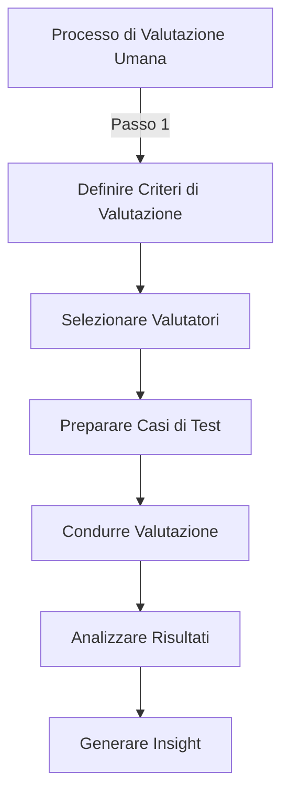
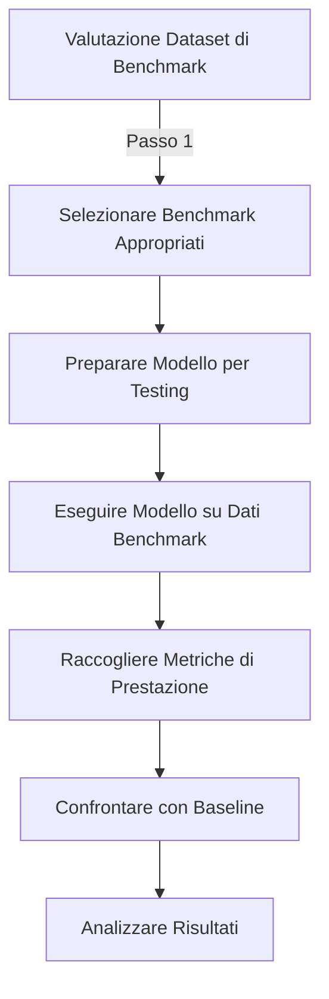
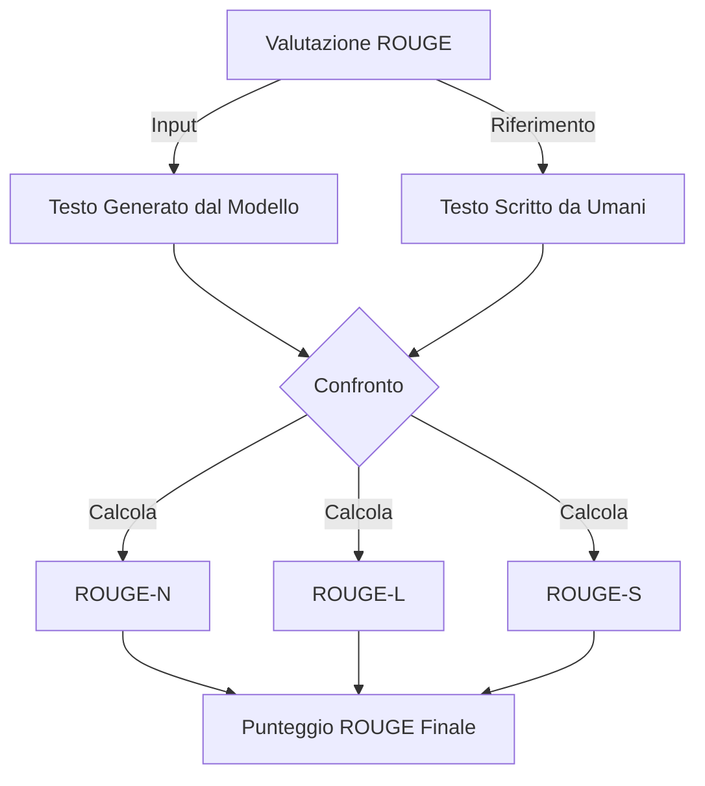
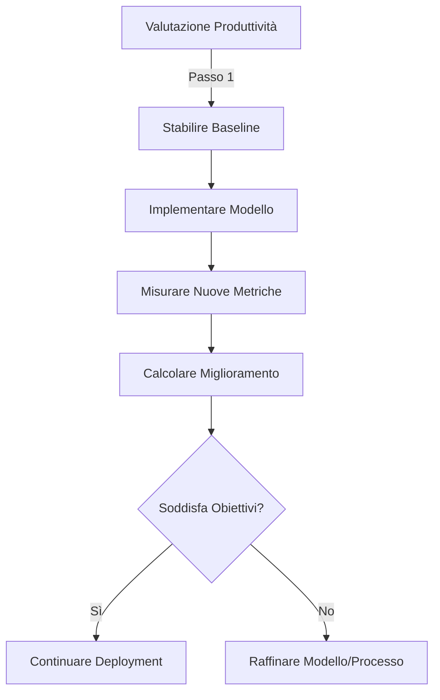

## 3.4 Metodi per valutare le prestazioni dei foundation model

I foundation model alimentano numerose applicazioni di IA attraverso le aziende oggi, dall'elaborazione del linguaggio naturale alla generazione di immagini. Valutare accuratamente le prestazioni di questi modelli è critico per garantire che forniscano valore aziendale e identificare opportunità di ottimizzazione. Per i candidati AWS Certified AI Practitioner, comprendere i metodi di valutazione consente il processo decisionale informato sulle implementazioni di IA e aiuta a dimostrare il valore delle iniziative di IA agli stakeholder.

Questo sottocapitolo esplora approcci per valutare le prestazioni dei foundation model, esamina metriche di valutazione rilevanti e discute strategie per determinare se i modelli soddisfano efficacemente gli obiettivi aziendali. Padroneggiare questi concetti vi equipaggerà per navigare le sfide di implementazione dell'IA e guidare risultati di successo per la vostra organizzazione.

### Approcci per valutare le prestazioni dei foundation model

Valutare le prestazioni dei foundation model richiede sia metodi quantitativi che qualitativi. Due approcci primari si distinguono: valutazione umana e dataset di benchmark. Ciascuno fornisce insight unici nelle capacità e limitazioni del modello.

#### Valutazione umana

**La valutazione umana** coinvolge esperti o utenti finali che interagiscono con un foundation model e valutano i suoi output basandosi su criteri predefiniti. Questo approccio è specialmente prezioso per compiti che richiedono giudizio soggettivo, comprensione contestuale o valutazione della creatività.[^900]

*Figura 3.4.1: Processo di Valutazione Umana. Questo diagramma illustra i passi coinvolti nel condurre una valutazione umana delle prestazioni dei foundation model, dalla definizione dei criteri alla generazione di insight.*

Aspetti chiave della valutazione umana includono:

- **Pool di valutatori diversi**: Garantire un gruppo diverso di valutatori aiuta a catturare diverse prospettive e riduce il bias nella valutazione.
- **Criteri di valutazione strutturati**: Sviluppare criteri chiari e consistenti da seguire per i valutatori garantisce risultati più obiettivi e comparabili.
- **Valutazioni specifiche del compito**: Adattare i compiti di valutazione per corrispondere ai casi d'uso del mondo reale fornisce insight più rilevanti nelle prestazioni del modello.
- **Feedback qualitativo**: Raccogliere feedback dettagliato dai valutatori può scoprire problemi sfumati o opportunità di miglioramento che le metriche quantitative potrebbero perdere.

La valutazione umana è particolarmente utile per valutare:

- Qualità della generazione del linguaggio naturale
- Appropriatezza contestuale delle risposte
- Creatività e originalità nella creazione di contenuti
- Esperienza utente e soddisfazione con le interazioni del modello

Mentre la valutazione umana fornisce insight preziosi, può essere dispendiosa in termini di tempo e potenzialmente soggettiva. Per complementare questo approccio, le organizzazioni spesso si rivolgono ai dataset di benchmark per valutazioni più standardizzate e quantitative.

#### Dataset di benchmark

**I dataset di benchmark** sono collezioni standardizzate di dati progettate per valutare le prestazioni del modello attraverso vari compiti e domini. Questi dataset tipicamente includono coppie input-output o sfide specifiche che i modelli devono affrontare, consentendo confronti consistenti tra diversi modelli o versioni dello stesso modello.[^901]

*Figura 3.4.2: Processo di Valutazione Dataset di Benchmark. Questo diagramma delinea i passi coinvolti nel valutare le prestazioni dei foundation model utilizzando dataset di benchmark, dalla selezione all'analisi.*

Vantaggi chiave dell'utilizzo di dataset di benchmark includono:

- **Standardizzazione**: Consente confronti consistenti attraverso diversi modelli e sforzi di ricerca.
- **Efficienza**: I processi di valutazione automatizzati possono rapidamente valutare le prestazioni del modello su grandi dataset.
- **Riproducibilità**: I risultati possono essere facilmente verificati e riprodotti da altri ricercatori o organizzazioni.
- **Copertura completa**: I benchmark spesso coprono una vasta gamma di compiti e scenari, fornendo una vista ampia delle capacità del modello.

Dataset di benchmark popolari per foundation model includono:

- **GLUE** (General Language Understanding Evaluation): Una collezione di compiti per valutare la comprensione del linguaggio naturale.[^902]
- **SuperGLUE**: Un'estensione di GLUE con compiti più sfidanti.[^903]
- **SQuAD** (Stanford Question Answering Dataset): Per valutare capacità di domanda-risposta.[^904]
- **ImageNet**: Un dataset su larga scala per compiti di classificazione di immagini e rilevamento di oggetti.[^905]

Quando si utilizzano dataset di benchmark, considerate:

- **Rilevanza agli obiettivi aziendali**: Scegliere benchmark che si allineano con i vostri casi d'uso e obiettivi specifici.
- **Limitazioni potenziali**: Essere consapevoli di qualsiasi bias o limitazione nei dataset di benchmark che potrebbero influenzare la loro applicabilità al vostro contesto specifico.
- **Aggiornamenti continui**: Mentre la tecnologia IA evolve, emergono nuovi benchmark. Rimanere informati sui dataset più recenti rilevanti per il vostro dominio.

La maggior parte delle organizzazioni combinano valutazione umana e dataset di benchmark per ottenere una comprensione completa delle prestazioni dei foundation model. Questo approccio ibrido fornisce sia confronti quantitativi che insight qualitativi per un framework di valutazione più robusto.

### Metriche rilevanti per valutare le prestazioni dei foundation model

Le metriche standardizzate aiutano a quantificare vari aspetti della qualità dell'output del modello, consentendo confronti tra modelli e tracciamento dei miglioramenti nel tempo. Mentre la selezione delle metriche dipende da compiti specifici e obiettivi aziendali, diverse sono diventate standard del settore per valutare le prestazioni dei foundation model.

#### ROUGE (Recall-Oriented Understudy for Gisting Evaluation)

**ROUGE** è un set di metriche utilizzate principalmente per valutare la riassuntivazione automatica e la traduzione automatica. Confronta il testo generato dal modello con uno o più testi di riferimento, tipicamente scritti da umani.[^906]

Le metriche ROUGE chiave includono:

- **ROUGE-N**: Misura la sovrapposizione di n-grammi tra i testi generati e di riferimento.
- **ROUGE-L**: Considera la sequenza comune più lunga tra i testi generati e di riferimento.
- **ROUGE-S**: Valuta la sovrapposizione di skip-bigrammi tra i testi.

*Figura 3.4.3: Processo di Valutazione ROUGE. Questo diagramma illustra i passi coinvolti nel calcolare i punteggi ROUGE per valutare le prestazioni dei foundation model nei compiti di generazione di testo.*

ROUGE è particolarmente utile per:
- Valutare la qualità della riassuntivazione del testo
- Valutare l'accuratezza della traduzione automatica
- Misurare la coerenza e rilevanza del testo generato

#### BLEU (Bilingual Evaluation Understudy)

**BLEU** è un'altra metrica ampiamente utilizzata per valutare la traduzione automatica e i compiti di generazione di testo. Misura la similarità tra il testo generato dal modello e una o più traduzioni di riferimento.[^907]

Aspetti chiave di BLEU:

- Calcola la precisione confrontando n-grammi nel testo generato con quelli nel testo di riferimento
- Applica una penalità di brevità per tenere conto delle differenze di lunghezza
- I punteggi vanno da 0 a 1, con punteggi più alti che indicano prestazioni migliori

BLEU è prezioso per:
- Valutare la qualità della traduzione automatica
- Valutare la generazione di testo in contesti multilingui
- Confrontare diversi modelli linguistici sui compiti di traduzione

#### BERTScore

**BERTScore** è una metrica più recente che sfrutta modelli linguistici pre-addestrati (specificamente BERT) per calcolare punteggi di similarità tra testi generati e di riferimento. Mira a catturare la similarità semantica oltre la semplice sovrapposizione di n-grammi.[^908]

Caratteristiche chiave di BERTScore:

- Utilizza embedding contestuali per catturare il significato semantico
- Calcola punteggi di precisione, recall e F1 basati su similarità di token
- Può gestire parafrasi e sinonimi meglio delle metriche tradizionali

BERTScore è particolarmente utile per:
- Valutare la qualità della generazione di testo in compiti che richiedono comprensione semantica
- Valutare parafrasi e trasferimento di stile del testo
- Complementare altre metriche per una valutazione più completa

Quando si applicano queste metriche, considerate:

- **Rilevanza specifica del compito**: Scegliere metriche che si allineano con il vostro caso d'uso specifico e obiettivi aziendali.
- **Limitazioni**: Comprendere i punti di forza e debolezza di ogni metrica per interpretare accuratamente i risultati.
- **Approccio a metriche multiple**: Utilizzare una combinazione di metriche per una valutazione più completa.
- **Correlazione del giudizio umano**: Validare i risultati delle metriche contro valutazioni umane per garantire rilevanza.

Tabella 3.4.1: Confronto delle Metriche di Valutazione dei Foundation Model

| Metrica | Punti di Forza | Limitazioni | Casi d'Uso Migliori |
|--------|-----------|-------------|----------------|
| ROUGE  | - Ben stabilita per riassuntivazione - Varianti multiple per aspetti diversi | - Si focalizza sulla sovrapposizione lessicale - Potrebbe perdere similarità semantiche | - Riassuntivazione del testo - Valutazione generazione contenuti |
| BLEU   | - Standard del settore per traduzione - Facile da calcolare e interpretare | - Non cattura bene il significato - Favorisce traduzioni più corte | - Traduzione automatica - Generazione testo cross-linguale |
| BERTScore | - Cattura similarità semantica - Gestisce bene le parafrasi | - Computazionalmente intensivo - Richiede modelli pre-addestrati | - Valutazione semantica del testo generato - Valutazione parafrasi |

Sfruttando efficacemente queste metriche, le organizzazioni possono ottenere insight preziosi nelle prestazioni dei loro foundation model e prendere decisioni basate sui dati per miglioramento e ottimizzazione.

### Determinare l'efficacia dei foundation model per gli obiettivi aziendali

La misura ultima del successo per un foundation model è quanto bene soddisfa obiettivi aziendali specifici. Valutare l'efficacia aziendale richiede un approccio olistico che va oltre i punteggi di prestazione grezzi.

#### Miglioramento della produttività

Un obiettivo primario dell'implementazione dei foundation model è migliorare la produttività. Questo può essere misurato valutando:

- **Risparmio di tempo**: Confrontare il tempo di completamento del compito con e senza l'assistenza del modello.
- **Qualità dell'output**: Valutare l'accuratezza e rilevanza dei contenuti o insight generati dal modello.
- **Riduzione degli errori**: Misurare la diminuzione di errori o inconsistenze nei processi dove il modello è applicato.

Per valutare i guadagni di produttività:

1. Stabilire metriche baseline per i processi attuali
2. Implementare il foundation model in un ambiente controllato
3. Misurare le stesse metriche dopo l'implementazione
4. Calcolare la percentuale di miglioramento in produttività

*Figura 3.4.4: Processo di Valutazione della Produttività. Questo diagramma illustra i passi coinvolti nel valutare i guadagni di produttività dall'implementazione di un foundation model in un contesto aziendale.*

#### Coinvolgimento utente

Per applicazioni rivolte ai clienti, il coinvolgimento utente è una misura critica di efficacia. Indicatori chiave includono:

- **Punteggi di soddisfazione utente**: Condurre sondaggi o analizzare feedback per misurare la soddisfazione utente con le interazioni del modello.
- **Metriche di coinvolgimento**: Tracciare metriche come tempo trascorso interagendo con il modello, frequenza di utilizzo e tassi di ritorno.
- **Tassi di conversione**: Per applicazioni di e-commerce o generazione di lead, misurare l'impatto sui tassi di conversione.

Per valutare il coinvolgimento utente:

1. Definire metriche di coinvolgimento chiave rilevanti per il vostro business
2. Implementare meccanismi di tracciamento per queste metriche
3. Analizzare tendenze nei dati di coinvolgimento nel tempo
4. Correlare metriche di coinvolgimento con risultati aziendali (es. ricavi, ritenzione clienti)

#### Task engineering

**Il task engineering** coinvolge l'ottimizzazione di come i foundation model sono applicati a compiti aziendali specifici. Questo processo include:

- **Progettazione prompt**: Creare prompt efficaci che elicitano le risposte desiderate dal modello.
- **Integrazione del flusso di lavoro**: Incorporare senza interruzioni il modello nei processi aziendali esistenti.
- **Raffinamento dell'output**: Affinare gli output del modello per corrispondere alle esigenze aziendali specifiche.

Per valutare l'efficacia del task engineering:

1. Identificare indicatori di prestazione chiave (KPI) per il compito specifico
2. Sperimentare con diverse progettazioni di prompt e integrazioni del flusso di lavoro
3. Misurare l'impatto sui KPI per ogni iterazione
4. Implementare l'approccio più efficace basato sui risultati

Tabella 3.4.2: Framework di Valutazione del Task Engineering

| Aspetto | Metriche | Metodo di Valutazione |
|--------|---------|-------------------|
| Progettazione Prompt | - Rilevanza della risposta - Consistenza dell'output - Tasso di completamento del compito | - Test A/B di prompt diversi - Revisione esperta degli output |
| Integrazione Flusso di Lavoro | - Efficienza del processo - Tasso di adozione utente - Riduzione errori | - Studi di tempo e movimento - Sondaggi utente - Analisi log errori |
| Raffinamento Output | - Miglioramento accuratezza - Livello personalizzazione - Impatto aziendale | - Confronto con output baseline - Feedback stakeholder - Analisi ROI |

Quando si determina se un foundation model soddisfa efficacemente gli obiettivi aziendali, considerate queste migliori pratiche:

1. **Allineare criteri di valutazione con obiettivi strategici**: Garantire che metriche e metodi di valutazione si relazionino direttamente agli obiettivi strategici della vostra organizzazione.

2. **Implementare monitoraggio continuo**: Configurare sistemi per tracciare continuamente le prestazioni del modello e l'impatto aziendale nel tempo.

3. **Raccogliere feedback diversificato**: Raccogliere input da vari stakeholder, inclusi utenti finali, esperti del dominio e leader aziendali.

4. **Condurre revisioni regolari**: Programmare revisioni periodiche delle prestazioni del modello e del suo allineamento con gli obiettivi aziendali.

5. **Iterare e migliorare**: Utilizzare insight di valutazione per raffinare il modello, regolare strategie di implementazione e ottimizzare processi aziendali.

6. **Considerare impatto a lungo termine**: Guardare oltre i guadagni di prestazione immediati e valutare il potenziale del modello per la creazione di valore a lungo termine.

Valutando sistematicamente le prestazioni dei foundation model attraverso le dimensioni di produttività, coinvolgimento utente e task engineering, le aziende possono garantire che i loro investimenti in IA forniscano valore tangibile allineato con gli obiettivi strategici. Questo approccio completo consente decisioni basate sui dati sul deployment, raffinamento e scaling dei modelli per massimizzare l'impatto aziendale.

### Domande per l'auto-verifica

1. **Un'azienda sta valutando le prestazioni del suo foundation model di recente implementazione per chatbot di servizio clienti. Quale dei seguenti approcci sarebbe più efficace per valutare la capacità del modello di gestire richieste clienti sfumate?**

   A. Eseguire il modello attraverso una serie di dataset di benchmark
   B. Condurre valutazione umana con un gruppo diversificato di valutatori
   C. Calcolare punteggi BLEU per le risposte del modello
   D. Misurare la velocità di elaborazione del modello per vari input

2. **Un ricercatore IA sta confrontando diversi modelli di riassuntivazione testo utilizzando la metrica ROUGE. Quale delle seguenti descrive meglio cosa misura ROUGE?**

   A. La similarità semantica tra riassunti generati e di riferimento
   B. L'accuratezza grammaticale dei riassunti generati
   C. La sovrapposizione di n-grammi tra riassunti generati e di riferimento
   D. La coerenza e leggibilità dei riassunti generati

3. **Un'azienda sta implementando un foundation model per migliorare la produttività nel suo processo di creazione contenuti. Quale delle seguenti metriche sarebbe MENO rilevante nel determinare l'efficacia del modello per questo obiettivo aziendale?**

   A. Tempo risparmiato nella generazione contenuti rispetto ai processi manuali
   B. Riduzione di errori o inconsistenze nel contenuto generato
   C. Metriche di coinvolgimento utente per l'interfaccia del modello
   D. Miglioramento nella qualità e rilevanza del contenuto generato

4. **Quando si valutano le prestazioni di un foundation model utilizzando dataset di benchmark, quale delle seguenti è una considerazione chiave?**

   A. Garantire che i dataset siano il più grandi possibile
   B. Utilizzare solo dataset proprietari sviluppati internamente
   C. Selezionare benchmark che si allineano con casi d'uso e obiettivi specifici
   D. Focalizzarsi esclusivamente su dataset che testano le aree più deboli del modello

5. **Un'azienda sta utilizzando BERTScore per valutare il suo modello di traduzione linguistica. Quale vantaggio offre BERTScore rispetto alle metriche tradizionali come BLEU?**

   A. Fornisce tempi di calcolo più veloci per valutazioni su larga scala
   B. Cattura similarità semantica oltre la semplice sovrapposizione di n-grammi
   C. Elimina completamente la necessità di valutazione umana
   D. Offre correlazione perfetta con giudizi umani di qualità

### Risposte e Spiegazioni

1. **Risposta corretta: B. Condurre valutazione umana con un gruppo diversificato di valutatori**

   Spiegazione: Per valutare la capacità di un modello di gestire richieste clienti sfumate, la valutazione umana è l'approccio più efficace. I valutatori umani possono valutare aspetti soggettivi come appropriatezza contestuale, creatività e la capacità di gestire scenari complessi che potrebbero non essere catturati da metriche automatizzate o dataset di benchmark. Un gruppo diversificato di valutatori aiuta a garantire una valutazione completa da diverse prospettive, che è cruciale per applicazioni di servizio clienti dove comprendere sfumature e contesto è importante.[^909]

2. **Risposta corretta: C. La sovrapposizione di n-grammi tra riassunti generati e di riferimento**

   Spiegazione: ROUGE (Recall-Oriented Understudy for Gisting Evaluation) misura principalmente la sovrapposizione di n-grammi tra il testo generato dal modello e uno o più testi di riferimento. Specificamente, ROUGE-N calcola questa sovrapposizione per diverse dimensioni di n-grammi. Mentre ROUGE è ampiamente utilizzato per valutare la riassuntivazione del testo, si focalizza sulla sovrapposizione lessicale piuttosto che sulla similarità semantica (che è meglio catturata da metriche come BERTScore) o sull'accuratezza grammaticale.[^910]

3. **Risposta corretta: C. Metriche di coinvolgimento utente per l'interfaccia del modello**

   Spiegazione: Nel contesto del miglioramento della produttività nella creazione di contenuti, le metriche di coinvolgimento utente per l'interfaccia del modello sono le meno direttamente rilevanti. Mentre importanti per applicazioni rivolte agli utenti, questa metrica non misura direttamente il miglioramento della produttività. Le altre opzioni - tempo risparmiato, riduzione errori e miglioramento nella qualità del contenuto - sono tutte direttamente correlate alla produttività nella creazione di contenuti e sarebbero più rilevanti per determinare l'efficacia del modello nel soddisfare questo specifico obiettivo aziendale.[^911]

4. **Risposta corretta: C. Selezionare benchmark che si allineano con casi d'uso e obiettivi specifici**

   Spiegazione: Quando si valuta un foundation model utilizzando dataset di benchmark, è cruciale scegliere benchmark che siano rilevanti per i casi d'uso e obiettivi specifici dell'organizzazione. Questo garantisce che i risultati della valutazione siano significativi e applicabili all'uso previsto del modello. Mentre dataset grandi possono essere utili, la dimensione da sola non garantisce rilevanza. Utilizzare solo dataset interni o focalizzarsi esclusivamente su aree deboli fornirebbe una valutazione limitata e potenzialmente distorta.[^912]

5. **Risposta corretta: B. Cattura similarità semantica oltre la semplice sovrapposizione di n-grammi**

   Spiegazione: BERTScore offre un vantaggio rispetto alle metriche tradizionali come BLEU catturando similarità semantica oltre la semplice sovrapposizione di n-grammi. Utilizza embedding contestuali da modelli linguistici pre-addestrati (come BERT) per calcolare punteggi di similarità, consentendogli di gestire meglio parafrasi e sinonimi. Mentre questo rende BERTScore più sofisticato, non fornisce tempi di calcolo più veloci o elimina la necessità di valutazione umana. Nessuna metrica offre correlazione perfetta con giudizi umani, poiché la valutazione umana gioca ancora un ruolo cruciale nel valutare la qualità del linguaggio.[^913]

[^900]: Human Evaluation of AI Systems. URL: <https://aws.amazon.com/sagemaker-ai/groundtruth/>

[^901]: AWS Machine Learning Benchmark Datasets. URL: <https://docs.aws.amazon.com/marketplace/latest/userguide/ml-service-restrictions-and-limits.html>

[^902]: GLUE Benchmark. URL: <https://gluebenchmark.com/>

[^903]: SuperGLUE Benchmark. URL: <https://super.gluebenchmark.com/>

[^904]: Stanford Question Answering Dataset (SQuAD). URL: <https://rajpurkar.github.io/SQuAD-explorer/>

[^905]: ImageNet. URL: <https://www.image-net.org/>

[^906]: ROUGE: A Package for Automatic Evaluation of Summaries. URL: <https://aclanthology.org/W04-1013.pdf>

[^907]: BLEU: a Method for Automatic Evaluation of Machine Translation. URL: <https://aclanthology.org/P02-1040.pdf>

[^908]: BERTScore: Evaluating Text Generation with BERT. URL: <https://arxiv.org/abs/1904.09675>

[^909]: AWS SageMaker Clarify for Model Evaluation. URL: <https://docs.aws.amazon.com/sagemaker/latest/dg/clarify-model-explainability.html>

[^910]: Evaluation Metrics for Language Models. URL: <https://huggingface.co/docs/evaluate/index>

[^911]: AWS Machine Learning Productivity Tools. URL: <https://docs.aws.amazon.com/whitepapers/latest/aws-overview/machine-learning.html>

[^912]: AWS Machine Learning Benchmark Datasets. URL: <https://docs.aws.amazon.com/marketplace/latest/userguide/ml-service-restrictions-and-limits.html>

[^913]: BERTScore: Evaluating Text Generation with BERT. URL: <https://arxiv.org/abs/1904.09675>