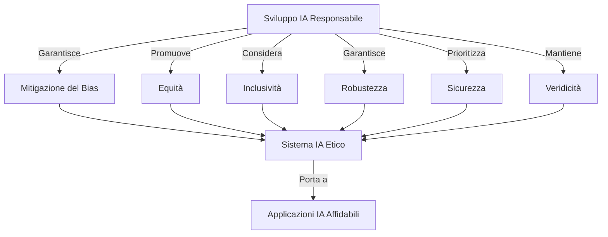
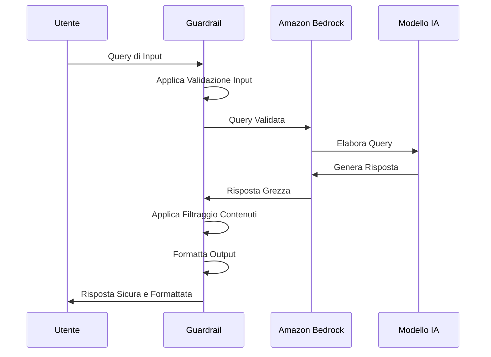
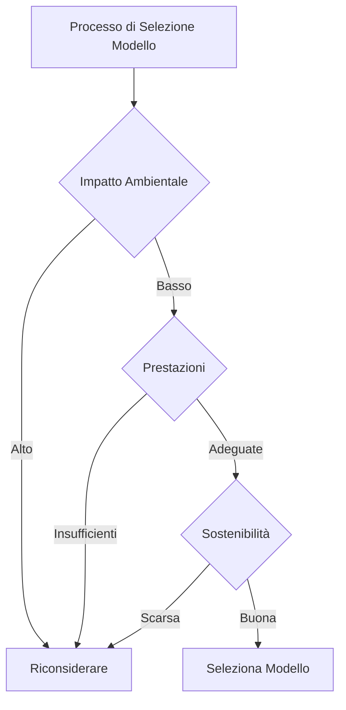
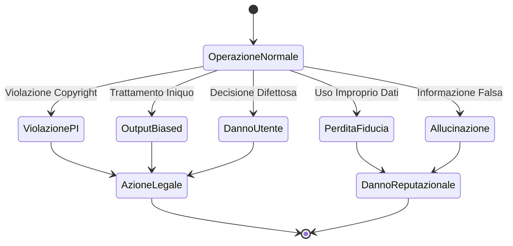
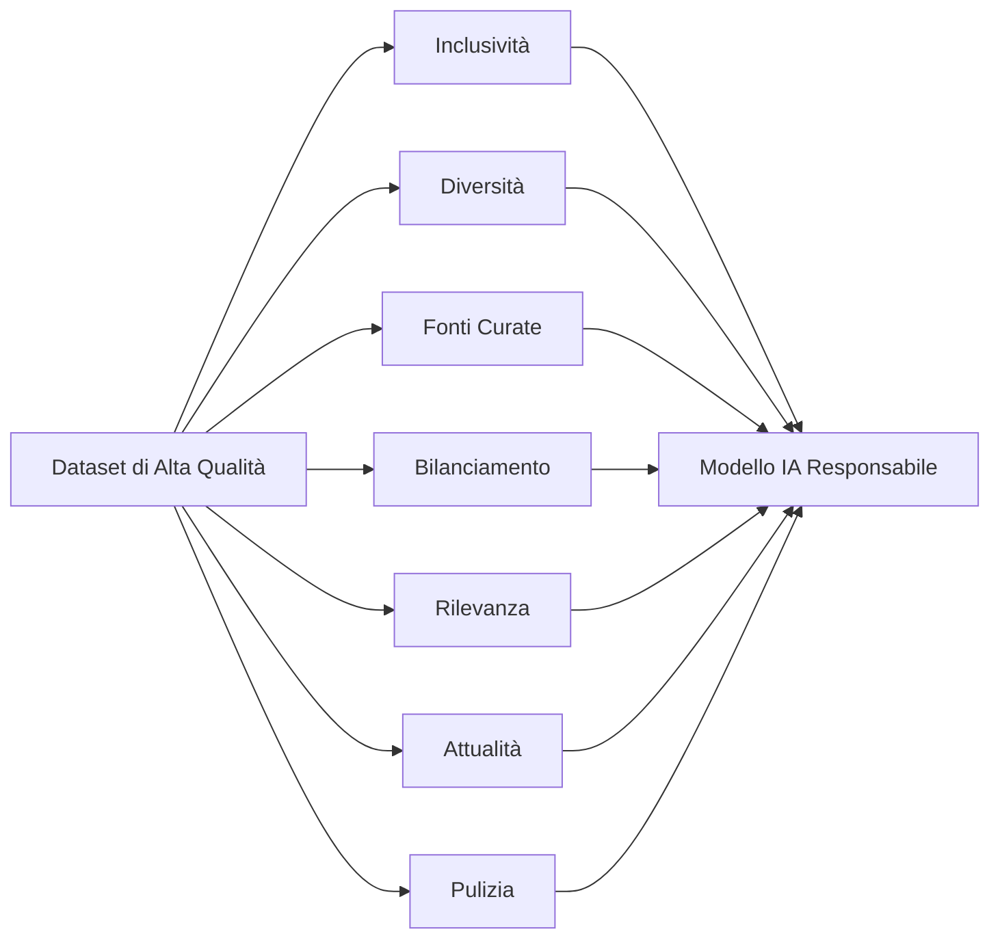
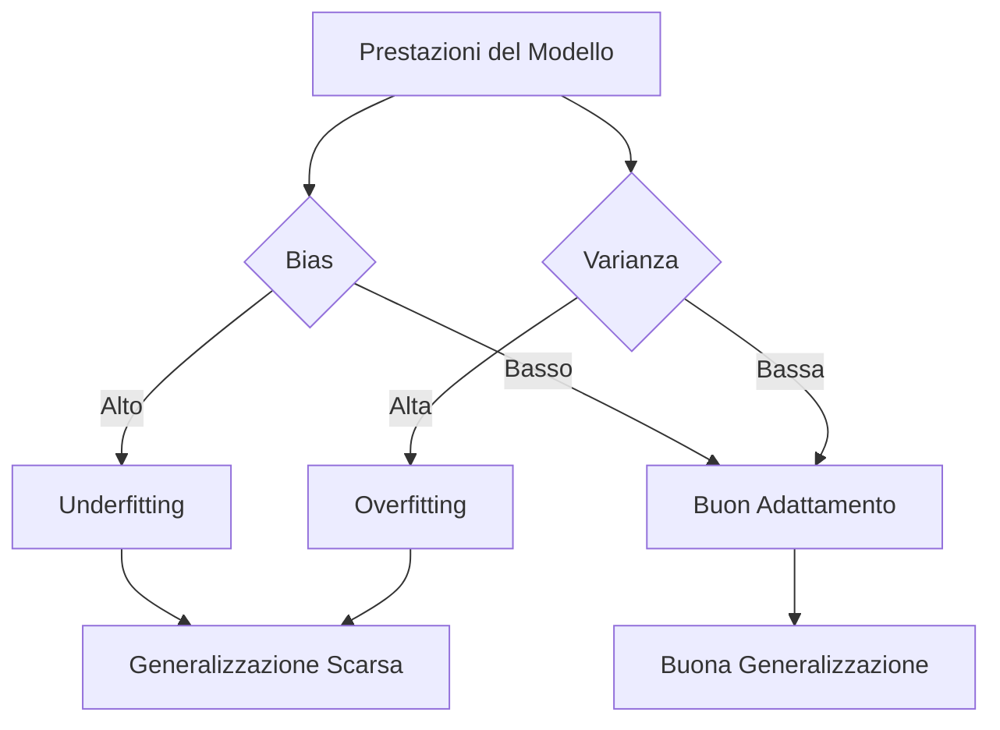

## 4.1 Sistemi di IA Responsabile

Lo sviluppo di IA responsabile è diventato un imperativo strategico per le organizzazioni in tutti i settori. Le tecnologie di IA continuano a trasformare le industrie, richiedendo ai professionisti aziendali di comprendere i principi e le pratiche che garantiscono che questi potenti strumenti siano deployati eticamente, in sicurezza e in allineamento con i valori sociali. L'IA responsabile non è solo un obbligo morale; è una **necessità strategica** che migliora la reputazione del marchio, mitiga i rischi e favorisce la fiducia tra gli stakeholder.[^1100] Per i leader aziendali che si preparano per l'esame AWS Certified AI Practitioner, comprendere lo sviluppo di IA responsabile consente il processo decisionale informato sull'implementazione dell'IA, aiuta a navigare potenziali insidie e sfrutta il pieno potenziale dell'IA mantenendo l'integrità etica.

### Identificazione delle Caratteristiche dell'IA Responsabile

I sistemi di IA responsabile incorporano diverse caratteristiche critiche che garantiscono sviluppo e deployment etici, equi e benefici. Queste caratteristiche costruiscono fiducia nelle tecnologie di IA mitigando i rischi potenziali associati al loro uso.

1. **Bias**: I sistemi di IA responsabile minimizzano il bias nei processi decisionali esaminando attentamente i dati di addestramento, gli algoritmi e gli output per prevenire discriminazioni ingiuste contro certi gruppi o la perpetuazione di bias sociali esistenti.[^1101]

2. **Equità**: I sistemi di IA dovrebbero trattare tutti gli individui e gruppi equamente, fornendo pari opportunità e risultati indipendentemente dalle caratteristiche personali come razza, genere o status socioeconomico.

3. **Inclusività**: Lo sviluppo di IA responsabile considera prospettive diverse e garantisce che i sistemi di IA siano accessibili e benefici per una vasta gamma di utenti, inclusi quelli con disabilità o provenienti da comunità sottorappresentate.

4. **Robustezza**: I sistemi di IA devono performare consistentemente attraverso vari scenari, inclusi casi limite e input inaspettati, richiedendo processi rigorosi di testing e validazione.

5. **Sicurezza**: Garantire la sicurezza del sistema di IA è fondamentale, particolarmente in applicazioni critiche come sanità o veicoli autonomi. Questo include implementare salvaguardie contro danni potenziali e considerare le conseguenze a lungo termine.

6. **Veridicità**: I sistemi di IA dovrebbero fornire informazioni accurate e veritiere, con meccanismi per rilevare e mitigare output falsi o fuorvianti, specialmente nelle applicazioni di IA generativa.[^1102]

Per illustrare l'interazione di queste caratteristiche nello sviluppo di IA responsabile, considerate il seguente diagramma:

In pratica, implementare queste caratteristiche richiede un approccio multisfaccettato. Per affrontare il bias, le aziende potrebbero impiegare metodi di raccolta dati diversificati e utilizzare tecniche di equità algoritmica. Per l'inclusività, potrebbero condurre ricerca utente con varie demografie e progettare interfacce di IA accessibili.

Robustezza e sicurezza possono essere migliorate attraverso protocolli di testing rigorosi, incluso testing avversario per identificare vulnerabilità. La veridicità, particolarmente cruciale nelle applicazioni di IA generativa, potrebbe coinvolgere l'implementazione di meccanismi di fact-checking o etichettatura chiara del contenuto generato dall'IA.

Prioritizzando queste caratteristiche, le aziende sviluppano sistemi di IA che non solo performano bene ma si allineano anche con standard etici e aspettative sociali, costruendo fiducia con clienti e stakeholder.

### Strumenti per Identificare le Caratteristiche dell'IA Responsabile

AWS fornisce strumenti specializzati che aiutano le organizzazioni a implementare efficacemente le pratiche di IA responsabile. **Guardrail per Amazon Bedrock** si distingue come una soluzione potente che garantisce che le applicazioni di IA generativa operino entro confini etici e operativi predefiniti.[^1103]

Guardrail per Amazon Bedrock fornisce un approccio strutturato per implementare le caratteristiche di IA responsabile:

1. **Filtraggio dei Contenuti**: Previene la generazione di contenuti inappropriati o dannosi, affrontando preoccupazioni di sicurezza e veridicità.

2. **Validazione degli Input**: Garantisce che gli input degli utenti soddisfino criteri specifici, migliorando robustezza e sicurezza.

3. **Formattazione degli Output**: Struttura le risposte generate dall'IA in un formato consistente, migliorando inclusività e usabilità.

4. **Prompt Engineering**: Consente la messa a punto dei prompt dell'IA per ridurre il bias e migliorare l'equità nelle risposte.

Ecco un diagramma semplificato che illustra come Guardrail per Amazon Bedrock si integra nel processo di sviluppo dell'IA:

Questo diagramma mostra come Guardrail agisce come strato intermediario, garantendo che sia input che output aderiscano ai principi di IA responsabile.

In pratica, le aziende potrebbero utilizzare Guardrail per:

- Configurare filtri di contenuto che prevengono la generazione di linguaggio offensivo o informazioni sensibili da parte dell'IA
- Implementare regole di validazione input che garantiscono che le query degli utenti siano entro parametri accettabili
- Definire formati di output che presentano informazioni chiaramente e consistentemente attraverso diverse interazioni utente

Utilizzando strumenti come Guardrail, le aziende possono più facilmente identificare e implementare caratteristiche di IA responsabile, garantendo che le loro applicazioni di IA soddisfino standard etici e requisiti normativi.

### Pratiche Responsabili per la Selezione dei Modelli

La selezione dei modelli rappresenta un punto decisionale critico nello sviluppo di IA responsabile che influenza non solo le prestazioni ma anche l'impatto ambientale e la sostenibilità. Fare scelte informate in quest'area dimostra impegno sia per l'eccellenza tecnica che per la responsabilità aziendale.

**Considerazioni Ambientali**:
- **Efficienza Energetica**: Scegliere modelli che richiedono meno potenza computazionale ed energia per essere addestrati ed eseguiti.[^1104]
- **Impronta di Carbonio**: Considerare le emissioni di carbonio associate all'addestramento e deployment del modello.
- **Requisiti Hardware**: Optare per modelli che operano efficacemente sull'infrastruttura esistente per minimizzare la necessità di hardware aggiuntivo ad alta intensità energetica.

**Pratiche di Sostenibilità**:
- **Riusabilità del Modello**: Selezionare modelli che possono essere affinati per molteplici compiti, riducendo la necessità di addestrare nuovi modelli da zero.
- **Uso Efficiente dei Dati**: Prioritizzare modelli che apprendono efficacemente da dataset più piccoli, riducendo i requisiti di archiviazione e elaborazione dati.
- **Longevità**: Scegliere architetture di modello che probabilmente rimarranno rilevanti, riducendo la frequenza di sostituzioni di modelli ad alta intensità di risorse.

Per illustrare il processo decisionale per la selezione responsabile dei modelli, considerate il seguente diagramma di flusso:

Questo diagramma delinea un processo decisionale che prioritizza sia l'impatto ambientale che la sostenibilità insieme alle prestazioni quando si seleziona un modello di IA.

In pratica, le aziende potrebbero implementare queste pratiche responsabili attraverso:

1. Condurre analisi del consumo energetico di diverse architetture di modello
2. Utilizzare servizi cloud come AWS che offrono opzioni di computing carbon-neutral[^1105]
3. Implementare tecniche di compressione del modello per ridurre i requisiti computazionali
4. Rivedere e aggiornare regolarmente i criteri di selezione del modello per allinearsi con gli standard di sostenibilità più recenti

Adottando queste pratiche responsabili, le aziende garantiscono che le loro iniziative di IA soddisfino gli obiettivi di prestazione contribuendo agli obiettivi di sostenibilità più ampi.

### Rischi Legali del Lavoro con IA Generativa

L'adozione di IA generativa porta sfide legali e di conformità significative che le organizzazioni devono affrontare proattivamente. Comprendere questi rischi è essenziale per implementare salvaguardie appropriate e mantenere la conformità legale durante tutto il ciclo di vita dell'IA.

I rischi legali chiave includono:

1. **Rivendicazioni di Violazione della Proprietà Intellettuale**: I modelli di IA generativa addestrati su materiale protetto da copyright potrebbero produrre output che violano diritti di proprietà intellettuale esistenti.[^1106]

2. **Output di Modello Biased**: I sistemi di IA che producono risultati distorti potrebbero portare a rivendicazioni di discriminazione e violazioni normative.

3. **Perdita di Fiducia dei Clienti**: L'uso improprio o la gestione errata dei dati dei clienti nell'addestramento o deployment dell'IA può erodere la fiducia e potenzialmente violare le leggi di protezione dei dati.

4. **Rischio per l'Utente Finale**: Contenuti o decisioni generati dall'IA che causano danni agli utenti finali potrebbero risultare in responsabilità per l'azienda.

5. **Allucinazioni**: I modelli di IA che producono informazioni false o fuorvianti (*allucinazioni*) potrebbero portare a rivendicazioni di disinformazione o danni reputazionali.[^1107]

Per illustrare la natura interconnessa di questi rischi, considerate il seguente diagramma:

Questo diagramma di stato mostra come vari rischi possano portare ad azioni legali o danni reputazionali, enfatizzando l'importanza della gestione proattiva del rischio nei deployment di IA generativa.

Per mitigare questi rischi, le aziende possono:

1. Implementare processi robusti di filtraggio dei contenuti e validazione degli output
2. Condurre audit regolari degli output del modello di IA per bias e accuratezza
3. Stabilire politiche chiare di governance dei dati e ottenere permessi necessari per i dati di addestramento
4. Sviluppare politiche trasparenti sull'uso dell'IA e comunicarle chiaramente agli utenti finali
5. Implementare meccanismi di supervisione umana per decisioni critiche guidate dall'IA

Comprendendo e affrontando questi rischi legali, le aziende possono sfruttare il potere dell'IA generativa mantenendo la conformità legale e preservando la fiducia degli stakeholder.

### Caratteristiche dei Dataset di Alta Qualità

La qualità dei dati forma la base dei sistemi di IA responsabile. I dataset di alta qualità mostrano caratteristiche specifiche che influenzano direttamente l'equità, l'accuratezza e l'affidabilità dei modelli di IA addestrati su di essi.

**Caratteristiche Chiave**:

1. **Inclusività**: I dataset dovrebbero rappresentare popolazioni diverse, garantendo che il modello di IA performa equamente attraverso diversi gruppi demografici.

2. **Diversità**: Una vasta gamma di scenari, casi d'uso e tipi di dati migliora la capacità del modello di generalizzare.

3. **Fonti di Dati Curate**: Dati raccolti da fonti reputabili e verificate garantiscono accuratezza e affidabilità.

4. **Dataset Bilanciati**: La distribuzione dei dati attraverso diverse categorie dovrebbe essere bilanciata per prevenire bias verso gruppi sovrarappresentati.

5. **Rilevanza**: I dati dovrebbero essere pertinenti al problema specifico o dominio che il modello di IA affronta.

6. **Attualità**: I dataset dovrebbero essere aggiornati e regolarmente rinfrescati per riflettere tendenze e informazioni attuali.

7. **Pulizia**: I dati dovrebbero essere liberi da errori, duplicati e inconsistenze che potrebbero influenzare negativamente le prestazioni del modello.[^1108]

Per illustrare l'interazione di queste caratteristiche nella creazione di dataset di alta qualità, considerate il seguente diagramma:

In pratica, le aziende possono garantire la qualità del dataset attraverso:

1. Implementare strategie di raccolta dati che catturano prospettive ed esperienze diverse
2. Fare audit regolari dei dataset per bilanciamento e rappresentazione attraverso diverse categorie
3. Stabilire partnership con fornitori di dati reputabili o curare processi di raccolta dati interni
4. Sviluppare pipeline di pulizia e preprocessing dei dati per mantenere l'integrità dei dati
5. Implementare controllo di versione per i dataset per tracciare i cambiamenti e garantire l'attualità

Prioritizzando queste caratteristiche nella creazione e curation dei dataset, le aziende pongono una base solida per sviluppare modelli di IA che sono accurati, equi e allineati con i principi di IA responsabile.

### Comprensione degli Effetti di Bias e Varianza

Bias e varianza rappresentano concetti fondamentali del machine learning che influenzano significativamente le prestazioni, l'equità e l'affidabilità dei modelli di IA. Comprendere questi concetti aiuta i praticanti a sviluppare modelli che performano consistentemente attraverso diversi scenari e gruppi demografici.

**Bias**:
- **Definizione**: Il bias si verifica quando un modello sistematicamente sottostima o sovrastima il valore vero, portando a errori sistematici.
- **Effetti sui Gruppi Demografici**: I modelli biased possono influenzare sproporzionatamente certi gruppi demografici, portando a risultati ingiusti o discriminatori.
- **Impatto sull'Accuratezza**: Un bias alto può risultare in *underfitting*, dove il modello fallisce nel catturare i pattern sottostanti nei dati.

**Varianza**:
- **Definizione**: La varianza si riferisce alla sensibilità del modello alle fluttuazioni nei dati di addestramento.
- **Overfitting**: Un'alta varianza può portare a *overfitting*, dove il modello performa bene sui dati di addestramento ma male su dati nuovi e non visti.
- **Underfitting**: Una bassa varianza (accoppiata con bias alto) può risultare in underfitting, dove il modello è troppo semplicistico per catturare la complessità dei dati.[^1109]

Per illustrare la relazione tra bias, varianza e prestazioni del modello, considerate il seguente diagramma:

Questo diagramma mostra come diverse combinazioni di bias e varianza influenzano le prestazioni del modello e la capacità di generalizzazione.

In pratica, le aziende possono affrontare i problemi di bias e varianza attraverso:

1. **Regolarizzazione**: Implementare tecniche come regolarizzazione L1/L2 per prevenire overfitting
2. **Cross-validation**: Utilizzare k-fold cross-validation per valutare le prestazioni del modello attraverso diversi subset di dati
3. **Metodi Ensemble**: Combinare molteplici modelli per ridurre sia bias che varianza
4. **Feature Engineering**: Selezionare e creare attentamente feature che sono rappresentative e non discriminatorie
5. **Data Augmentation**: Espandere il dataset con esempi sintetici per migliorare la rappresentazione e ridurre il bias

Comprendendo e affrontando gli effetti di bias e varianza, le aziende possono sviluppare modelli di IA che sono più accurati, equi e generalizzabili attraverso diversi scenari e gruppi demografici.

### Strumenti per Rilevare e Monitorare Bias, Affidabilità e Veridicità

Mantenere l'integrità del sistema di IA richiede monitoraggio continuo durante tutto il ciclo di vita del modello. AWS fornisce strumenti specializzati che aiutano le organizzazioni a rilevare e affrontare problemi relativi a bias, affidabilità e veridicità nelle loro soluzioni di IA.

1. **Amazon SageMaker Clarify**:
   - Rileva potenziali bias nei dati di addestramento e nelle predizioni del modello
   - Fornisce spiegazioni per le predizioni del modello per migliorare la trasparenza
   - Genera report sull'importanza delle feature e metriche di bias[^1110]

2. **SageMaker Model Monitor**:
   - Monitora continuamente le prestazioni del modello in produzione
   - Rileva data drift e concept drift che potrebbero impattare l'accuratezza del modello
   - Avvisa i team di potenziali problemi prima che influenzino i risultati aziendali[^1111]

3. **Amazon Augmented AI (Amazon A2I)**:
   - Implementa flussi di lavoro di revisione umana per predizioni sensibili dell'IA
   - Aiuta a validare output del modello e identificare potenziali bias o errori
   - Migliora l'accuratezza del modello attraverso loop di feedback umano[^1112]

Oltre a questi strumenti specifici di AWS, le aziende possono impiegare altre tecniche per migliorare l'affidabilità e veridicità dei loro sistemi di IA:

1. **Analisi della Qualità delle Etichette**:
   - Implementare processi di controllo qualità rigorosi per l'etichettatura dei dati
   - Utilizzare etichettatura consensuale con molteplici annotatori per dataset critici

2. **Audit Umani**:
   - Condurre audit umani regolari degli output del modello, specialmente per decisioni ad alto rischio
   - Stabilire criteri chiari per ciò che costituisce prestazioni accettabili del modello

3. **Analisi dei Sottogruppi**:
   - Eseguire analisi dettagliate delle prestazioni del modello attraverso diversi sottogruppi demografici
   - Identificare e affrontare eventuali disparità nell'accuratezza o equità del modello

Sfruttando questi strumenti e tecniche, le aziende possono:
- Identificare e mitigare proattivamente i bias nei loro sistemi di IA
- Migliorare la trasparenza e spiegabilità dei processi decisionali dell'IA
- Mantenere monitoraggio continuo per garantire che i modelli di IA rimangano accurati ed equi nel tempo
- Costruire fiducia con gli stakeholder dimostrando impegno per le pratiche di IA responsabile

Implementare un approccio completo per rilevare e monitorare bias, affidabilità e veridicità è essenziale per le aziende che mirano a sviluppare e mantenere sistemi di IA responsabile che si allineano con standard etici e requisiti normativi.

### Domande per l'auto-verifica

1. **Un'azienda sta implementando pratiche di IA responsabile e vuole garantire che i loro modelli di IA siano equi e non distorti. Quale dei seguenti strumenti sarebbe più appropriato per rilevare potenziali bias nei loro dati di addestramento e predizioni del modello?**

   A. Amazon SageMaker Model Monitor
   B. Amazon SageMaker Clarify
   C. Amazon Augmented AI (A2I)
   D. Amazon SageMaker Feature Store

2. **Un team di sviluppo IA è preoccupato per l'impatto ambientale dei loro large language model. Quale delle seguenti pratiche sarebbe più efficace nel ridurre l'impronta di carbonio dei loro sistemi di IA?**

   A. Aumentare la dimensione dei dataset di addestramento
   B. Utilizzare GPU più potenti per l'addestramento
   C. Selezionare modelli che richiedono meno potenza computazionale
   D. Implementare inferenza in tempo reale per tutte le applicazioni

3. **Un'azienda di servizi finanziari sta sviluppando un sistema di IA per approvare richieste di prestito. Quale dei seguenti rappresenta il maggior rischio legale associato all'uso di IA generativa in questo contesto?**

   A. Violazione della proprietà intellettuale
   B. Output di modello biased che portano a discriminazione
   C. Perdita di fiducia dei clienti dovuta a uso improprio dei dati
   D. Contenuto generato dall'IA che causa danni reputazionali

4. **Nel contesto dello sviluppo di IA responsabile, a cosa si riferisce il termine "allucinazione"?**

   A. Modelli di IA che producono informazioni false o fuorvianti
   B. Utenti che interpretano male il contenuto generato dall'IA
   C. Sistemi di IA che consumano risorse computazionali eccessive
   D. Pattern inaspettati che emergono nei dati di addestramento

5. **Un data scientist sta valutando le prestazioni di un modello di IA e nota che performa bene sui dati di addestramento ma male su dati nuovi e non visti. Cosa indica più probabilmente questo scenario?**

   A. Il modello ha bias alto e varianza bassa
   B. Il modello ha bias basso e varianza alta
   C. Il modello ha raggiunto prestazioni ottimali
   D. Il modello richiede più dati di addestramento

### Risposte e Spiegazioni

1. **Risposta corretta: B. Amazon SageMaker Clarify**

   Spiegazione: Amazon SageMaker Clarify è specificamente progettato per rilevare potenziali bias nei dati di addestramento e nelle predizioni del modello, il che si allinea con l'obiettivo dell'azienda di garantire modelli di IA equi e non distorti.[^1113] Fornisce report sull'importanza delle feature e metriche di bias, rendendolo lo strumento più appropriato per questo compito. Mentre SageMaker Model Monitor è utile per il monitoraggio continuo, e A2I aiuta con la revisione umana, non si concentrano specificamente sulla rilevazione di bias nei dati di addestramento e predizioni del modello.

2. **Risposta corretta: C. Selezionare modelli che richiedono meno potenza computazionale**

   Spiegazione: Per ridurre l'impronta di carbonio dei sistemi di IA, selezionare modelli che richiedono meno potenza computazionale è l'approccio più efficace. Questo affronta direttamente l'aspetto di efficienza energetica delle pratiche di IA responsabile.[^1114] Aumentare la dimensione del dataset o utilizzare GPU più potenti probabilmente aumenterebbe il consumo energetico, mentre l'inferenza in tempo reale non è necessariamente correlata alla riduzione dell'impatto ambientale.

3. **Risposta corretta: B. Output di modello biased che portano a discriminazione**

   Spiegazione: Nel contesto dell'approvazione di prestiti, output di modello biased che portano a discriminazione rappresentano il maggior rischio legale. Questo potrebbe risultare in trattamento iniquo di certi gruppi demografici, potenzialmente violando leggi anti-discriminazione ed esponendo l'azienda a significative responsabilità legali.[^1115] Mentre le altre opzioni sono preoccupazioni, sono meno direttamente legate al caso d'uso specifico dell'approvazione di prestiti e ai rischi legali associati ai servizi finanziari.

4. **Risposta corretta: A. Modelli di IA che producono informazioni false o fuorvianti**

   Spiegazione: Nel contesto dell'IA responsabile, "allucinazione" si riferisce ai modelli di IA, particolarmente large language model, che producono informazioni false o fuorvianti.[^1116] Questa è una preoccupazione critica nello sviluppo di IA responsabile poiché può portare a disinformazione ed erodere la fiducia nei sistemi di IA. Le altre opzioni, pur essendo potenzialmente problematiche, non descrivono accuratamente il concetto di allucinazione nell'IA.

5. **Risposta corretta: B. Il modello ha bias basso e varianza alta**

   Spiegazione: Questo scenario descrive un caso classico di overfitting, che è caratterizzato da bias basso e varianza alta.[^1117] Il modello performa bene sui dati di addestramento (indicando bias basso) ma male su dati nuovi e non visti (indicando varianza alta). Questo suggerisce che il modello ha imparato troppo bene il rumore nei dati di addestramento, piuttosto che generalizzare i pattern sottostanti. È un concetto chiave nella comprensione degli effetti di bias e varianza nei modelli di machine learning.

[^1100]: AWS Responsible AI. URL: <https://aws.amazon.com/machine-learning/responsible-ai/>

[^1101]: Amazon SageMaker Clarify - Detect bias in ML models. URL: <https://aws.amazon.com/sagemaker/clarify/>

[^1102]: AWS AI & ML Blog - Responsible AI: Trustworthy, Ethical, and Unbiased AI. URL: <https://aws.amazon.com/ai/responsible-ai/>

[^1103]: Amazon Bedrock - Guardrails for responsible AI. URL: <https://aws.amazon.com/bedrock/guardrails/>

[^1104]: AWS Sustainability - Carbon Footprint Tool. URL: <https://aws.amazon.com/aws-cost-management/aws-customer-carbon-footprint-tool/>

[^1105]: AWS Sustainability - 100% Renewable Energy by 2025. URL: <https://sustainability.aboutamazon.com/products-services/aws-cloud>

[^1106]: AWS Machine Learning Blog - Mitigating AI/ML Risks. URL: <https://aws.amazon.com/blogs/machine-learning/learn-how-to-assess-risk-of-ai-systems/>

[^1107]: AWS AI & ML Blog - Addressing AI/ML Model Hallucinations. URL: <https://aws.amazon.com/blogs/machine-learning/reducing-hallucinations-in-large-language-models-with-custom-intervention-using-amazon-bedrock-agents/>

[^1108]: Amazon SageMaker Data Wrangler - Clean and prepare ML data. URL: <https://aws.amazon.com/sagemaker/data-wrangler/>

[^1109]: AWS Machine Learning Blog - Understanding Bias-Variance Tradeoff. URL: <https://docs.aws.amazon.com/wellarchitected/latest/machine-learning-lens/mlper-09.html>

[^1110]: Amazon SageMaker Clarify Documentation. URL: <https://docs.aws.amazon.com/sagemaker/latest/dg/clarify-configure-processing-jobs.html>

[^1111]: Amazon SageMaker Model Monitor Documentation. URL: <https://docs.aws.amazon.com/sagemaker/latest/dg/model-monitor.html>

[^1112]: Amazon Augmented AI (A2I) Documentation. URL: <https://docs.aws.amazon.com/sagemaker/latest/dg/a2i-use-augmented-ai-a2i-human-review-loops.html>

[^1113]: Amazon SageMaker Clarify - Detect bias in ML models. URL: <https://aws.amazon.com/sagemaker/clarify/>

[^1114]: AWS Sustainability - Reducing Carbon Footprint in AI/ML. URL: <https://www.aboutamazon.com/news/aws/aws-carbon-footprint-ai-workload>

[^1115]: AWS Financial Services Blog - Responsible AI in Finance. URL: <https://aws.amazon.com/financial-services/generative-ai/>

[^1116]: AWS AI & ML Blog - Addressing AI/ML Model Hallucinations. URL: <https://aws.amazon.com/blogs/machine-learning/reducing-hallucinations-in-large-language-models-with-custom-intervention-using-amazon-bedrock-agents/>

[^1117]: AWS Machine Learning Blog - Understanding Bias-Variance Tradeoff. URL: <https://docs.aws.amazon.com/wellarchitected/latest/machine-learning-lens/mlper-09.html>