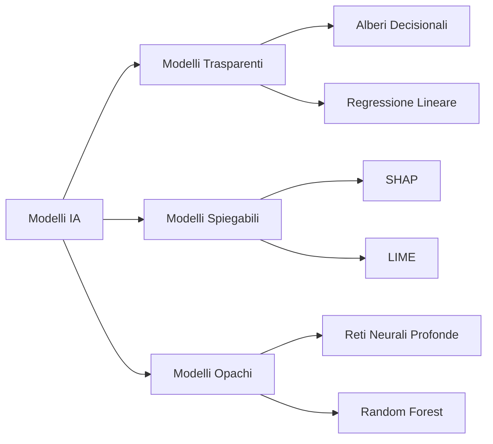
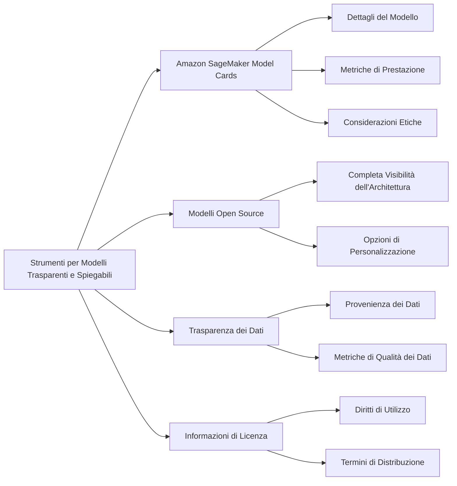
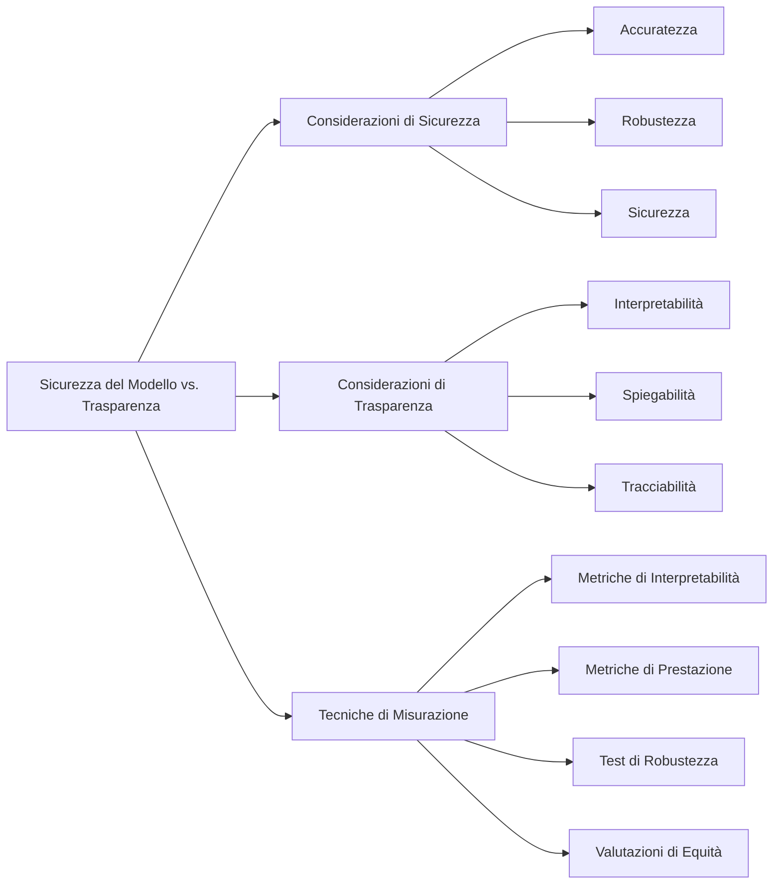
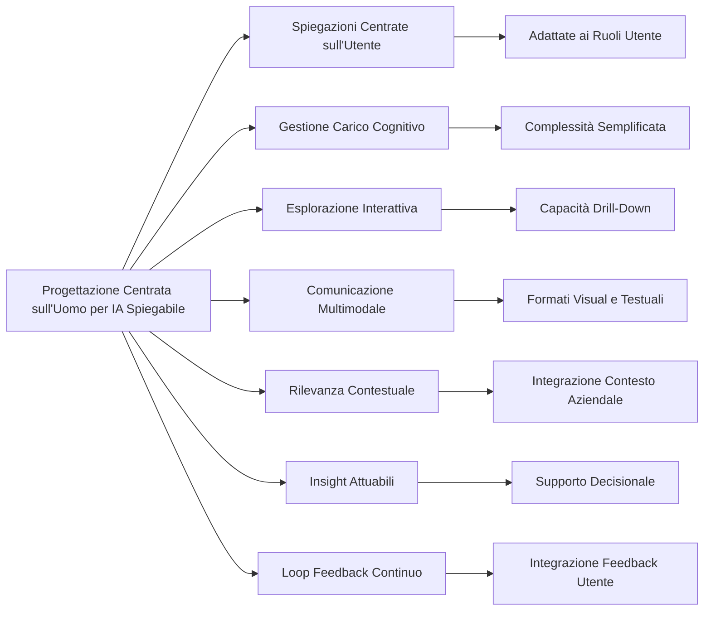

## 4.2 Modelli Trasparenti e Spiegabili: Costruire Fiducia nei Sistemi di IA

Trasparenza e spiegabilità sono elementi fondamentali dell'implementazione responsabile dell'IA. Mentre le organizzazioni deployano sistemi di IA per il processo decisionale critico, comprendere come questi sistemi arrivano alle loro conclusioni diventa essenziale per la fiducia degli stakeholder, la conformità normativa e la gestione del rischio. **L'IA trasparente e spiegabile** consente alle organizzazioni di validare il comportamento del modello, identificare potenziali bias e giustificare decisioni guidate dall'IA a clienti, regolatori e team interni. I professionisti aziendali che si preparano per l'esame AWS Certified AI Practitioner devono comprendere questi concetti oltre la teoria—devono riconoscere come la trasparenza influisce sul deployment dell'IA attraverso settori come finanza, sanità, retail e manifatturiero. Questo capitolo esplora le distinzioni tra modelli trasparenti e opachi, esamina strumenti per identificare modelli spiegabili, discute l'equilibrio tra sicurezza del modello e trasparenza, e introduce principi di progettazione centrati sull'uomo per creare sistemi di IA che gli utenti possano comprendere e di cui possano fidarsi.

### Comprensione delle differenze tra modelli trasparenti e spiegabili e modelli opachi

**I modelli trasparenti e spiegabili**, spesso chiamati modelli "white box", forniscono visibilità nei loro processi decisionali, rivelando come gli input portano a output specifici. Al contrario, **i modelli opachi**, o modelli "black box", offrono insight minimi nelle loro operazioni interne. Questa distinzione influenza significativamente l'implementazione dell'IA attraverso conformità normativa, fiducia degli utenti ed efficacia operativa.

I modelli trasparenti tipicamente presentano architetture più semplici con algoritmi interpretabili come alberi decisionali, regressione lineare o sistemi basati su regole. Questi modelli consentono l'esame diretto della loro logica e confini decisionali. Per esempio, un albero decisionale utilizzato nella previsione del churn dei clienti può essere visualizzato per mostrare esattamente quali feature e soglie determinano classificazioni specifiche.

I modelli spiegabili possono incorporare strutture più complesse ma forniscono metodi per interpretare le loro decisioni dopo che sono state prese. Questi approcci includono tecniche come valori SHAP (SHapley Additive exPlanations) o LIME (Local Interpretable Model-agnostic Explanations) che rivelano l'importanza delle feature e confini decisionali locali.[^1200]

I modelli opachi, inclusi reti neurali profonde e metodi ensemble come random forest, spesso offrono prestazioni superiori a spese dell'interpretabilità. Mentre questi modelli eccellono nel catturare relazioni complesse e non lineari nei dati, i loro processi decisionali rimangono difficili da comprendere per gli umani.

*Figura 4.2.1. Tipi di Modelli IA ed Esempi. Questo diagramma illustra la categorizzazione dei modelli IA in tipi trasparenti, spiegabili e opachi, insieme ad esempi di ogni categoria.*

La selezione tra modelli trasparenti, spiegabili e opachi dipende da casi d'uso specifici e ambienti normativi. Settori altamente regolamentati come finanza o sanità spesso richiedono modelli trasparenti o spiegabili per garantire conformità e auditabilità. Per esempio, istituzioni finanziarie che utilizzano IA per credit scoring devono fornire spiegazioni chiare per i rifiuti di prestito per conformarsi alle leggi di prestito equo.[^1201]

In applicazioni dove le prestazioni sono fondamentali e la spiegabilità è meno critica, come riconoscimento di immagini o elaborazione del linguaggio naturale, i modelli opachi potrebbero essere preferiti. Tuttavia, anche in questi scenari, tecniche di spiegazione post-hoc sono sempre più impiegate per fornire qualche livello di interpretabilità.

Per i professionisti aziendali, comprendere queste differenze di modello è importante per diverse ragioni:

1. **Gestione del Rischio**: I modelli trasparenti e spiegabili consentono migliore valutazione e mitigazione del rischio
2. **Conformità Normativa**: Molti settori richiedono decisioni di IA spiegabili, particolarmente per impatti sui diritti individuali o risultati aziendali significativi
3. **Fiducia degli Stakeholder**: I modelli spiegabili costruiscono fiducia con clienti, dipendenti e partner chiarificando i processi decisionali
4. **Miglioramento del Modello**: Comprendere la logica del modello facilita debugging efficace e miglioramento iterativo
5. **Considerazioni Etiche**: I modelli trasparenti semplificano la rilevazione e correzione di bias o pratiche ingiuste

Mentre i sistemi di IA diventano sempre più centrali alle operazioni aziendali, la capacità di distinguere tra e applicare appropriatamente modelli trasparenti, spiegabili e opachi diventa una competenza critica per i praticanti di IA e leader aziendali.

### Comprensione degli strumenti per identificare modelli trasparenti e spiegabili

Implementare modelli di IA trasparenti e spiegabili richiede familiarità con strumenti e tecniche specializzati. AWS offre diversi servizi che supportano trasparenza e spiegabilità del modello, che servono sia requisiti di conformità che iniziative di costruzione della fiducia.

**Amazon SageMaker Model Cards** fornisce un framework standardizzato per documentare informazioni essenziali sui modelli di machine learning.[^1202] Queste schede catturano dettagli critici che aiutano gli utenti a comprendere il comportamento di un modello e potenziali bias.

Componenti chiave di Amazon SageMaker Model Cards includono:

- Dettagli del modello (architettura, dati di addestramento, ecc.)
- Usi previsti e limitazioni
- Metriche di prestazione attraverso diversi sottogruppi
- Considerazioni etiche e potenziali bias
- Risultati dei test e comportamento del modello in vari scenari

Implementando Model Cards, le organizzazioni garantiscono che tutti gli stakeholder abbiano chiara visibilità nelle capacità e vincoli di un modello, promuovendo il deployment responsabile dell'IA.

**I modelli open source** rappresentano un altro aspetto importante della trasparenza del modello. Questi modelli forniscono completa visibilità nella loro architettura e processo di addestramento, consentendo esame approfondito e personalizzazione. AWS supporta il deployment e la gestione di diversi modelli open source attraverso servizi come Amazon SageMaker e Amazon Bedrock.[^1203]

*Figura 4.2.2. Strumenti per Modelli Trasparenti e Spiegabili. Questo diagramma illustra vari strumenti e componenti che contribuiscono alla trasparenza e spiegabilità del modello, inclusi Amazon SageMaker Model Cards, modelli open source, trasparenza dei dati e informazioni di licenza.*

**La trasparenza dei dati** forma una base critica per la spiegabilità del modello. AWS fornisce strumenti specializzati per tracciare la lineage e provenienza dei dati, garantendo che i dati di addestramento e validazione siano accuratamente documentati e compresi:

- **Amazon SageMaker Data Wrangler** per preparazione dei dati e feature engineering[^1204]
- **Amazon SageMaker Feature Store** per gestione e versionamento delle feature[^1205]
- **AWS Glue Data Catalog** per mantenere un repository di metadati centralizzato[^1206]

**Le licenze appropriate** sono anche essenziali per modelli trasparenti e spiegabili. AWS fornisce informazioni di licenza chiare per i suoi servizi di IA e supporta varie licenze open source. Comprendere i termini di licenza aiuta le organizzazioni a:

- Garantire conformità con restrizioni d'uso
- Determinare diritti per modifica e distribuzione del modello
- Valutare potenziali rischi legali associati al deployment del modello

Per i professionisti aziendali, questi strumenti e pratiche offrono vantaggi significativi:

1. **Conformità Migliorata**: Documentazione dettagliata del modello e pratiche di dati trasparenti soddisfano requisiti normativi
2. **Processo Decisionale Migliorato**: Comprendere il comportamento del modello consente decisioni aziendali più informate basate su output dell'IA
3. **Troubleshooting Più Facile**: Modelli trasparenti e lineage chiara dei dati semplificano l'identificazione e risoluzione dei problemi
4. **Comunicazione con gli Stakeholder**: Documentazione completa facilita comunicazione chiara sulle capacità e limitazioni dell'IA sia a stakeholder tecnici che non tecnici
5. **Mitigazione del Rischio**: Trasparenza nell'architettura del modello e uso dei dati aiuta a identificare potenziali bias o preoccupazioni etiche precocemente nello sviluppo

Sfruttando questi strumenti AWS e prioritizzando trasparenza nella selezione del modello, gestione dei dati e licenze, le organizzazioni possono costruire sistemi di IA che offrono sia prestazioni che affidabilità mantenendo la conformità normativa.

### Identificazione dei trade-off tra sicurezza del modello e trasparenza

Le organizzazioni che implementano pratiche di IA responsabile spesso incontrano una tensione fondamentale tra sicurezza del modello e trasparenza. Questo trade-off rappresenta una considerazione critica che impatta prestazioni, affidabilità e conformità normativa dei sistemi di IA.

**La sicurezza del modello** comprende l'affidabilità, robustezza e sicurezza di un modello di IA, inclusi:

- Accuratezza e consistenza delle predizioni
- Resilienza contro attacchi avversari
- Protezione di informazioni sensibili
- Stabilità attraverso distribuzioni di input diverse

**La trasparenza** si riferisce all'interpretabilità e spiegabilità del processo decisionale del modello, inclusi:

- Chiara comprensione dell'importanza delle feature
- Visibilità nella logica interna del modello
- Capacità di tracciare output specifici back agli input
- Spiegazioni comprensibili per le decisioni del modello

Questo trade-off spesso si manifesta nella scelta tra modelli semplici e interpretabili e modelli complessi ad alte prestazioni. Per esempio, un modello di regressione lineare offre alta trasparenza ma può mancare del potere predittivo di una rete neurale profonda, che tipicamente fornisce meno visibilità nelle sue operazioni.

Per navigare efficacemente questo trade-off, le organizzazioni dovrebbero considerare diversi fattori:

1. **Requisiti Normativi**: Alcuni settori richiedono decisioni di IA spiegabili, necessitando trasparenza anche a costo delle prestazioni
2. **Criticità del Caso d'Uso**: Decisioni ad alto rischio possono richiedere modelli più trasparenti per garantire supervisione e responsabilità appropriate
3. **Complessità del Modello**: Modelli più complessi spesso offrono prestazioni migliori ma ridotta interpretabilità
4. **Sensibilità dei Dati**: Modelli che gestiscono dati sensibili possono prioritizzare sicurezza sulla trasparenza per proteggere la privacy
5. **Fiducia degli Stakeholder**: In applicazioni rivolte ai clienti, la trasparenza può essere cruciale per costruire fiducia degli utenti

Le organizzazioni possono impiegare varie tecniche per misurare e bilanciare questi trade-off:

- **Metriche di Interpretabilità**: Strumenti come valori SHAP o LIME quantificano quanto bene le decisioni di un modello possano essere spiegate[^1207]
- **Metriche di Prestazione**: Misure tradizionali come accuratezza, precisione e recall valutano l'efficacia del modello
- **Test di Robustezza**: Tecniche come testing avversario valutano la resilienza di un modello a input inusuali o malevoli
- **Valutazioni di Equità**: Metriche che misurano bias attraverso diversi sottogruppi aiutano a garantire comportamento etico del modello

*Figura 4.2.3. Trade-off Sicurezza del Modello vs. Trasparenza. Questo diagramma illustra le considerazioni chiave nel bilanciare sicurezza del modello e trasparenza, insieme a tecniche per misurare questi aspetti.*

AWS fornisce diversi strumenti per aiutare le organizzazioni a navigare questi trade-off:

- **Amazon SageMaker Clarify**: Offre rilevazione di bias e funzionalità di spiegabilità per migliorare la trasparenza senza compromettere le prestazioni[^1208]
- **Amazon SageMaker Model Monitor**: Consente monitoraggio continuo delle prestazioni e rilevazione di drift, bilanciando sicurezza e trasparenza nel tempo[^1209]
- **AWS Security Hub**: Fornisce visibilità completa su sicurezza e conformità, garantendo sicurezza del modello nel deployment[^1210]

Per i professionisti aziendali, comprendere e gestire questi trade-off offre diversi benefici:

1. **Gestione del Rischio**: Bilanciare sicurezza e trasparenza consente migliore valutazione e mitigazione dei rischi correlati all'IA
2. **Conformità Normativa**: Molti settori richiedono livelli specifici di spiegabilità del modello insieme a standard di prestazione
3. **Pratiche IA Etiche**: Modelli trasparenti facilitano revisione e aggiustamento etici, essenziali per il deployment responsabile dell'IA
4. **Comunicazione con gli Stakeholder**: Comprendere i trade-off del modello consente comunicazione più chiara sulle capacità e limitazioni dell'IA
5. **Miglioramento Continuo**: Riconoscere l'equilibrio tra sicurezza e trasparenza guida gli sforzi di raffinamento continuo del modello

Affrontando thoughtfully questi trade-off e sfruttando strumenti e metriche appropriate, le organizzazioni possono sviluppare sistemi di IA che offrono sia alte prestazioni che operazione responsabile, soddisfacendo requisiti diversi per prestazioni, spiegabilità e standard etici.

### Comprensione dei principi di progettazione centrata sull'uomo per l'IA spiegabile

**La progettazione centrata sull'uomo** (HCD) per l'IA spiegabile si concentra sulla creazione di sistemi che non sono solo tecnicamente robusti ma anche intuitivi, accessibili e significativi per gli utenti umani. Questo approccio garantisce che le spiegazioni dell'IA forniscano valore genuino a stakeholder diversi, dai data scientist ai decision-maker aziendali e agli utenti finali.

Principi chiave della progettazione centrata sull'uomo per l'IA spiegabile includono:

1. **Spiegazioni Centrate sull'Utente**: Adattare le spiegazioni per corrispondere alle esigenze specifiche, livelli di conoscenza e contesti di diversi gruppi di utenti
2. **Gestione del Carico Cognitivo**: Presentare informazioni in modi che evitano di sopraffare gli utenti con complessità non necessaria
3. **Esplorazione Interattiva**: Consentire agli utenti di investigare più profondamente nelle spiegazioni ed esaminare diversi aspetti delle decisioni del modello
4. **Comunicazione Multimodale**: Utilizzare vari formati (testo, visual, elementi interattivi) per comunicare efficacemente le spiegazioni
5. **Rilevanza Contestuale**: Garantire che le spiegazioni siano significative all'interno di contesti aziendali o operativi specifici
6. **Insight Attuabili**: Fornire spiegazioni che guidano gli utenti verso decisioni informate o azioni concrete
7. **Loop di Feedback Continuo**: Incorporare input degli utenti per migliorare iterativamente la spiegabilità dei sistemi di IA

Implementare questi principi migliora significativamente l'efficacia e adozione del sistema di IA. Per esempio, un modello di credit scoring potrebbe fornire diversi livelli di spiegazione per un ufficiale prestiti (fattori di rischio dettagliati) versus un richiedente prestito (feedback semplificato e attuabile).

*Figura 4.2.4. Principi di Progettazione Centrata sull'Uomo per IA Spiegabile. Questo diagramma illustra i principi chiave della progettazione centrata sull'uomo nel contesto dell'IA spiegabile, evidenziando come questi principi contribuiscano a spiegazioni IA più efficaci e user-friendly.*

AWS fornisce diversi strumenti e servizi che supportano IA spiegabile centrata sull'uomo:

- **Amazon SageMaker Canvas**: Offre un'interfaccia visuale per creare e comprendere modelli ML, rendendo l'IA più accessibile agli utenti non tecnici[^1211]
- **Amazon QuickSight Q**: Fornisce capacità di query in linguaggio naturale, consentendo agli utenti di esplorare dati e insight IA intuitivamente[^1212]
- **Amazon Augmented AI (A2I)**: Facilita la revisione umana delle predizioni ML, incorporando giudizio umano nei sistemi di IA[^1213]

Per i professionisti aziendali, applicare questi principi offre benefici sostanziali:

1. **Adozione Utente Migliorata**: I sistemi di IA progettati con esigenze umane in mente sono più probabilmente accettati e utilizzati efficacemente
2. **Processo Decisionale Migliorato**: Spiegazioni chiare e contestuali consentono agli stakeholder di prendere decisioni più informate basate su output dell'IA
3. **Fiducia Aumentata**: Spiegazioni IA trasparenti e user-friendly costruiscono fiducia nei sistemi di IA tra stakeholder interni ed esterni
4. **Conformità Normativa**: IA spiegabile centrata sull'uomo aiuta a soddisfare requisiti normativi per trasparenza e equità dell'IA
5. **Risoluzione Efficiente dei Problemi**: Quando gli utenti comprendono le decisioni dell'IA, possono più rapidamente identificare e affrontare problemi o bias

Applicazioni pratiche di IA spiegabile centrata sull'uomo includono:

- **Servizio Clienti**: Chatbot IA che forniscono spiegazioni chiare per le loro risposte, consentendo ad agenti umani di comprendere e verificare informazioni generate dall'IA
- **Servizi Finanziari**: Modelli di valutazione del rischio che offrono spiegazioni interattive e visuali delle decisioni di credito, aiutando sia analisti che clienti a comprendere i fattori contribuenti
- **Sanità**: Sistemi di IA diagnostica che presentano risultati in modi che supportano, piuttosto che sostituire, il processo decisionale del medico
- **Manifatturiero**: Sistemi di manutenzione predittiva che forniscono insight attuabili ai tecnici, spiegando non solo cosa potrebbe fallire, ma perché e come prevenirlo

Incorporando principi di progettazione centrata sull'uomo, le organizzazioni creano sistemi di IA che non sono solo potenti e accurati ma anche comprensibili e preziosi per gli utenti umani. Questo approccio colma il divario tra capacità avanzate dell'IA e applicazione pratica del mondo reale, garantendo che l'IA serva veramente e empoweri i suoi utenti.

In conclusione, modelli trasparenti e spiegabili formano la base dell'implementazione responsabile dell'IA. Comprendendo diversi tipi di modello, sfruttando strumenti appropriati, bilanciando sicurezza e trasparenza, e applicando principi di progettazione centrata sull'uomo, le organizzazioni possono sviluppare sistemi di IA che offrono sia efficacia che affidabilità. Mentre l'IA trasforma le operazioni aziendali attraverso i settori, la capacità di costruire e deployare sistemi di IA spiegabili differenzierà le organizzazioni impegnate con standard etici e conformità normativa massimizzando il valore aziendale dell'IA.

### Domande per l'auto-verifica

1. **Quale delle seguenti descrive meglio la differenza tra modelli di IA trasparenti e opachi?**

   A. I modelli trasparenti sono sempre più accurati dei modelli opachi
   B. I modelli opachi forniscono spiegazioni più chiare del loro processo decisionale
   C. I modelli trasparenti consentono l'esame diretto della loro logica e confini decisionali
   D. I modelli opachi sono richiesti per la conformità in settori altamente regolamentati

2. **Un'istituzione finanziaria sta implementando un sistema di IA per credit scoring. Quale strumento AWS sarebbe più appropriato per documentare l'uso previsto del modello, caratteristiche di prestazione e limitazioni?**

   A. Amazon SageMaker Clarify
   B. Amazon SageMaker Model Cards
   C. AWS Security Hub
   D. Amazon QuickSight Q

3. **Nel contesto dell'IA spiegabile, a cosa si riferisce il principio di "gestione del carico cognitivo"?**

   A. Massimizzare la quantità di informazioni presentate agli utenti
   B. Presentare informazioni in un modo che non sopraffà gli utenti con complessità non necessaria
   C. Focalizzarsi esclusivamente su spiegazioni tecniche per data scientist
   D. Evitare rappresentazioni visuali delle decisioni del modello

4. **Un'azienda sta sviluppando un sistema di IA per diagnosi medica. Vogliono bilanciare prestazioni del modello con la necessità di trasparenza. Quale delle seguenti affermazioni descrive meglio un approccio appropriato?**

   A. Scegliere sempre il modello più complesso per la massima accuratezza
   B. Utilizzare solo modelli semplici e completamente trasparenti per garantire spiegabilità
   C. Considerare requisiti normativi e criticità del caso d'uso quando si bilanciano prestazioni e trasparenza
   D. Prioritizzare sicurezza del modello sulla trasparenza in tutte le applicazioni mediche

5. **Quale servizio AWS facilita la revisione umana delle predizioni di machine learning, supportando il principio di progettazione centrata sull'uomo del loop di feedback continuo nell'IA spiegabile?**

   A. Amazon SageMaker Canvas
   B. Amazon QuickSight Q
   C. Amazon Augmented AI (A2I)
   D. AWS Glue Data Catalog

### Risposte e Spiegazioni

1. **Risposta corretta: C. I modelli trasparenti consentono l'esame diretto della loro logica e confini decisionali**

   Spiegazione: I modelli trasparenti, spesso riferiti come modelli "white box", forniscono insight nei loro processi decisionali. Hanno tipicamente architetture più semplici che consentono agli utenti di esaminare direttamente la loro logica e confini decisionali. Questo è in contrasto con i modelli opachi o "black box", che offrono poca visibilità nel loro funzionamento interno. Le altre opzioni sono incorrette: l'accuratezza non è intrinsecamente legata alla trasparenza (A), i modelli opachi per definizione non forniscono spiegazioni più chiare (B), e mentre i modelli trasparenti possono essere preferiti in settori regolamentati, i modelli opachi non sono universalmente richiesti (D).[^1214]

2. **Risposta corretta: B. Amazon SageMaker Model Cards**

   Spiegazione: Amazon SageMaker Model Cards è specificamente progettato per fornire un modo standardizzato per documentare informazioni essenziali sui modelli di machine learning, incluso il loro uso previsto, caratteristiche di prestazione e limitazioni. Questo strumento è cruciale per comprendere il comportamento di un modello e potenziali bias, rendendolo ideale per lo scenario descritto. Mentre Amazon SageMaker Clarify (A) offre rilevazione di bias e funzionalità di spiegabilità, non fornisce documentazione completa come Model Cards. AWS Security Hub (C) è focalizzato su sicurezza e conformità, non documentazione del modello. Amazon QuickSight Q (D) è uno strumento di business intelligence e non direttamente correlato alla documentazione del modello.[^1215]

3. **Risposta corretta: B. Presentare informazioni in un modo che non sopraffà gli utenti con complessità non necessaria**

   Spiegazione: Nel contesto dell'IA spiegabile, gestione del carico cognitivo si riferisce al principio di presentare informazioni in un modo facilmente digeribile e che non sopraffà gli utenti con complessità non necessaria. Questo è cruciale per garantire che le spiegazioni dell'IA siano significative e attuabili per vari stakeholder. Le altre opzioni sono incorrette: massimizzare informazioni (A) probabilmente aumenterebbe il carico cognitivo, focalizzarsi esclusivamente su spiegazioni tecniche (C) non considera diverse esigenze degli utenti, ed evitare rappresentazioni visuali (D) potrebbe effettivamente aumentare il carico cognitivo per molti utenti.[^1216]

4. **Risposta corretta: C. Considerare requisiti normativi e criticità del caso d'uso quando si bilanciano prestazioni e trasparenza**

   Spiegazione: Quando si sviluppano sistemi di IA, specialmente per applicazioni critiche come diagnosi medica, è importante bilanciare prestazioni del modello con la necessità di trasparenza. L'approccio appropriato è considerare fattori come requisiti normativi e criticità del caso d'uso. Questo consente una decisione sfumata che può coinvolgere l'uso di modelli più complessi e ad alte prestazioni dove necessario, garantendo al contempo spiegabilità sufficiente per soddisfare standard normativi ed etici. Le altre opzioni sono troppo estreme: scegliere sempre il modello più complesso (A) o utilizzare solo modelli semplici (B) non consente questo equilibrio, e mentre la sicurezza è importante, prioritizzarla categoricamente sulla trasparenza (D) potrebbe non soddisfare tutti i requisiti normativi ed etici nelle applicazioni di IA medica.[^1217]

5. **Risposta corretta: C. Amazon Augmented AI (A2I)**

   Spiegazione: Amazon Augmented AI (A2I) è specificamente progettato per facilitare la revisione umana delle predizioni di machine learning. Questo servizio supporta il principio di progettazione centrata sull'uomo del loop di feedback continuo nell'IA spiegabile consentendo l'incorporazione del giudizio umano nei sistemi di IA. Questo consente miglioramento continuo e validazione degli output dell'IA. Le altre opzioni, pur essendo servizi AWS utili, non facilitano direttamente la revisione umana delle predizioni ML: Amazon SageMaker Canvas (A) è un'interfaccia visuale per creare modelli ML, Amazon QuickSight Q (B) fornisce query in linguaggio naturale per esplorazione dati, e AWS Glue Data Catalog (C) è un repository di metadati centralizzato.[^1218]

[^1200]: Explainable AI: ML Explainability with Amazon SageMaker Debugger. URL: <https://aws.amazon.com/blogs/machine-learning/ml-explainability-with-amazon-sagemaker-debugger/>

[^1201]: Responsible AI: AWS Responsible AI Policy. URL: <https://aws.amazon.com/ai/responsible-ai/policy/>

[^1202]: Amazon SageMaker Model Cards. URL: <https://docs.aws.amazon.com/sagemaker/latest/dg/model-cards.html>

[^1203]: Amazon Bedrock. URL: <https://aws.amazon.com/bedrock/>

[^1204]: Amazon SageMaker Data Wrangler. URL: <https://aws.amazon.com/sagemaker/data-wrangler/>

[^1205]: Amazon SageMaker Feature Store. URL: <https://aws.amazon.com/sagemaker/feature-store/>

[^1206]: AWS Glue Data Catalog. URL: <https://docs.aws.amazon.com/glue/latest/dg/components-overview.html#data-catalog-intro>

[^1207]: Interpretable Machine Learning: Interpreting Machine Learning Models With SHAP. URL: <https://mindfulmodeler.substack.com/p/interpreting-machine-learning-models>

[^1208]: Amazon SageMaker Clarify. URL: <https://aws.amazon.com/sagemaker/clarify/>

[^1209]: Amazon SageMaker Model Monitor. URL: <https://docs.aws.amazon.com/sagemaker/latest/dg/model-monitor.html>

[^1210]: AWS Security Hub. URL: <https://aws.amazon.com/security-hub/>

[^1211]: Amazon SageMaker Canvas. URL: <https://aws.amazon.com/sagemaker/canvas/>

[^1212]: Amazon QuickSight Q. URL: <https://aws.amazon.com/quicksight/q/>

[^1213]: Amazon Augmented AI. URL: <https://docs.aws.amazon.com/sagemaker/latest/dg/a2i-api-references.html>

[^1214]: AWS Machine Learning: Model Explainability. URL: <https://docs.aws.amazon.com/sagemaker/latest/dg/clarify-model-explainability.html>

[^1215]: Amazon SageMaker Model Cards Documentation. URL: <https://docs.aws.amazon.com/sagemaker/latest/dg/model-cards.html>

[^1216]: AWS Responsible AI. URL: <https://aws.amazon.com/ai/responsible-ai/>

[^1217]: AWS for Healthcare & Life Sciences. URL: <https://aws.amazon.com/health/>

[^1218]: Use APIs in Amazon Augmented AI. URL: <https://docs.aws.amazon.com/sagemaker/latest/dg/a2i-api-references.html>