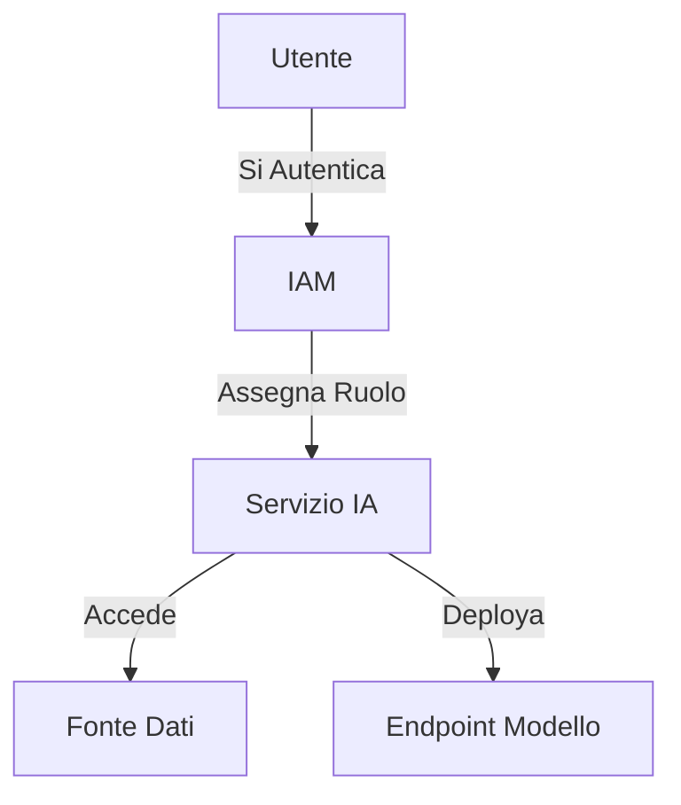
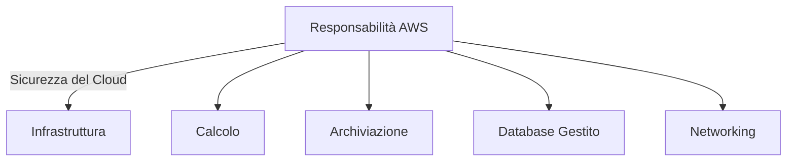
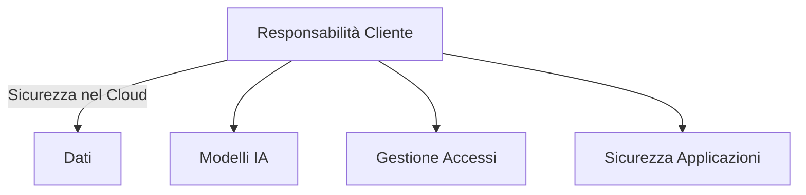
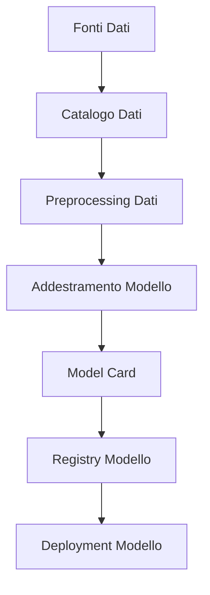
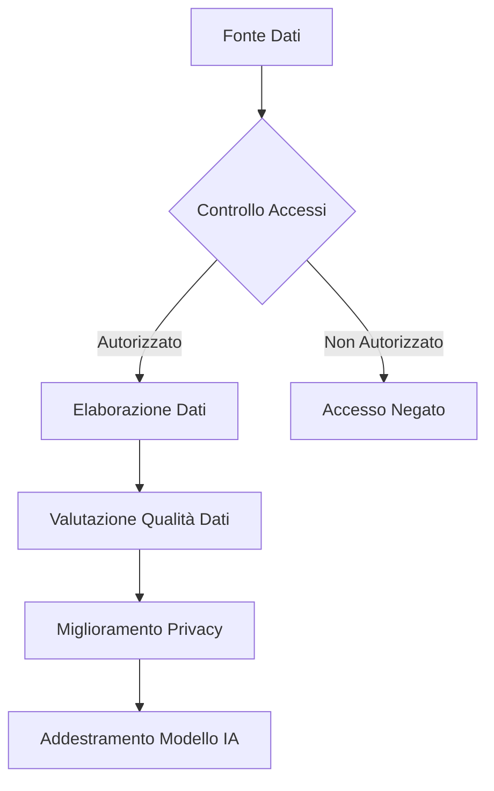
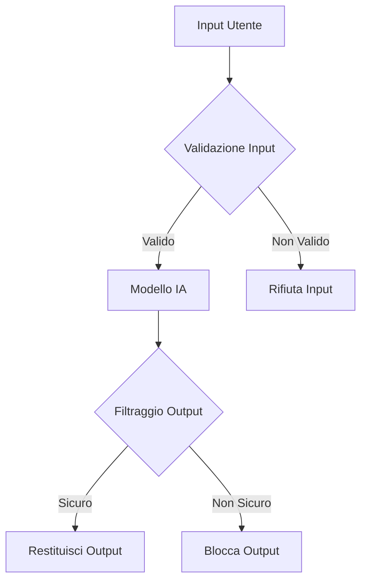

## 5.1 Metodi per proteggere i sistemi di IA

Proteggere i sistemi di IA è una sfida critica per le organizzazioni che sfruttano le tecnologie di machine learning. Mentre l'IA diventa integrata nei processi aziendali principali, introduce vulnerabilità uniche che gli approcci di sicurezza tradizionali potrebbero non affrontare. Per i professionisti aziendali che si preparano per l'esame AWS Certified AI Practitioner, comprendere i metodi di sicurezza dell'IA è essenziale per costruire soluzioni robuste che mantengano integrità, riservatezza e disponibilità dei dati.

Il panorama di sicurezza per l'IA comprende molteplici domini – dalla protezione dei dati di addestramento sensibili alla salvaguardia dell'integrità del modello e alla garanzia di deployment responsabile. Un sistema di IA compromesso può portare a conseguenze serie, incluse violazioni dei dati, decisioni distorte o manipolazione di processi aziendali critici. Implementare misure di sicurezza complete è quindi vitale per la conformità normativa, la fiducia dei clienti e la reputazione organizzativa.

Questo sottocapitolo esplora l'approccio multisfaccettato per proteggere i sistemi di IA su AWS, coprendo servizi essenziali, migliori pratiche e considerazioni chiave. Dalle robuste funzionalità di gestione dell'identità di AWS alle tecniche avanzate di protezione dei dati, otterrete conoscenze pratiche di strumenti e strategie per proteggere le vostre iniziative di IA. Questi concetti vi equipaggeranno per affrontare le sfide di sicurezza e contribuire allo sviluppo di soluzioni di IA affidabili e resilienti nella vostra organizzazione.

### Identificare servizi e funzionalità AWS per proteggere i sistemi di IA

AWS fornisce una suite completa di servizi progettati per proteggere i sistemi di IA attraverso tutti i livelli dello stack tecnologico. Comprendere questi strumenti consente ai professionisti aziendali di proteggere efficacemente le loro iniziative di IA contro potenziali minacce e vulnerabilità.

#### Identity and Access Management (IAM)

**IAM**[^1400] forma la base della sicurezza AWS controllando l'accesso ai servizi e risorse AWS. Per i sistemi di IA, IAM garantisce che solo utenti e processi autorizzati possano interagire con dati e modelli sensibili.

Le funzionalità IAM chiave per proteggere i sistemi di IA includono:

- **Ruoli IAM**: Consentono di delegare permessi ai servizi AWS senza condividere chiavi di accesso a lungo termine. Per esempio, potete creare un ruolo che concede a un'istanza di notebook Amazon **SageMaker**[^1401] accesso a bucket S3 specifici contenenti dati di addestramento.

- **Policy IAM**: Documenti JSON che definiscono i permessi. Potete creare policy personalizzate per affinare l'accesso alle risorse di IA, come consentire ai data scientist di addestrare modelli limitando le capacità di deployment in produzione.

- **Boundaries dei Permessi IAM**: Impostano i permessi massimi che un'entità IAM può avere, particolarmente utili in organizzazioni grandi per prevenire l'escalation dei privilegi nei progetti di IA.

*Figura 5.1.1: Controllo di Accesso Basato su Ruoli IAM per Servizi IA*

Questo diagramma illustra come i ruoli e le policy IAM controllano l'accesso ai servizi e risorse di IA, garantendo che solo entità autorizzate possano interagire con componenti sensibili del vostro sistema di IA.

#### Crittografia e Gestione delle Chiavi

Proteggere i dati a riposo e in transito è cruciale per i sistemi di IA che gestiscono informazioni sensibili. AWS fornisce diversi servizi per la crittografia robusta:

- **AWS Key Management Service (KMS)**[^1402]: Crea e gestisce chiavi crittografiche utilizzate per crittografare i vostri dati. Per carichi di lavoro IA, KMS può crittografare dataset di addestramento, artefatti del modello e risultati di inferenza.

- **Amazon Macie**[^1403]: Un servizio di sicurezza dei dati che utilizza machine learning per scoprire, classificare e proteggere automaticamente dati sensibili. Particolarmente prezioso per identificare informazioni personalmente identificabili (PII) nei dataset utilizzati per l'addestramento dell'IA.

- **AWS PrivateLink**[^1404]: Consente accesso privato ai servizi AWS senza esporre il traffico all'internet pubblico. Per i sistemi di IA, PrivateLink può connettere in sicurezza il vostro VPC agli endpoint SageMaker o altri servizi di IA.

#### Modello di Responsabilità Condivisa AWS

Comprendere il **Modello di Responsabilità Condivisa AWS**[^1405] è essenziale per proteggere i sistemi di IA nel cloud. Questo modello definisce chiaramente le responsabilità di sicurezza tra AWS e i clienti:

- AWS è responsabile per la sicurezza dell'infrastruttura sottostante che esegue tutti i servizi AWS Cloud.
- I clienti sono responsabili per la sicurezza "nel" cloud, inclusa crittografia dei dati, gestione degli accessi e sicurezza delle applicazioni.

Per i sistemi di IA, mentre AWS protegge le risorse di calcolo sottostanti e l'infrastruttura di rete, rimanete responsabili per proteggere i vostri modelli di IA, dati di addestramento e applicazioni che consumano servizi di IA.

*Figura 5.1.2: Modello di Responsabilità Condivisa AWS per Sistemi IA*

Questo diagramma illustra la divisione delle responsabilità di sicurezza tra AWS e il cliente per i sistemi di IA, evidenziando dove ciascuna parte dovrebbe concentrare i propri sforzi di sicurezza.

Sfruttando questi servizi e funzionalità AWS, le organizzazioni possono costruire una base di sicurezza robusta per i loro sistemi di IA. Ricordate che la sicurezza è un processo continuo che richiede monitoraggio continuo e adattamento alle minacce e vulnerabilità emergenti.

### Comprendere il concetto di citazione delle fonti e documentazione delle origini dei dati

L'integrità e la provenienza dei dati sono fondamentali per sistemi di IA affidabili. Documentare le origini dei dati utilizzati nello sviluppo dell'IA—conosciuto come *lineage dei dati* o *citazione delle fonti*—è diventato non solo una migliore pratica ma sempre più un requisito normativo attraverso i settori. Questa documentazione garantisce trasparenza, riproducibilità e responsabilità nei modelli di IA.

#### Lineage dei Dati

**La lineage dei dati** si riferisce al ciclo di vita completo dei dati, incluse le loro origini, movimenti, trasformazioni e destinazioni. Per i sistemi di IA, una lineage appropriata dei dati aiuta a:

- Tracciare la fonte dei dati di addestramento
- Documentare come i dati sono stati processati o trasformati
- Identificare potenziali bias o problemi di qualità
- Garantire conformità con le regolamentazioni sull'uso dei dati

AWS fornisce diversi strumenti per mantenere la lineage dei dati:

- **AWS Glue Data Catalog**[^1406]: Un repository di metadati completamente gestito per archiviare, annotare e condividere metadati sui dataset utilizzati nei progetti di IA.

- **Amazon SageMaker Data Wrangler**[^1407]: Fornisce visibilità nei flussi di dati e trasformazioni, aiutando i data scientist a documentare i passi di preprocessing applicati ai loro dataset.

#### Catalogazione dei Dati

**La catalogazione dei dati** crea un inventario organizzato degli asset di dati all'interno di un'organizzazione. Per i sistemi di IA, un catalogo dati completo:

- Facilita la scoperta dei dati per progetti di IA
- Fornisce contesto sulla qualità e rilevanza dei dati
- Consente governance e controllo degli accessi

AWS offre servizi che supportano la catalogazione dei dati:

- **AWS Lake Formation**[^1408]: Aiuta a costruire, proteggere e gestire data lake, incluso un catalogo centrale dove potete registrare i dati e definire policy di accesso.

- **Amazon Athena**[^1409]: Un servizio di query interattivo che lavora con AWS Glue Data Catalog per interrogare metadati sui vostri dataset.

#### SageMaker Model Cards

**Amazon SageMaker Model Cards**[^1410] vi consente di documentare informazioni essenziali sui modelli di machine learning in un formato standardizzato, incluso:

- Scopo del modello e casi d'uso previsti
- Fonti e caratteristiche dei dati di addestramento
- Metriche di prestazione del modello
- Considerazioni etiche e potenziali bias

Le Model Cards promuovono trasparenza e pratiche di IA responsabile fornendo una registrazione chiara della lineage e caratteristiche di un modello.

*Figura 5.1.3: Lineage di Dati e Modelli nei Sistemi IA*

Questo diagramma illustra il flusso di informazioni sui dati e modelli in un sistema di IA, evidenziando il ruolo dei cataloghi dati e delle model card nel documentare origini e caratteristiche.

Implementare pratiche robuste di citazione delle fonti e documentazione delle origini dei dati è essenziale per:

1. **Conformità Normativa**: Molti settori richiedono registrazioni dettagliate dell'uso dei dati e dei processi di sviluppo del modello.
2. **Governance del Modello**: Comprendere le origini dei dati aiuta a gestire versioni e aggiornamenti del modello.
3. **IA Etica**: Documentare le fonti dei dati aiuta nell'identificare e mitigare potenziali bias.
4. **Riproducibilità**: Documentazione dettagliata consente ricreazione del modello e validazione dei risultati.
5. **Fiducia e Trasparenza**: Documentazione chiara delle origini dei dati costruisce fiducia tra stakeholder e utenti finali.

Sfruttando strumenti AWS e seguendo le migliori pratiche per la citazione delle fonti, le organizzazioni possono costruire sistemi di IA più affidabili e conformi.

### Descrivere le migliori pratiche per data engineering sicuro

Il data engineering sicuro forma la base critica di sistemi di IA robusti. Comprende pratiche progettate per proteggere l'integrità dei dati, garantire la privacy e mantenere la sicurezza durante tutta la pipeline dei dati. Per i professionisti aziendali che implementano IA su AWS, queste migliori pratiche sono essenziali per creare soluzioni sicure e conformi.

#### Valutazione della Qualità dei Dati

La qualità dei dati influenza direttamente le prestazioni e l'affidabilità del modello di IA. Le pratiche chiave per la valutazione della qualità includono:

1. **Profilazione dei Dati**: Utilizzare **AWS Glue DataBrew**[^1411] per analizzare le caratteristiche dei dati, identificare anomalie e comprendere le distribuzioni.

2. **Validazione dei Dati**: Implementare controlli per verificare accuratezza, completezza e consistenza dei dati. SageMaker Data Wrangler fornisce funzionalità per validazione e trasformazione.

3. **Pulizia dei Dati**: Rimuovere o correggere dati inaccurati, incompleti o irrilevanti. AWS Glue offre capacità ETL per pulizia dati su larga scala.

4. **Monitoraggio del Data Drift**: Tracciare continuamente i cambiamenti nelle distribuzioni dei dati che potrebbero influenzare le prestazioni del modello. **Amazon SageMaker Model Monitor**[^1412] può rilevare data drift negli ambienti di produzione.

#### Implementazione di Tecnologie Privacy-Enhancing

Proteggere informazioni sensibili all'interno dei dataset è cruciale per mantenere privacy e conformità. AWS offre diverse tecnologie privacy-enhancing:

- **Amazon Macie**: Scopre e protegge automaticamente dati sensibili in AWS.
- **AWS Glue DataBrew**: Fornisce trasformazioni integrate per anonimizzazione e pseudonimizzazione dei dati.
- **AWS Encryption SDK**[^1413]: Consente crittografia facile utilizzando algoritmi standard del settore.

Le migliori pratiche per implementare tecnologie privacy-enhancing includono:

1. **Minimizzazione dei Dati**: Raccogliere e mantenere solo i dati necessari per il compito di IA specifico.
2. **Mascheramento dei Dati**: Utilizzare tokenizzazione o hashing per proteggere campi sensibili.
3. **Privacy Differenziale**: Implementare algoritmi che aggiungono rumore ai dati o risultati delle query per proteggere la privacy individuale mantenendo l'accuratezza statistica.

#### Controllo degli Accessi ai Dati

Implementare controlli di accesso stretti garantisce che solo il personale autorizzato possa interagire con dati sensibili:

1. **Principio del Privilegio Minimo**: Concedere agli utenti solo i permessi minimi necessari per eseguire i loro compiti.
2. **Controllo di Accesso Basato su Ruoli (RBAC)**: Utilizzare ruoli IAM per gestire l'accesso basato sulle funzioni lavorative.
3. **Controllo di Accesso Basato su Attributi (ABAC)**: Implementare controllo granulare utilizzando tag o altri attributi.
4. **Crittografia dei Dati**: Utilizzare AWS KMS per gestire chiavi di crittografia e crittografare dati a riposo e in transito.

*Figura 5.1.4: Flusso di Data Engineering Sicuro per Sistemi IA*

Questo diagramma illustra i passi chiave nel data engineering sicuro per sistemi di IA, evidenziando controllo accessi, valutazione qualità e miglioramento privacy.

#### Garantire l'Integrità dei Dati

Mantenere l'integrità dei dati durante tutta la pipeline dell'IA è cruciale per produrre modelli affidabili:

1. **Controllo Versione**: Utilizzare **AWS CodeCommit**[^1414] o versionamento Amazon S3 per tracciare cambiamenti nei dataset e codice.
2. **Tracciamento Lineage Dati**: Implementare sistemi per registrare trasformazioni e passi di elaborazione dei dati.
3. **Checksum e Firme Digitali**: Verificare che i dati non siano stati manomessi durante trasferimento o archiviazione.
4. **Audit Trail**: Implementare logging e monitoraggio utilizzando **AWS CloudTrail**[^1415] per tracciare accessi ai dati e modifiche.

Implementando queste migliori pratiche, le organizzazioni costruiscono una base solida per le loro iniziative di IA, garantendo qualità, privacy e integrità dei dati durante tutto il ciclo di vita dell'IA.

### Comprendere considerazioni di sicurezza e privacy per sistemi di IA

I sistemi di IA presentano sfide uniche di sicurezza e privacy che si estendono oltre le misure tradizionali di sicurezza IT. È richiesto un approccio completo per affrontare le vulnerabilità specifiche associate alle tecnologie di machine learning e ai dati sensibili che processano.

#### Sicurezza delle Applicazioni per Sistemi IA

Proteggere le applicazioni di IA richiede la protezione sia del modello che della sua infrastruttura:

1. **Integrità del Modello**: Garantire che i modelli deployati non siano stati manomessi utilizzando **AWS SageMaker Model Registry**[^1416] per versionare e tracciare i modelli.

2. **Validazione degli Input**: Implementare validazione robusta per prevenire *attacchi avversari* che manipolano il comportamento del modello, specialmente per modelli esposti attraverso API.

3. **Sanificazione degli Output**: Sanificare gli output del modello per prevenire perdite di informazioni o attacchi injection nelle applicazioni downstream.

4. **Sicurezza API**: Utilizzare **Amazon API Gateway**[^1417] con **AWS WAF**[^1418] per proteggere gli endpoint del modello di IA da exploit web comuni.

5. **Sicurezza Container**: Per applicazioni di IA containerizzate, utilizzare la scansione **Amazon ECR**[^1419] per rilevare vulnerabilità nelle immagini container.

#### Rilevazione delle Minacce e Gestione delle Vulnerabilità

Il monitoraggio proattivo della sicurezza è essenziale per i sistemi di IA:

1. **Monitoraggio Continuo**: Utilizzare **Amazon GuardDuty**[^1420] per rilevare attività malevole e comportamenti non autorizzati nel vostro ambiente AWS.

2. **Scansione delle Vulnerabilità**: Scansionare regolarmente l'infrastruttura IA con strumenti come **Amazon Inspector**[^1421].

3. **Penetration Testing**: Condurre test regolari per identificare potenziali debolezze, seguendo le policy di penetration testing AWS.

4. **Risposta agli Incidenti**: Sviluppare un piano di risposta agli incidenti specifico per l'IA. Utilizzare **AWS Security Hub**[^1422] per centralizzare gli alert di sicurezza e automatizzare i controlli di sicurezza.

#### Protezione dell'Infrastruttura

Proteggere l'infrastruttura sottostante che supporta i sistemi di IA è cruciale:

1. **Segmentazione di Rete**: Utilizzare **Amazon VPC**[^1423] per isolare carichi di lavoro IA e implementare controlli di accesso alla rete.

2. **Protezione DDoS**: Implementare **AWS Shield**[^1424] per proteggere contro attacchi Distributed Denial of Service sugli endpoint del modello di IA.

3. **Comunicazione Sicura**: Utilizzare AWS PrivateLink per stabilire connettività privata tra VPC e servizi AWS senza esporre dati all'internet pubblico.

#### Protezione da Prompt Injection

*Il prompt injection* rappresenta una preoccupazione di sicurezza unica per large language model (LLM) e altri sistemi di IA generativa:

1. **Sanificazione degli Input**: Implementare validazione stretta per prevenire che prompt malevoli vengano processati.

2. **Confini di Contesto**: Stabilire confini chiari tra input degli utenti e prompt di sistema per prevenire manipolazione non autorizzata.

3. **Filtraggio degli Output**: Implementare filtri per rilevare e bloccare output potenzialmente dannosi.

4. **Rate Limiting**: Utilizzare Amazon API Gateway per implementare rate limiting e prevenire abusi degli endpoint IA.

*Figura 5.1.5: Flusso di Protezione da Prompt Injection*

Questo diagramma illustra il processo di protezione contro attacchi di prompt injection nei sistemi di IA, evidenziando l'importanza della validazione input e filtraggio output.

#### Crittografia a Riposo e in Transito

Proteggere la riservatezza dei dati richiede crittografia completa:

1. **Crittografia a Riposo**: Utilizzare AWS KMS per gestire chiavi di crittografia per dati archiviati in Amazon S3, volumi Amazon EBS e altri servizi di archiviazione.

2. **Crittografia in Transito**: Implementare TLS per tutte le comunicazioni tra componenti del sistema di IA. Utilizzare **AWS Certificate Manager**[^1425] per fornire e gestire certificati SSL/TLS.

3. **Crittografia Client-Side**: Per dati altamente sensibili, implementare crittografia client-side prima di caricare su AWS.

4. **Rotazione delle Chiavi**: Ruotare regolarmente le chiavi di crittografia per minimizzare l'impatto di potenziali compromissioni delle chiavi.

Affrontando queste considerazioni di sicurezza e privacy, le organizzazioni possono costruire sistemi di IA più resilienti e affidabili. La sicurezza nell'IA è un campo in evoluzione che richiede di rimanere informati sulle minacce emergenti e migliori pratiche per mantenere una forte postura di sicurezza.

Proteggere i sistemi di IA richiede un approccio multisfaccettato che comprende protezione dei dati, sicurezza delle applicazioni, hardening dell'infrastruttura e vigilanza continua. Sfruttando i servizi AWS e seguendo le migliori pratiche, i professionisti aziendali possono garantire che le loro iniziative di IA siano non solo innovative ma anche sicure e conformi ai requisiti normativi.

### Domande per l'auto-verifica

1. **Quale servizio AWS è più appropriato per implementare controllo di accesso granulare alle risorse di IA basato su attributi come ruolo utente, progetto o sensibilità dei dati?**

   A. AWS Key Management Service (KMS)
   B. Amazon Macie
   C. AWS Identity and Access Management (IAM)
   D. Amazon GuardDuty

2. **Un data scientist sta lavorando su un progetto di machine learning utilizzando dati sensibili dei clienti. Quale delle seguenti NON è una migliore pratica raccomandata per data engineering sicuro in questo scenario?**

   A. Implementare tecniche di minimizzazione dei dati
   B. Utilizzare AWS Glue DataBrew per anonimizzazione dei dati
   C. Archiviare tutti i dati in un singolo bucket Amazon S3 per facilità di accesso
   D. Crittografare dati a riposo utilizzando AWS KMS

3. **Un team di IA è preoccupato per potenziali attacchi di prompt injection sul loro large language model deployato su AWS. Quale delle seguenti è la misura PIÙ efficace per mitigare questo rischio?**

   A. Implementare AWS Shield per protezione DDoS
   B. Utilizzare Amazon SageMaker Model Monitor per rilevazione data drift
   C. Applicare validazione e sanificazione stretta degli input
   D. Abilitare versionamento in Amazon S3 per artefatti del modello

4. **Un'azienda vuole garantire l'integrità e provenienza dei dati utilizzati nei loro modelli di IA. Quale servizio AWS sarebbe PIÙ utile nel documentare il ciclo di vita e le trasformazioni dei loro dataset?**

   A. Amazon SageMaker Data Wrangler
   B. AWS Glue Data Catalog
   C. Amazon Athena
   D. AWS Lake Formation

5. **Nel contesto della sicurezza IA su AWS, qual è lo scopo primario di Amazon SageMaker Model Cards?**

   A. Crittografare modelli IA durante addestramento e inferenza
   B. Rilevare vulnerabilità in applicazioni IA containerizzate
   C. Documentare informazioni essenziali sui modelli di machine learning
   D. Implementare controllo di accesso basato su ruoli per deployment del modello

### Risposte e Spiegazioni

1. **Risposta corretta: C. AWS Identity and Access Management (IAM)**

   Spiegazione: AWS IAM è il servizio più appropriato per implementare controllo di accesso granulare alle risorse di IA. Consente la creazione di policy dettagliate basate su vari attributi, inclusi ruoli utente, progetti e sensibilità dei dati. Mentre AWS KMS è cruciale per la crittografia, Macie per la scoperta dei dati e GuardDuty per la rilevazione delle minacce, IAM gestisce specificamente l'aspetto del controllo accessi, che è chiave per la domanda.[^1426]

2. **Risposta corretta: C. Archiviare tutti i dati in un singolo bucket Amazon S3 per facilità di accesso**

   Spiegazione: Archiviare tutti i dati, specialmente dati sensibili dei clienti, in un singolo bucket S3 per facilità di accesso non è una migliore pratica raccomandata per data engineering sicuro. Questo approccio viola il principio del privilegio minimo e aumenta il rischio di accesso non autorizzato. Le altre opzioni - minimizzazione dei dati, anonimizzazione con AWS Glue DataBrew e crittografia con AWS KMS - sono tutte pratiche raccomandate per gestire dati sensibili in sicurezza.[^1427]

3. **Risposta corretta: C. Applicare validazione e sanificazione stretta degli input**

   Spiegazione: Per mitigare attacchi di prompt injection sui large language model, applicare validazione e sanificazione stretta degli input è la misura più efficace. Questo affronta direttamente il rischio prevenendo che prompt malevoli vengano processati dal modello. Mentre le altre opzioni sono misure di sicurezza importanti, non prendono di mira specificamente i rischi di prompt injection. AWS Shield protegge contro attacchi DDoS, SageMaker Model Monitor rileva data drift e il versionamento S3 aiuta con il controllo versione del modello.[^1428]

4. **Risposta corretta: A. Amazon SageMaker Data Wrangler**

   Spiegazione: Amazon SageMaker Data Wrangler è il servizio più utile per documentare il ciclo di vita e le trasformazioni dei dataset utilizzati nei modelli di IA. Fornisce visibilità nei flussi di dati e trasformazioni, aiutando i data scientist a documentare i passi di preprocessing applicati ai loro dataset. Mentre AWS Glue Data Catalog è utile per archiviazione metadati, Athena per query e Lake Formation per gestione data lake, Data Wrangler si focalizza specificamente sul processo di preparazione e trasformazione dati, che è chiave per mantenere la lineage dei dati.[^1429]

5. **Risposta corretta: C. Documentare informazioni essenziali sui modelli di machine learning**

   Spiegazione: Lo scopo primario di Amazon SageMaker Model Cards è documentare informazioni essenziali sui modelli di machine learning. Questo include dettagli come scopo del modello, casi d'uso previsti, fonti dei dati di addestramento, metriche di prestazione e considerazioni etiche. Le Model Cards giocano un ruolo cruciale nel promuovere trasparenza e pratiche di IA responsabile fornendo una registrazione chiara della lineage e caratteristiche di un modello. Le altre opzioni, pur essendo aspetti importanti della sicurezza IA, non sono le funzioni primarie delle SageMaker Model Cards.[^1430]

[^1400]: AWS Identity and Access Management (IAM) Overview. URL: <https://aws.amazon.com/iam/>
[^1401]: Amazon SageMaker Overview. URL: <https://aws.amazon.com/sagemaker/>
[^1402]: AWS Key Management Service (KMS) Overview. URL: <https://aws.amazon.com/kms/>
[^1403]: Amazon Macie Overview. URL: <https://aws.amazon.com/macie/>
[^1404]: AWS PrivateLink Overview. URL: <https://aws.amazon.com/privatelink/>
[^1405]: AWS Shared Responsibility Model. URL: <https://aws.amazon.com/compliance/shared-responsibility-model/>
[^1406]: AWS Glue Data Catalog Overview. URL: <https://docs.aws.amazon.com/glue/latest/dg/components-overview.html#data-catalog-intro>
[^1407]: Amazon SageMaker Data Wrangler Overview. URL: <https://docs.aws.amazon.com/sagemaker/latest/dg/data-wrangler.html>
[^1408]: AWS Lake Formation Overview. URL: <https://aws.amazon.com/lake-formation/>
[^1409]: Amazon Athena Overview. URL: <https://aws.amazon.com/athena/>
[^1410]: Amazon SageMaker Model Cards Overview. URL: <https://docs.aws.amazon.com/sagemaker/latest/dg/model-cards.html>
[^1411]: AWS Glue DataBrew Overview. URL: <https://aws.amazon.com/glue/features/databrew/>
[^1412]: Amazon SageMaker Model Monitor Overview. URL: <https://docs.aws.amazon.com/sagemaker/latest/dg/model-monitor.html>
[^1413]: AWS Encryption SDK Overview. URL: <https://docs.aws.amazon.com/encryption-sdk/latest/developer-guide/introduction.html>
[^1414]: AWS CodeCommit Overview. URL: <https://aws.amazon.com/codecommit/>
[^1415]: AWS CloudTrail Overview. URL: <https://aws.amazon.com/cloudtrail/>
[^1416]: AWS SageMaker Model Registry Overview. URL: <https://docs.aws.amazon.com/sagemaker/latest/dg/model-registry.html>
[^1417]: Amazon API Gateway Overview. URL: <https://aws.amazon.com/api-gateway/>
[^1418]: AWS WAF (Web Application Firewall) Overview. URL: <https://aws.amazon.com/waf/>
[^1419]: Amazon Elastic Container Registry (ECR) Overview. URL: <https://aws.amazon.com/ecr/>
[^1420]: Amazon GuardDuty Overview. URL: <https://aws.amazon.com/guardduty/>
[^1421]: Amazon Inspector Overview. URL: <https://aws.amazon.com/inspector/>
[^1422]: AWS Security Hub Overview. URL: <https://aws.amazon.com/security-hub/>
[^1423]: Amazon Virtual Private Cloud (VPC) Overview. URL: <https://aws.amazon.com/vpc/>
[^1424]: AWS Shield Overview. URL: <https://aws.amazon.com/shield/>
[^1425]: AWS Certificate Manager Overview. URL: <https://aws.amazon.com/certificate-manager/>
[^1426]: AWS IAM Best Practices. URL: <https://docs.aws.amazon.com/IAM/latest/UserGuide/best-practices.html>
[^1427]: AWS Security Best Practices for S3. URL: <https://docs.aws.amazon.com/AmazonS3/latest/userguide/security-best-practices.html>
[^1428]: AWS Security Best Practices for AI/ML. URL: <https://docs.aws.amazon.com/whitepapers/latest/ml-best-practices-public-sector-organizations/security-and-compliance.html>
[^1429]: Amazon SageMaker Data Wrangler. URL: <https://docs.aws.amazon.com/sagemaker/latest/dg/data-wrangler.html>
[^1430]: Amazon SageMaker Model Cards Documentation. URL: <https://docs.aws.amazon.com/sagemaker/latest/dg/model-cards.html>