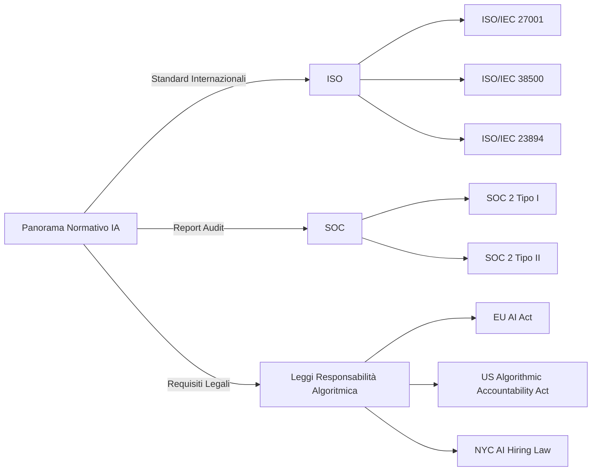
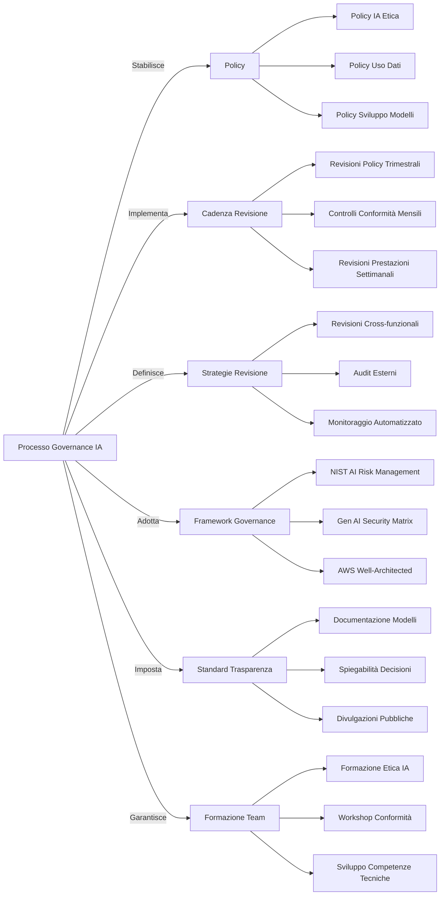

## 5.2 Governance e regolamentazioni di conformità per sistemi di IA

Le regolamentazioni di governance e conformità formano la base dell'implementazione responsabile dell'IA. Le organizzazioni che deployano sistemi di IA devono navigare i requisiti normativi, le considerazioni etiche e gli standard del settore per garantire che le loro soluzioni di IA operino entro confini legali ed etici appropriati. **I framework normativi** e **i protocolli di conformità** proteggono dati sensibili, garantiscono decisioni eque e stabiliscono responsabilità per i risultati dell'IA.

Comprendere queste regolamentazioni è essenziale non solo per la conformità legale ma anche per costruire fiducia degli stakeholder. Le organizzazioni che dimostrano pratiche di IA responsabile ottengono vantaggio competitivo attraverso una reputazione migliorata e rischio normativo ridotto. Questa conoscenza rappresenta un componente critico per i professionisti aziendali che si preparano per l'esame AWS Certified AI Practitioner e implementano soluzioni di IA aziendali.

### Identificare standard di conformità normativa per sistemi di IA

I sistemi di IA cadono sempre più sotto vari standard normativi e requisiti di conformità progettati per garantire sviluppo e deployment responsabili con appropriata considerazione per privacy, sicurezza ed etica.

#### International Organization for Standardization (ISO)

ISO ha sviluppato diversi standard rilevanti per i sistemi di IA:

- ISO/IEC 27001: Gestione della sicurezza delle informazioni[^1500]
- ISO/IEC 38500: Governance IT[^1501]
- ISO/IEC 23894: Intelligenza Artificiale — Gestione del Rischio[^1502]

Questi standard forniscono framework per gestire sicurezza delle informazioni, governance IT e rischi specifici dell'IA. Aiutano le organizzazioni a stabilire **migliori pratiche** per lo sviluppo e deployment dell'IA, garantendo che i sistemi siano sicuri, ben governati e allineati con gli obiettivi aziendali.

#### System and Organization Controls (SOC)

I report SOC, sviluppati dall'American Institute of Certified Public Accountants (AICPA), dimostrano l'efficacia dei controlli interni di un'organizzazione. Per i sistemi di IA, i **report SOC 2** sono particolarmente rilevanti, concentrandosi su sicurezza, disponibilità, integrità dell'elaborazione, riservatezza e privacy.[^1503]

- SOC 2 Tipo I: Valuta il design dei controlli in un punto specifico nel tempo
- SOC 2 Tipo II: Valuta l'efficacia dei controlli in un periodo (solitamente 6-12 mesi)

Le organizzazioni che sviluppano o utilizzano sistemi di IA dovrebbero considerare di ottenere certificazione SOC 2 per dimostrare il loro impegno per la protezione dei dati e l'integrità del sistema.

#### Leggi di Responsabilità Algoritmica

Varie giurisdizioni stanno introducendo leggi che prendono di mira specificamente la responsabilità degli algoritmi di IA:

- EU Artificial Intelligence Act: Propone un approccio basato sul rischio per regolare i sistemi di IA[^1504]
- US Algorithmic Accountability Act: Mira ad aumentare trasparenza e responsabilità nei sistemi decisionali automatizzati[^1505]
- Legge NYC sull'assunzione IA: Richiede audit di bias per strumenti di assunzione alimentati dall'IA[^1506]

Queste leggi tipicamente richiedono alle organizzazioni di:

- Condurre valutazioni di impatto per sistemi di IA ad alto rischio
- Garantire trasparenza nei processi decisionali dell'IA
- Implementare misure per prevenire bias e discriminazione
- Fornire meccanismi per supervisione e intervento umano

*Figura 5.2.1: Panorama Normativo IA. Questo diagramma illustra i componenti chiave del panorama normativo IA, inclusi standard internazionali, report di audit e requisiti legali. Mostra come questi elementi sono interconnessi e formano un framework completo per governance e conformità IA.*

Per conformarsi a questi standard e leggi, le organizzazioni devono implementare framework di governance robusti, condurre audit regolari e mantenere documentazione completa dei loro sistemi di IA. Questo include dettagliare i dati utilizzati per l'addestramento, i processi decisionali e i potenziali impatti su individui e società.

### Identificare servizi e funzionalità AWS per assistere con governance e conformità normativa

AWS offre una suite completa di servizi e funzionalità progettate per aiutare le organizzazioni a soddisfare gli obblighi di governance e conformità per i sistemi di IA. Questi strumenti semplificano l'implementazione e manutenzione di soluzioni di IA conformi.

#### AWS Config

**AWS Config**[^1507] consente valutazione, audit e valutazione delle configurazioni delle risorse AWS. Per i sistemi di IA, può:

- Monitorare cambiamenti di configurazione nelle risorse AI/ML
- Garantire che le risorse soddisfino regole di conformità predefinite
- Generare report per scopi di audit

Esempio di caso d'uso: Configurare regole AWS Config per garantire che tutti i notebook Amazon SageMaker siano crittografati e abbiano appropriati controlli di accesso.

#### Amazon Inspector

**Amazon Inspector**[^1508] fornisce valutazione automatizzata della sicurezza per migliorare sicurezza e conformità delle applicazioni deployate su AWS. Per i sistemi di IA:

- Identifica vulnerabilità di sicurezza nelle istanze EC2 che eseguono carichi di lavoro IA
- Controlla conformità con le migliori pratiche di sicurezza
- Fornisce report dettagliati sui risultati e passi di rimediazione

Esempio di caso d'uso: Utilizzare Amazon Inspector per scansionare regolarmente l'infrastruttura che ospita i vostri modelli di IA per vulnerabilità e problemi di conformità.

#### AWS Audit Manager

**AWS Audit Manager**[^1509] aiuta ad auditare continuamente l'uso di AWS per semplificare valutazione del rischio e conformità con regolamentazioni e standard del settore. Per la governance IA, può:

- Mappare risorse AWS a requisiti di conformità specifici
- Automatizzare la raccolta di evidenze per audit
- Fornire una dashboard centralizzata per monitoraggio conformità

Esempio di caso d'uso: Creare un framework di valutazione Audit Manager per sistemi di IA che si allinea con i requisiti ISO/IEC 27001.

#### AWS Artifact

**AWS Artifact**[^1510] fornisce accesso on-demand a report di sicurezza e conformità AWS e accordi online selezionati. Per la conformità IA, offre:

- Accesso a report di conformità AWS (es. report SOC, certificazioni ISO)
- Accesso self-service agli accordi AWS
- Repository centralizzato per documentazione di conformità

Esempio di caso d'uso: Utilizzare AWS Artifact per ottenere i report di conformità necessari quando si subisce un audit di terze parti dei vostri sistemi di IA.

#### AWS CloudTrail

**AWS CloudTrail**[^1511] registra azioni intraprese da utenti, ruoli o servizi AWS nel vostro account. Per la governance IA:

- Registra tutte le chiamate API relative alle risorse AI/ML
- Fornisce un audit trail per conformità e audit operativi
- Consente analisi di sicurezza e troubleshooting

Esempio di caso d'uso: Configurare CloudTrail per monitorare e registrare tutte le azioni eseguite sulle vostre risorse SageMaker, garantendo tracciabilità delle attività di sviluppo e deployment del modello.

#### AWS Trusted Advisor

**AWS Trusted Advisor**[^1512] offre raccomandazioni che aiutano a seguire le migliori pratiche AWS. Per i sistemi di IA, può:

- Fornire suggerimenti di ottimizzazione dei costi per carichi di lavoro AI/ML
- Identificare vulnerabilità di sicurezza nella vostra infrastruttura IA
- Offrire raccomandazioni di miglioramento delle prestazioni

Esempio di caso d'uso: Utilizzare Trusted Advisor per ottimizzare costo e prestazioni dei vostri carichi di lavoro IA in esecuzione su istanze Amazon EC2.

Sfruttando questi servizi AWS, le organizzazioni possono creare un framework completo di governance e conformità per i loro sistemi di IA. Questo approccio non solo aiuta a soddisfare i requisiti normativi ma costruisce anche fiducia con gli stakeholder dimostrando impegno per pratiche di IA responsabile.

### Descrivere strategie di governance dei dati

Una governance dei dati efficace garantisce integrità, sicurezza e conformità dei sistemi di IA. Una strategia robusta di governance dei dati comprende molteplici aspetti della gestione dei dati durante tutto il loro ciclo di vita.

#### Cicli di Vita dei Dati

Il **ciclo di vita dei dati** nei sistemi di IA tipicamente include le seguenti fasi:

1. Raccolta Dati: Raccogliere dati grezzi da varie fonti
2. Preparazione Dati: Pulire, trasformare ed etichettare i dati
3. Archiviazione Dati: Archiviare in sicurezza dati in formati e località appropriate
4. Uso Dati: Utilizzare dati per addestramento modelli e inferenza
5. Archiviazione Dati: Archiviazione a lungo termine di dati storici
6. Cancellazione Dati: Rimuovere in sicurezza dati quando non più necessari

Implementare governance in ogni fase garantisce qualità, sicurezza e conformità dei dati durante tutto il ciclo di vita del sistema di IA.

#### Logging

Il logging completo mantiene un audit trail e garantisce responsabilità nei sistemi di IA. Aspetti chiave includono:

- **Logging delle Attività**: Registrare tutte le azioni eseguite su dati e modelli
- **Logging degli Accessi**: Tracciare chi ha acceduto ai dati e quando
- **Logging delle Prestazioni del Modello**: Monitorare predizioni e risultati del modello

Strumenti come AWS CloudTrail e Amazon CloudWatch[^1513] implementano pratiche di logging robuste per carichi di lavoro IA su AWS.

#### Residenza dei Dati

**La residenza dei dati** si riferisce alla posizione geografica dove i dati sono archiviati ed elaborati. Considerazioni includono:

- Conformità con leggi locali di protezione dati (es. GDPR nell'UE)
- Uso di Regioni e Zone di Disponibilità AWS per controllare la posizione dei dati
- Implementazione di meccanismi di trasferimento dati che si conformano alle regolamentazioni

Esempio: Utilizzare Amazon S3 Object Lock[^1514] per applicare requisiti di residenza dei dati prevenendo il trasferimento di dati fuori da Regioni AWS specifiche.

#### Monitoraggio e Osservazione

Il monitoraggio continuo dei sistemi di IA è cruciale per mantenere governance e conformità. Aree chiave da monitorare includono:

- **Prestazioni del Modello**: Tracciare accuratezza, bias e drift
- **Qualità dei Dati**: Monitorare dati in arrivo per anomalie o problemi di qualità
- **Salute del Sistema**: Osservare metriche dell'infrastruttura e log

Servizi AWS come Amazon SageMaker Model Monitor[^1515] possono automatizzare il monitoraggio di modelli ML in produzione.

#### Ritenzione Dati

Stabilire policy chiare di ritenzione dati è essenziale per conformità e gestione delle risorse:

- Definire periodi di ritenzione basati su requisiti legali e necessità aziendali
- Implementare gestione automatizzata del ciclo di vita dei dati utilizzando servizi come le policy del Ciclo di Vita Amazon S3[^1516]
- Garantire cancellazione sicura dei dati alla fine del loro periodo di ritenzione

Esempio: Configurare una regola del Ciclo di Vita S3 per spostare automaticamente dati ad Amazon S3 Glacier Deep Archive dopo un periodo specificato e cancellarli dopo il periodo di ritenzione richiesto.

Implementare queste strategie di governance dei dati aiuta le organizzazioni a mantenere controllo sui loro asset di dati, garantire conformità con le regolamentazioni e costruire fiducia nei loro sistemi di IA. Revisione regolare e aggiornamento di queste strategie mantiene il passo con requisiti normativi in evoluzione e progressi tecnologici.

### Descrivere processi per seguire protocolli di governance

Implementare e seguire protocolli di governance garantisce che i sistemi di IA siano sviluppati e deployati responsabilmente. Questi processi aiutano le organizzazioni a mantenere conformità, gestire rischi e costruire fiducia degli stakeholder.

#### Policy

Sviluppare policy complessive di governance IA forma la base delle pratiche di IA responsabile:

- **Policy IA Etica**: Delineare principi per sviluppo IA equo e non distorto
- **Policy Uso Dati**: Definire regole per raccolta, archiviazione ed elaborazione dati
- **Policy Sviluppo Modelli**: Stabilire standard per creazione e validazione modelli
- **Policy Deployment**: Impostare linee guida per mettere modelli IA in produzione

Esempio: Creare un Consiglio di Etica IA per supervisionare sviluppo e applicazione delle policy attraverso l'organizzazione.

#### Cadenza di Revisione

Revisioni regolari mantengono governance efficace:

- Revisioni Policy Trimestrali: Valutare e aggiornare policy di governance
- Controlli Conformità Mensili: Garantire aderenza continua alle regolamentazioni
- Revisioni Prestazioni Modello Settimanali: Monitorare output e impatti del sistema IA

Implementare processi di revisione automatizzati utilizzando servizi AWS come Amazon SageMaker Model Monitor per valutazione continua del modello.

#### Strategie di Revisione

Strategie di revisione efficaci garantiscono governance completa:

- **Revisioni Cross-funzionali**: Coinvolgere stakeholder da vari dipartimenti
- **Audit Esterni**: Coinvolgere esperti di terze parti per valutazioni imparziali
- **Monitoraggio Automatizzato**: Utilizzare strumenti per tracciare continuamente metriche di conformità

Esempio: Implementare un processo di revisione multi-fase per modelli IA ad alto rischio, incluse valutazioni tecniche, etiche e legali prima del deployment.

#### Framework di Governance

Adottare framework di governance stabiliti fornisce struttura agli sforzi di governance IA:

- **NIST AI Risk Management Framework**[^1517]: Fornisce linee guida per gestire rischi IA
- **Generative AI Security Scoping Matrix**[^1518]: Aiuta a identificare considerazioni di sicurezza per sistemi di IA generativa
- **AWS Well-Architected Framework**[^1519]: Offre migliori pratiche per progettare e operare sistemi affidabili, sicuri, efficienti e convenienti

Personalizzare questi framework per adattarsi alle esigenze specifiche della vostra organizzazione e casi d'uso IA.

#### Standard di Trasparenza

Implementare standard di trasparenza costruisce fiducia e facilita conformità:

- **Documentazione del Modello**: Creare registrazioni dettagliate di architettura del modello, dati di addestramento e metriche di prestazione
- **Spiegabilità delle Decisioni**: Implementare tecniche per rendere interpretabili le decisioni IA
- **Divulgazioni Pubbliche**: Comunicare uso e impatti dell'IA agli stakeholder rilevanti

Utilizzare strumenti come Amazon SageMaker Model Cards[^1520] per documentare e condividere informazioni sui vostri modelli ML.

#### Requisiti di Formazione del Team

Garantire competenza del team è cruciale per governance efficace:

- **Formazione Etica IA**: Educare i team su considerazioni etiche nello sviluppo IA
- **Workshop Conformità**: Condurre sessioni regolari sui requisiti normativi
- **Sviluppo Competenze Tecniche**: Fornire formazione continua su tecnologie e migliori pratiche IA

Sfruttare programmi di Formazione e Certificazione AWS[^1521] per migliorare le competenze IA e ML del vostro team.

*Figura 5.2.4: Processi di Governance IA nell'Organizzazione. Questo diagramma illustra i componenti chiave di un processo di governance IA. Mostra come policy, processi di revisione, framework di governance, standard di trasparenza e requisiti di formazione del team sono interconnessi per formare una strategia di governance completa.*

Implementando questi protocolli di governance, le organizzazioni garantiscono che i loro sistemi di IA siano sviluppati e deployati responsabilmente, in conformità con le regolamentazioni e allineati con principi etici. Revisione e adattamento regolari di questi processi sono essenziali per mantenere il passo con il panorama IA in rapida evoluzione e l'ambiente normativo.

In conclusione, riconoscere e implementare regolamentazioni di governance e conformità per i sistemi di IA è cruciale per le organizzazioni che sfruttano tecnologie IA responsabilmente. Comprendendo standard normativi, utilizzando servizi AWS per assistenza alla conformità, implementando strategie robuste di governance dei dati e seguendo protocolli di governance completi, le aziende possono costruire fiducia, mitigare rischi e sbloccare il pieno potenziale dell'IA mantenendo integrità etica e legale.

### Domande per l'auto-verifica

1. **Quale servizio AWS fornisce valutazioni automatizzate della sicurezza per aiutare a migliorare sicurezza e conformità delle applicazioni deployate su AWS?**

   A. AWS Config
   B. Amazon Inspector
   C. AWS Audit Manager
   D. AWS CloudTrail

2. **Un'azienda sta implementando una strategia di governance dei dati per i suoi sistemi di IA. Quale delle seguenti NON è tipicamente considerata una fase nel ciclo di vita dei dati?**

   A. Raccolta Dati
   B. Preparazione Dati
   C. Crittografia Dati
   D. Archiviazione Dati

3. **Un'organizzazione vuole garantire che i suoi modelli di IA siano sviluppati e deployati responsabilmente. Quale delle seguenti è un componente chiave di un processo di governance IA efficace?**

   A. Massimizzare la complessità del modello
   B. Implementare standard di trasparenza
   C. Evitare audit esterni
   D. Limitare revisioni cross-funzionali

4. **Un'azienda di servizi finanziari deve dimostrare conformità con standard del settore per i suoi sistemi di IA. Quale servizio AWS fornisce accesso on-demand a report di sicurezza e conformità AWS?**

   A. AWS Trusted Advisor
   B. Amazon SageMaker
   C. AWS Artifact
   D. AWS Config

5. **Quale delle seguenti descrive meglio lo scopo del NIST AI Risk Management Framework nel contesto della governance IA?**

   A. Fornisce linee guida per ottimizzare le prestazioni del modello IA
   B. Offre migliori pratiche per progettare sistemi IA convenienti
   C. Aiuta a identificare considerazioni di sicurezza per sistemi di IA generativa
   D. Fornisce linee guida per gestire rischi IA

### Risposte e Spiegazioni

1. **Risposta corretta: B. Amazon Inspector**

   Spiegazione: Amazon Inspector è un servizio di valutazione automatizzata della sicurezza che aiuta a migliorare sicurezza e conformità delle applicazioni deployate su AWS. Può identificare vulnerabilità di sicurezza nelle istanze EC2 che eseguono carichi di lavoro IA, controllare conformità con le migliori pratiche di sicurezza e fornire report dettagliati sui risultati e passi di rimediazione.[^1522] AWS Config, AWS Audit Manager e AWS CloudTrail servono scopi diversi nella governance e conformità ma non forniscono valutazioni automatizzate della sicurezza come Amazon Inspector.

2. **Risposta corretta: C. Crittografia Dati**

   Spiegazione: Mentre la crittografia dei dati è un aspetto importante della sicurezza dei dati, non è tipicamente considerata una fase distinta nel ciclo di vita dei dati per i sistemi di IA. Il ciclo di vita dei dati solitamente include fasi come Raccolta Dati, Preparazione Dati, Archiviazione Dati, Uso Dati, Archiviazione Dati e Cancellazione Dati.[^1523] La crittografia dei dati è una misura di sicurezza che può essere applicata attraverso varie fasi del ciclo di vita, piuttosto che essere una fase di per sé.

3. **Risposta corretta: B. Implementare standard di trasparenza**

   Spiegazione: Implementare standard di trasparenza è un componente chiave di governance IA efficace. Coinvolge creare documentazione dettagliata di architettura del modello, dati di addestramento e metriche di prestazione, oltre a implementare tecniche per rendere interpretabili le decisioni IA.[^1524] Questo costruisce fiducia e facilita conformità. Le altre opzioni sono o incorrette (massimizzare la complessità del modello non è un obiettivo di governance) o contrarie alle buone pratiche di governance (evitare audit esterni e limitare revisioni cross-funzionali ostacolerebbe governance efficace).

4. **Risposta corretta: C. AWS Artifact**

   Spiegazione: AWS Artifact fornisce accesso on-demand a report di sicurezza e conformità AWS e accordi online selezionati. Offre un repository centralizzato per documentazione di conformità, incluso accesso a report di conformità AWS come report SOC e certificazioni ISO.[^1525] Questo lo rende il servizio ideale per un'azienda di servizi finanziari che deve dimostrare conformità con standard del settore. Gli altri servizi menzionati non forniscono questa funzionalità specifica.

5. **Risposta corretta: D. Fornisce linee guida per gestire rischi IA**

   Spiegazione: Il NIST AI Risk Management Framework fornisce linee guida per gestire rischi IA. Offre un approccio strutturato per identificare, valutare e mitigare rischi associati allo sviluppo e uso di sistemi di IA.[^1526] Mentre le altre opzioni possono essere correlate alla governance IA, non descrivono accuratamente lo scopo primario del NIST AI Risk Management Framework. Questo framework è cruciale per organizzazioni che cercano di implementare pratiche di IA responsabile e garantire conformità con protocolli di governance.

[^1500]: ISO/IEC 27001 Information Security Management. URL: <https://www.iso.org/isoiec-27001-information-security.html>
[^1501]: ISO/IEC 38500 IT Governance. URL: <https://www.iso.org/standard/62816.html>
[^1502]: ISO/IEC 23894 Artificial Intelligence – Risk Management. URL: <https://www.iso.org/standard/77304.html>
[^1503]: AICPA SOC 2 - SOC for Service Organizations: Trust Services Criteria. URL: <https://us.aicpa.org/interestareas/frc/assuranceadvisoryservices/aicpasoc2report>
[^1504]: European Commission: Proposal for a Regulation on Artificial Intelligence. URL: <https://digital-strategy.ec.europa.eu/en/policies/regulatory-framework-ai>
[^1505]: US Algorithmic Accountability Act of 2022. URL: <https://www.congress.gov/bill/117th-congress/house-bill/6580>
[^1506]: New York City's AI hiring law. URL: <https://www.nyc.gov/site/dca/about/automated-employment-decision-tools.page>
[^1507]: AWS Config. URL: <https://aws.amazon.com/config/>
[^1508]: Amazon Inspector. URL: <https://aws.amazon.com/inspector/>
[^1509]: AWS Audit Manager. URL: <https://aws.amazon.com/audit-manager/>
[^1510]: AWS Artifact. URL: <https://aws.amazon.com/artifact/>
[^1511]: AWS CloudTrail. URL: <https://aws.amazon.com/cloudtrail/>
[^1512]: AWS Trusted Advisor. URL: <https://aws.amazon.com/premiumsupport/technology/trusted-advisor/>
[^1513]: Amazon CloudWatch. URL: <https://aws.amazon.com/cloudwatch/>
[^1514]: Amazon S3 Object Lock. URL: <https://docs.aws.amazon.com/AmazonS3/latest/userguide/object-lock.html>
[^1515]: Amazon SageMaker Model Monitor. URL: <https://docs.aws.amazon.com/sagemaker/latest/dg/model-monitor.html>
[^1516]: Amazon S3 Lifecycle policies. URL: <https://docs.aws.amazon.com/AmazonS3/latest/userguide/object-lifecycle-mgmt.html>
[^1517]: NIST AI Risk Management Framework. URL: <https://www.nist.gov/itl/ai-risk-management-framework>
[^1518]: AWS Generative AI Security Scoping Matrix. URL: <https://aws.amazon.com/ai/generative-ai/security/scoping-matrix/>
[^1519]: AWS Well-Architected Framework. URL: <https://aws.amazon.com/architecture/well-architected/>
[^1520]: Amazon SageMaker Model Cards. URL: <https://docs.aws.amazon.com/sagemaker/latest/dg/model-cards.html>
[^1521]: AWS Training and Certification. URL: <https://aws.amazon.com/training/>
[^1522]: Amazon Inspector Features. URL: <https://aws.amazon.com/inspector/features/>
[^1523]: AWS Machine Learning Lifecycle. URL: <https://docs.aws.amazon.com/wellarchitected/latest/machine-learning-lens/machine-learning-lifecycle.html>
[^1524]: AWS AI/ML Governance Best Practices. URL: <https://aws.amazon.com/blogs/enterprise-strategy/responsible-ai-best-practices-promoting-responsible-and-trustworthy-ai-systems/>
[^1525]: AWS Artifact Overview. URL: <https://aws.amazon.com/artifact/>
[^1526]: NIST AI Risk Management Framework Overview. URL: <https://www.nist.gov/itl/ai-risk-management-framework>