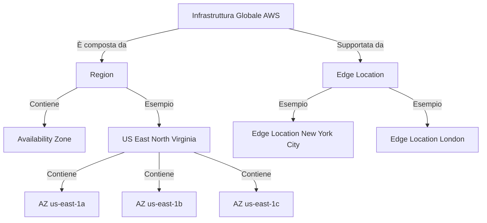
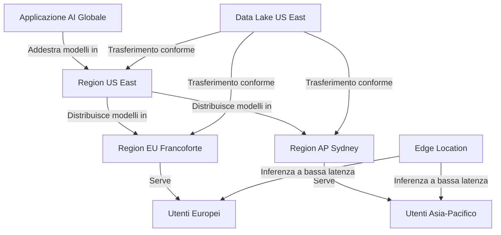
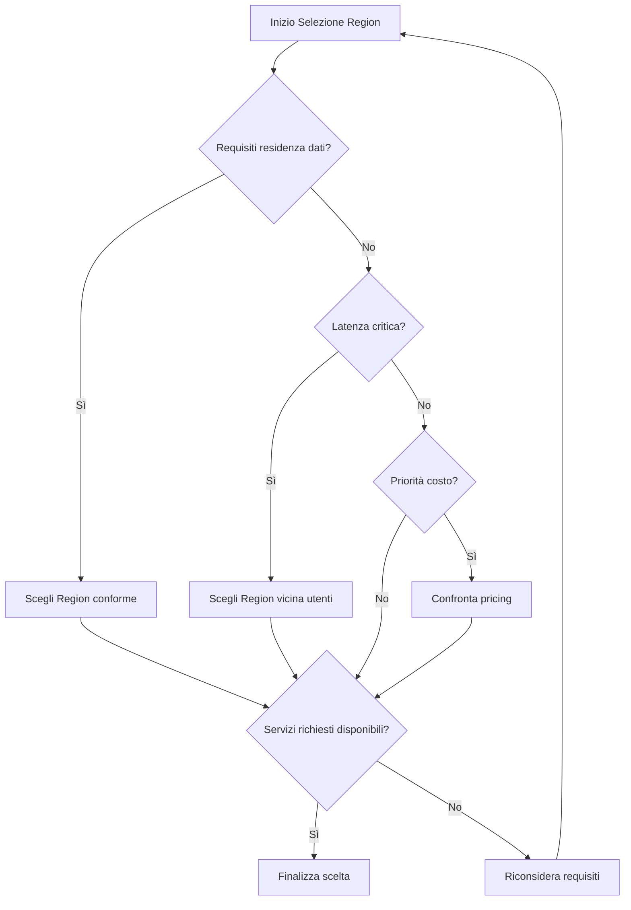

## 6.1 Infrastruttura Globale AWS

L'AWS Global Infrastructure funge da fondazione per la distribuzione di soluzioni di intelligenza artificiale e machine learning con portata globale, alte prestazioni e robusta affidabilità. Questa rete mondiale di risorse di calcolo consente a organizzazioni di tutte le dimensioni di costruire, addestrare e distribuire carichi di lavoro AI/ML su scala, indipendentemente dalla posizione geografica.[^1700] Per i professionisti business che implementano iniziative AI, comprendere questa infrastruttura impatta direttamente performance applicative, conformità normativa ed efficienza dei costi. La conoscenza dell'infrastruttura globale AWS è anche parte del contenuto dell'esame AWS Certified AI Practitioner.

La rete mondiale AWS abilita implementazioni AI diversificate—da startup innovative che creano nuove applicazioni AI a grandi enterprise che distribuiscono soluzioni ML a livello organizzativo. Sfruttando questa infrastruttura, le aziende possono costruire soluzioni AI/ML resilienti, conformi e ad alte prestazioni che operano efficientemente oltre i confini internazionali, ottenendo vantaggi competitivi in mercati sempre più guidati dall'AI.

### Comprendere Region, Availability Zone ed Edge Location AWS

L'infrastruttura globale AWS è composta da tre componenti chiave che lavorano insieme per fornire un ambiente resiliente per i carichi di lavoro AI e ML:

**AWS Region** sono aree geografiche discrete contenenti più Availability Zone isolate e fisicamente separate. Ogni Region funziona in modo indipendente dalle altre, migliorando tolleranza ai guasti e stabilità. AWS continua ad espandere il proprio footprint di Region nel mondo, in particolare nei mercati emergenti dove l'adozione di AI sta accelerando.[^1701]

Le **Availability Zone** (AZ) sono posizioni distinte all'interno di una Region progettate per isolare i guasti dalle altre AZ. Queste zone si connettono tra loro tramite collegamenti di rete a bassa latenza mantenendo la separazione fisica. Questa architettura abilita applicazioni e database altamente disponibili e tolleranti ai guasti, superiori rispetto a quanto potrebbe offrire un singolo data center.[^1702]

Le **Edge Location** sono siti usati da Amazon CloudFront per mettere in cache contenuti più vicino agli utenti finali, riducendo drasticamente la latenza.[^1703] Separate da Region e AZ, le Edge Location tipicamente operano in grandi città e centri popolati. Sono particolarmente preziose per applicazioni AI/ML che richiedono elaborazione a bassa latenza, come riconoscimento immagini in tempo reale o servizi di elaborazione del linguaggio naturale.

La relazione tra questi componenti è illustrata nel seguente diagramma:

*Figura 6.1.1. Componenti dell'Infrastruttura Globale AWS. Il diagramma mostra la struttura gerarchica e la relazione tra Region, Availability Zone ed Edge Location.*

Per i carichi di lavoro AI e ML, questa infrastruttura offre diversi vantaggi critici:

1. **Alta disponibilità**: Distribuire applicazioni AI su più AZ assicura continuità operativa anche se una zona subisce un'interruzione.
2. **Bassa latenza**: Le Edge Location abilitano consegna più rapida per applicazioni AI che richiedono elaborazione real-time (es. assistenti vocali, motori di raccomandazione).
3. **Sovranità dei dati**: Molteplici Region permettono di mantenere dati ed elaborazione AI all'interno di specifici confini geografici per soddisfare requisiti di residenza.
4. **Scalabilità**: L'estesa rete di Region e AZ consente scaling fluido dei carichi di lavoro AI e ML globalmente al crescere della domanda.
5. **Disaster Recovery**: L'isolamento tra Region facilita strategie robuste di ripristino per sistemi AI mission-critical.

Comprendere questi componenti è essenziale per progettare architetture AI resilienti e usare efficacemente servizi come Amazon SageMaker, che può operare su più AZ per maggiore affidabilità.[^1704]

### Benefici dell'Infrastruttura Globale AWS per Carichi AI/ML

L'infrastruttura globale AWS offre vantaggi specifici che abilitano la costruzione, l'addestramento e la distribuzione di modelli con efficienza e scala:

1. **Portata globale e bassa latenza**: La rete di Region ed Edge Location permette di distribuire servizi AI più vicini agli utenti, riducendo la latenza. Aziende multinazionali possono addestrare modelli in una Region e distribuire endpoint in più Region per servire clienti globali con ritardi minimi.[^1705]
2. **Alta disponibilità e tolleranza ai guasti**: Usando più AZ, le applicazioni AI ottengono disponibilità robusta. Componenti critici—dal training pipeline all'inferenza—possono essere distribuiti per assicurare operatività continua.
3. **Scalabilità ed elasticità**: Supporta scaling graduale; si può iniziare in una Region ed espandersi in altre al crescere degli utenti.
4. **Residenza dati e conformità**: Più Region consentono controllo su dove dati sono archiviati/elaborati, garantendo conformità (es. GDPR, CCPA). Fondamentale per applicazioni con dati sensibili.[^1706]
5. **Ottimizzazione dei costi**: Selezione di Region con pricing favorevole; uso di Spot Instance per ridurre costi di training di modelli di grandi dimensioni.[^1707]
6. **Accesso ad hardware specializzato**: Alcune Region offrono acceleratori (GPU avanzate, ecc.) critici per training ed inferenza efficienti.[^1708]
7. **Edge Computing**: Edge Location e servizi come AWS Outposts abilitano inferenza al margine, vicino alle fonti dati per IoT e casi real-time.[^1709]
8. **Disaster Recovery e continuità operativa**: L'isolamento tra Region supporta strategie di failover robuste.

Diagramma di una architettura AI globale:

*Figura 6.1.2. Architettura di Applicazione AI Globale: addestramento centralizzato, distribuzione multi-Region, edge per latenza minima, compliance e DR.*

Benefici riassunti:
- Training centralizzato per coerenza
- Inferenza distribuita per bassa latenza
- Edge per elaborazione real-time
- Conformità residenza dati
- Alta disponibilità multi-Region
- Ottimizzazione costi per workload specifici

### Scelta della Region AWS per Progetti AI/ML

La selezione della Region influenza performance, conformità ed efficienza dei costi. Fattori chiave:

1. **Residenza dati e conformità**: Per dati sensibili scegli una Region conforme (es. dati UE -> Region UE) per GDPR.[^1710]
2. **Latenza e performance**: Vicinanza a utenti o sorgenti dati; per applicazioni globali usare strategia multi-Region (es. endpoint SageMaker multi-Region).[^^1711]
3. **Disponibilità dei servizi**: Verifica disponibilità di servizi AI/ML richiesti (alcuni servizi nuovi partono in poche Region).
4. **Pricing**: Analizza differenze di costo per servizi intensivi (training LLM).[^^1712]
5. **DR e alta disponibilità**: Per workload critici, architetture multi-Region geograficamente diversificate.
6. **Ecosistema e trasferimento dati**: Vicinanza a data lake esistenti riduce latenza e costi trasferimento.
7. **Hardware specializzato**: Verifica disponibilità GPU / acceleratori.[^1713]
8. **Sostenibilità**: Considera Region con percentuali più alte di energia rinnovabile.[^1714]

Flowchart decisionale:

*Figura 6.1.3. Flowchart di selezione Region per workload AI/ML.*

Esempi pratici:
- Startup FinTech (fraud detection): US East per ampia disponibilità servizi e costo competitivo, con trasferimento conforme verso EU.
- Ricerca sanitaria: Region nazionale per compliance, anche a costo di maggiore spesa.
- E-commerce globale: Training modelli raccomandazione in Region costo-efficace, inferenza multi-Region per latenza.

### Domande di autoverifica

1. Una azienda AI globale deve mettere in cache risultati di modello per ridurre la latenza nel mondo. Quale componente usare?
   A. Availability Zone
   B. AWS Region
   C. Edge Location
   D. Data Center

2. Una startup elabora dati sanitari sensibili. Fattore primario nella scelta della Region?
   A. Latenza
   B. Costo compute
   C. Residenza dati e conformità
   D. Ultime GPU

3. Per distribuire un chatbot AI worldwide con latenza minima?
   A. Unica Region centralizzata
   B. Più AZ in una sola Region
   C. Solo Edge per contenuti
   D. Multi-Region + Edge Location

4. Garantire alta disponibilità training LLM?
   A. Una singola AZ
   B. Training su AZ in diverse Region
   C. Più AZ nella stessa Region
   D. Solo Edge Location

5. Quale NON è strategia valida di ottimizzazione costi infrastruttura globale?
   A. Selezionare Region con pricing migliore
   B. Usare EC2 Spot su AZ diverse
   C. Distribuire tutti i modelli in ogni Region disponibile
   D. Usare Edge Location per inferenza a bassa latenza

### Risposte e spiegazioni

1. C. Edge Location – CloudFront cache vicino agli utenti per ridurre latenza.[^1715]
2. C. Residenza dati e conformità – prioritaria per dati sanitari sensibili.[^1716]
3. D. Multi-Region + Edge – combinazione per bassa latenza globale.[^1717]
4. C. Più AZ stessa Region – pattern standard alta disponibilità.[^1718]
5. C. Distribuire ovunque incrementa costi e complessità senza beneficio proporzionale.[^1719]

[^1700]: AWS Global Infrastructure Overview. <https://aws.amazon.com/about-aws/global-infrastructure/>
[^1701]: Regions & AZs. <https://aws.amazon.com/about-aws/global-infrastructure/regions_az/>
[^1702]: Availability Zones. <https://docs.aws.amazon.com/AWSEC2/latest/UserGuide/using-regions-availability-zones.html>
[^1703]: CloudFront Features. <https://aws.amazon.com/cloudfront/features/>
[^1704]: Amazon SageMaker Features. <https://aws.amazon.com/sagemaker/features/>
[^1705]: Infrastructure for AI/ML. <https://aws.amazon.com/machine-learning/infrastructure/>
[^1706]: AWS Compliance Programs. <https://aws.amazon.com/compliance/programs/>
[^1707]: EC2 Spot. <https://aws.amazon.com/ec2/spot/>
[^1708]: Accelerated Computing. <https://aws.amazon.com/ec2/instance-types/#Accelerated_Computing>
[^1709]: AWS Outposts. <https://aws.amazon.com/outposts/>
[^1710]: Compliance Resources. <https://aws.amazon.com/compliance/resources/>
[^1711]: SageMaker Multi-Region Endpoints. <https://docs.aws.amazon.com/sagemaker/latest/dg/multi-region-endpoints.html>
[^1712]: AWS Pricing Calculator. <https://calculator.aws/#/>
[^1713]: High Performance Computing. <https://aws.amazon.com/hpc/>
[^1714]: AWS Sustainability. <https://sustainability.aboutamazon.com/environment/the-cloud>
[^1715]: CloudFront Features. <https://aws.amazon.com/cloudfront/features/>
[^1716]: Healthcare & Life Sciences. <https://aws.amazon.com/health/>
[^1717]: Multi-Region Application Blog. <https://aws.amazon.com/blogs/architecture/creating-a-multi-region-application-with-aws-services-part-1-compute-and-security/>
[^1718]: Well-Architected Framework. <https://aws.amazon.com/architecture/well-architected/>
[^1719]: Cost Optimization. <https://aws.amazon.com/aws-cost-management/>
