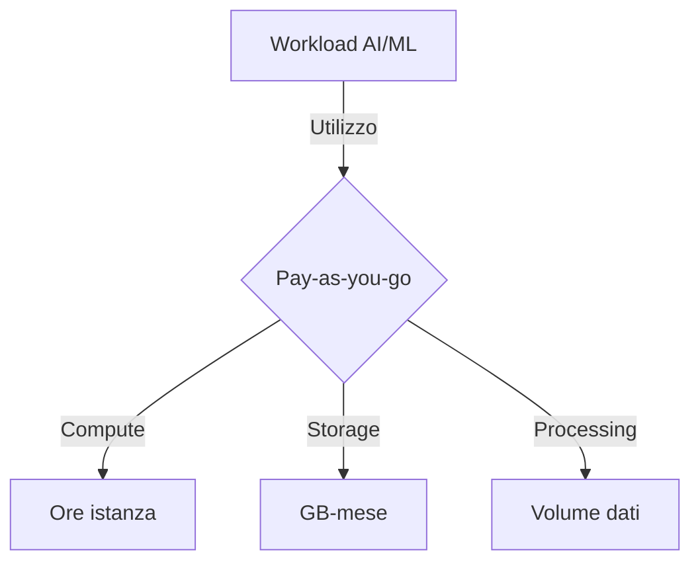
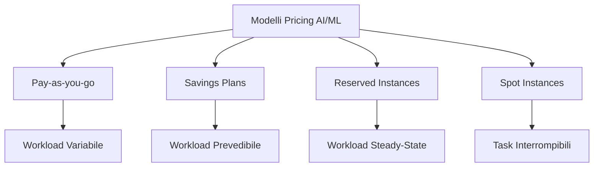
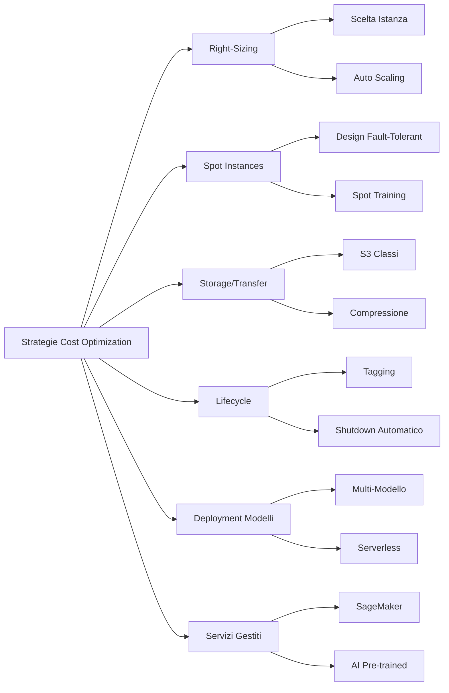
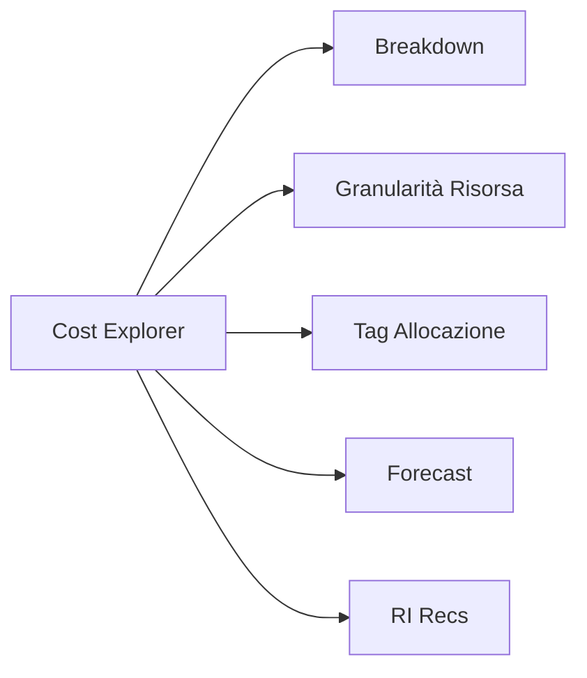
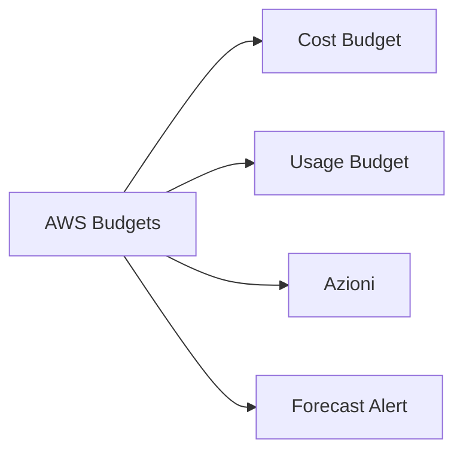

## 6.2 Pricing AWS e Ottimizzazione dei Costi per AI/ML

L'adozione di tecnologie di intelligenza artificiale e machine learning (AI/ML) offre un vantaggio competitivo, ma queste capacità comportano considerevoli implicazioni finanziarie. Comprendere i modelli di pricing AWS e implementare strategie efficaci di ottimizzazione dei costi per progetti AI/ML è essenziale per massimizzare il ritorno sugli investimenti mantenendo il controllo del budget. Questa conoscenza è parte critica dell'esame AWS Certified AI Practitioner, poiché bilancia capacità tecnologiche e prudenza finanziaria.

I carichi di lavoro AI/ML sono intrinsecamente intensivi in risorse e potenzialmente costosi. Padroneggiare i meccanismi di pricing AWS e le tecniche di ottimizzazione consente decisioni informate, allocazione efficiente e giustificazione degli investimenti agli stakeholder. Con l'avanzare rapido di modelli di grandi dimensioni e GenAI, la capacità di gestire e ottimizzare i costi diventa sempre più cruciale entro il 2025. Il mercato globale AI è proiettato a 243,72 miliardi USD nel 2025 e 826,73 miliardi nel 2030 (CAGR 27,67% 2025-2030).[^1800]

### Modelli di Pricing AWS per Servizi AI/ML

AWS offre diversi modelli di pricing per i servizi AI/ML, ciascuno adatto a pattern di utilizzo differenti.

#### Pay-as-you-go

Modello più comune: nessun costo upfront o impegni a lungo termine; paghi solo per ciò che consumi. Ideale per workload variabili o imprevedibili.
- **Flessibilità** nello scalare
- Nessun rischio di over/under-provisioning
- Sperimentazione rapida senza impegno finanziario eccessivo

Esempi: Amazon SageMaker addebita in base a istanze compute, storage e data processing[^1801]; Amazon Comprehend in base al volume di testo analizzato.[^1802]

*Figura 6.2.1: Componenti del modello pay-as-you-go per servizi AI/ML.*

#### Savings Plans

Per workload prevedibili: sconto in cambio di impegno (USD/ora) per 1 o 3 anni.
1. **Compute Savings Plans**: flessibilità massima (EC2, Fargate, SageMaker).[^1803]
2. **SageMaker Savings Plans**: fino al 64% di risparmio rispetto all'on-demand.[^1804]

Valore alto per inference continua o training prolungato.

#### Reserved Instance (RI)

Sconti fino al 72% vs on-demand per impegno su specifico tipo istanza/Region (1 o 3 anni).[^1805]
- Infrastruttura baseline sempre attiva
- Batch programmati
- Training di lunga durata stabile

#### Spot Instance

Capacità EC2 inutilizzata con sconti fino al 90%.[^1806]
Adatte a:
- Training distribuito tollerante interruzioni
- Batch inference flessibile
- Analisi esplorative / feature engineering

SageMaker supporta Spot per training gestito.[^1807]

*Figura 6.2.2: Panoramica modelli di pricing.*

### Strategie di Ottimizzazione dei Costi AI/ML su AWS

#### Right-Sizing Risorse
- Analizza metriche performance
- Seleziona instance type adeguato
- Auto Scaling dove opportuno
- Ottimizza modelli con SageMaker Neo per inferenza.[^1808]

#### Uso Efficace di Spot
- Progetta per resilienza (checkpointing)
- Managed Spot Training SageMaker
- Fault-tolerance nel codice training[^1809]

#### Ottimizzazione Storage & Transfer
- Classi S3 adeguate (Intelligent-Tiering, Glacier)[^1810]
- Compressione dati
- FSx for Lustre per I/O ad alte prestazioni[^1811]

#### Lifecycle Management
- Spegnimento automatico risorse inattive (notebook, istanze)
- Tagging per ownership/costi
- Lambda per scheduling start/stop[^1812]

#### Ottimizzazione Deployment Modelli
- Endpoint multi-modello SageMaker[^1813]
- Serverless inference per traffico variabile[^1814]
- Edge Manager per dispositivi edge[^1815]

#### Servizi Gestiti
- SageMaker end-to-end invece di infrastruttura custom
- Servizi AI pre-addestrati (Rekognition, Comprehend, Bedrock)[^1816]
- EMR per big data pipeline ML[^1817]

*Figura 6.2.3: Strategie di ottimizzazione costi.*

### Uso di AWS Cost Explorer e AWS Budgets

#### AWS Cost Explorer[^1818]
Funzionalità chiave:
1. Breakdown dettagliati (per servizio, tipo istanza, tag)
2. Granularità risorsa (notebook, training job)
3. Cost Allocation Tag
4. Forecasting basato su storico
5. Raccomandazioni RI

Best practice:
- Tagging coerente per progetto/team
- Review periodiche trend
- Previsioni per budgeting

*Figura 6.2.4: Funzioni chiave Cost Explorer.*

#### AWS Budgets[^1819]
Benefici:
1. Gestione proattiva costi
2. Budget basati su usage (ore training, GB elaborati)
3. Azioni automatiche (stop risorse non critiche)
4. Alert su forecast

Best practice:
- Budget separati: dev / test / prod
- Soglie multiple (50/80/100%)
- Azioni automatiche su risorse non essenziali

*Figura 6.2.5: Funzioni chiave Budgets.*

### Domande di autoverifica

1. Workload AI/ML continuo: modello di pricing più appropriato?
   A. Pay-as-you-go
   B. Savings Plans
   C. Spot Instances
   D. On-demand

2. Ridurre costi training SageMaker tollerante interruzioni?
   A. Reserved Instances
   B. Savings Plans
   C. Spot Instances
   D. On-demand

3. Visualizzare breakdown costi progetti AI/ML diversi?
   A. SageMaker
   B. AWS Cost Explorer
   C. AWS Budgets
   D. CloudWatch

4. Quale NON è strategia raccomandata di ottimizzazione costi?
   A. Right-sizing
   B. Lifecycle management
   C. Usare sempre istanze più grandi
   D. Servizi gestiti

5. Azioni automatiche su soglia budget superata?
   A. Cost Explorer
   B. SageMaker
   C. AWS Budgets
   D. EC2 Auto Scaling

### Risposte e spiegazioni

1. B. Savings Plans – sconti per uso continuo prevedibile.[^1820]
2. C. Spot – sconti elevati per job interrompibili.[^1821]
3. B. Cost Explorer – analisi e breakdown dettagliati.[^1822]
4. C. Istanza più grande sempre = spreco; serve right-sizing.[^1823]
5. C. Budgets – supporta azioni automatiche su soglie.[^1824]

[^1800]: Statista AI Market. <https://www.statista.com/outlook/tmo/artificial-intelligence/worldwide>
[^1801]: SageMaker Pricing. <https://aws.amazon.com/sagemaker/pricing/>
[^1802]: Comprehend Pricing. <https://aws.amazon.com/comprehend/pricing/>
[^1803]: Savings Plans. <https://aws.amazon.com/savingsplans/>
[^1804]: SageMaker Savings Plans. <https://aws.amazon.com/sagemaker/pricing/#Amazon_SageMaker_Savings_Plans>
[^1805]: EC2 Reserved Instances. <https://aws.amazon.com/ec2/pricing/reserved-instances/>
[^1806]: EC2 Spot Instances. <https://aws.amazon.com/ec2/spot/>
[^1807]: Managed Spot Training. <https://docs.aws.amazon.com/sagemaker/latest/dg/model-managed-spot-training.html>
[^1808]: SageMaker Neo. <https://aws.amazon.com/sagemaker/neo/>
[^1809]: EC2 Spot Pricing. <https://aws.amazon.com/ec2/spot/pricing/>
[^1810]: S3 Storage Classes. <https://aws.amazon.com/s3/storage-classes/>
[^1811]: FSx for Lustre. <https://aws.amazon.com/fsx/lustre/>
[^1812]: AWS Lambda. <https://aws.amazon.com/lambda/>
[^1813]: Multi-Model Endpoints. <https://docs.aws.amazon.com/sagemaker/latest/dg/multi-model-endpoints.html>
[^1814]: Serverless Inference. <https://docs.aws.amazon.com/sagemaker/latest/dg/serverless-endpoints.html>
[^1815]: Edge Manager. <https://aws.amazon.com/sagemaker/edge-manager/>
[^1816]: AWS AI Services. <https://aws.amazon.com/machine-learning/ai-services/>
[^1817]: Amazon EMR. <https://aws.amazon.com/emr/>
[^1818]: Cost Explorer. <https://aws.amazon.com/aws-cost-management/aws-cost-explorer/>
[^1819]: AWS Budgets. <https://aws.amazon.com/aws-cost-management/aws-budgets/>
[^1820]: Savings Plans Pricing. <https://aws.amazon.com/savingsplans/pricing/>
[^1821]: EC2 Spot Savings. <https://aws.amazon.com/ec2/spot/pricing/>
[^1822]: Cost Explorer Features. <https://aws.amazon.com/aws-cost-management/aws-cost-explorer/features/>
[^1823]: Well-Architected Cost Pillar. <https://docs.aws.amazon.com/wellarchitected/latest/cost-optimization-pillar/welcome.html>
[^1824]: Budgets Actions. <https://docs.aws.amazon.com/cost-management/latest/userguide/budgets-controls.html>
