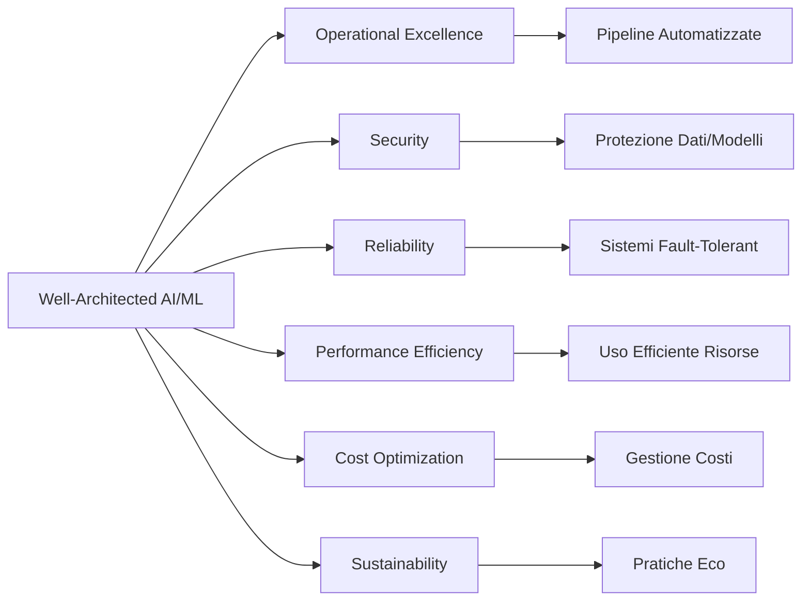

## 6.3 AWS Well-Architected Framework per AI/ML

L'AWS Well-Architected Framework fornisce linee guida essenziali per costruire architetture cloud robuste, sicure ed efficienti. Per i carichi di lavoro di intelligenza artificiale e machine learning (AI/ML), il framework affronta sfide peculiari: calcoli complessi, grandi dataset, processi mission-critical e requisiti di governance dei modelli e privacy dei dati. Applicare principi well-architected assicura sistemi performanti, affidabili, sicuri, ottimizzati nei costi e sostenibili. Con l'integrazione sempre più profonda dell'AI nelle operazioni, progettare soluzioni ben architettate diventa un differenziatore competitivo chiave entro il 2025.[^1900]

### I Sei Pilastri e la loro Applicazione AI/ML

1. **Operational Excellence**
   - Automazione training, deployment e monitoring
   - CI/CD per modelli ML
   - Versioning e rollback chiari
   - Riproducibilità esperimenti (tracking esperimenti)

2. **Security**
   - Protezione dati di training e artefatti modello
   - Access control granulare ML
   - Cifratura at-rest e in-transit
   - Difesa da attacchi avversariali

3. **Reliability**
   - Pipeline training/inferenza fault-tolerant
   - Auto scaling per carichi variabili
   - Integrità dati su tutto il ciclo ML
   - Gestione degrado performance e drift modelli

4. **Performance Efficiency**
   - Scelta corretta istanze (GPU/accelerate) per training e inferenza
   - Ottimizzazione preprocessing e feature engineering
   - Training distribuito per modelli grandi
   - Strategie di serving efficienti (batch, caching, multi-modello)

5. **Cost Optimization**
   - Right-sizing risorse
   - Spot per workload non critici
   - Scaling automatico
   - Ottimizzazione storage/transfer

6. **Sustainability**
   - Istanze energy-efficient
   - Architetture modello ottimizzate (pruning, distillation)
   - Riduzione trasferimenti e storage
   - Uso Region a minor impatto carbonico[^1902]

*Figura 6.3.1: Pillars Well-Architected in contesto AI/ML.*

### Applicazione Pratica dei Pilastri

1. **Operational Excellence**
   - MLOps con SageMaker MLOps[^1903]
   - Automazione retraining con Step Functions[^1904]
   - Monitoraggio con CloudWatch + Model Monitor[^1905]
   - Tracking esperimenti con MLflow[^1906]
   - Esempio: Pipeline automatizzata raccomandazioni retail con SageMaker Pipelines.[^1907]

2. **Security**
   - IAM per accesso granulare[^1908]
   - KMS per cifratura dati[^1909]
   - Isolamento rete (VPC) per training[^1910]
   - GuardDuty per pattern anomali[^1911]
   - Esempio: Healthcare usa Macie per identificare dati sensibili pazienti.[^1912]

3. **Reliability**
   - Endpoint inferenza multi-AZ[^1913]
   - Auto Scaling carichi inferenza[^1914]
   - Circuit breaker / fallback
   - Backup dati e artefatti (S3 versioning)[^1915]
   - Esempio: Fraud detection multi-model endpoints ad alta disponibilità.[^1916]

4. **Performance Efficiency**
   - Instance Explorer per scelta istanze[^1917]
   - Training distribuito (SageMaker libraries)[^1918]
   - S3 Select per accesso dati efficiente[^1919]
   - Compressione / quantizzazione per inferenza
   - Esempio: Visione artificiale training distribuito per riduzione tempi.[^1920]

5. **Cost Optimization**
   - Managed Spot Training[^1921]
   - Shutdown notebook inattivi
   - S3 Intelligent-Tiering[^1922]
   - Elastic Inference per inferenza economica[^1923]
   - Esempio: Startup riduce 70% costi retraining giornaliero.[^1924]

6. **Sustainability**
   - Region low-carbon[^1925]
   - Pruning / knowledge distillation
   - Data minimization
   - Graviton per inferenza[^1926]
   - Esempio: Modello raccomandazioni distillato + Graviton riduce energia.[^1927]

### Uso dell'AWS Well-Architected Tool per AI/ML

Passi operativi:[^1928]
1. **Definizione workload**: nome, industry, Region, owner.
2. **Questionario mirato**: data management, training, deployment, security ML.
3. **Raccolta raccomandazioni**: encryption, retraining automation, instance optimization, tagging costi.
4. **Prioritizzazione**: impatto vs effort (alto impatto/basso effort prima).[^^1936]
5. **Implementazione iterativa**: Infrastructure-as-code (CloudFormation/CDK)[^1929], servizi gestiti (SageMaker)[^1930], monitoraggio continuo.

Esempio: NLP service automation—il tool evidenzia miglioramento privacy e costi; team introduce Macie e Spot Training ottenendo +sicurezza e -40% costi training.[^1931]

Il framework consente di allineare robustezza tecnica e obiettivi business. L'approccio strutturato riduce rischi, migliora sostenibilità e controlla spesa mentre scala ad esigenze enterprise.

### Domande di autoverifica

1. Pillar che copre access control granulare e cifratura dati/modelli?
   A. Operational Excellence
   B. Security
   C. Reliability
   D. Performance Efficiency

2. Ridurre costo retraining giornaliero consentendo esperimenti complessi?
   A. EC2 Dedicated Instances
   B. SageMaker Managed Spot Training
   C. AWS Batch
   D. Amazon ECS

3. Scoprire e proteggere dati sensibili pazienti per compliance HIPAA?
   A. GuardDuty
   B. AWS Shield
   C. Inspector
   D. Macie

4. NON raccomandato per operational excellence AI/ML?
   A. MLOps con SageMaker
   B. Retraining manuale a schedule fisso
   C. Monitorare modelli (CloudWatch + Model Monitor)
   D. Tracking processi con MLflow

5. Dopo raccomandazioni Well-Architected Tool, passo successivo?
   A. Implementare tutto subito
   B. Ignorare quelle difficili
   C. Prioritizzare per impatto/feasibility
   D. Ripetere assessment con risposte diverse

### Risposte e spiegazioni

1. B. Security – pilastro protezione risorse e cifratura.[^1932]
2. B. Managed Spot Training – sfrutta Spot per risparmio training.[^1933]
3. D. Macie – discovery e protezione dati sensibili.[^1934]
4. B. Retraining manuale contrasta automazione/continuità miglioramento.[^1935]
5. C. Prioritizzazione consente focus su alto impatto.[^1936]

[^1900]: Future of AI/ML Business. <https://revstarconsulting.com/blog/the-future-of-it-embracing-ai-and-machine-learning-in-business-strategies>
[^1901]: Well-Architected Overview. <https://aws.amazon.com/architecture/well-architected/>
[^1902]: Sustainability Pillar. <https://docs.aws.amazon.com/wellarchitected/latest/sustainability-pillar/sustainability-pillar.html>
[^1903]: SageMaker MLOps. <https://aws.amazon.com/sagemaker/mlops/>
[^1904]: Step Functions ML Workflows. <https://docs.aws.amazon.com/step-functions/latest/dg/use-cases.html>
[^1905]: Model Monitor. <https://docs.aws.amazon.com/sagemaker/latest/dg/model-monitor.html>
[^1906]: MLflow su SageMaker. <https://aws.amazon.com/blogs/machine-learning/managing-your-machine-learning-lifecycle-with-mlflow-and-amazon-sagemaker/>
[^1907]: SageMaker Pipelines. <https://docs.aws.amazon.com/sagemaker/latest/dg/pipelines.html>
[^1908]: IAM ML Workloads. <https://docs.aws.amazon.com/IAM/latest/UserGuide/id_roles_use_switch-role-ec2.html>
[^1909]: KMS SageMaker. <https://docs.aws.amazon.com/kms/latest/developerguide/services-sagemaker.html>
[^1910]: VPC Training Jobs. <https://docs.aws.amazon.com/sagemaker/latest/dg/train-vpc.html>
[^1911]: GuardDuty. <https://aws.amazon.com/guardduty/>
[^1912]: Macie. <https://aws.amazon.com/macie/>
[^1913]: Multi-AZ Endpoints. <https://docs.aws.amazon.com/sagemaker/latest/dg/multi-az-endpoints.html>
[^1914]: Endpoint Auto Scaling. <https://docs.aws.amazon.com/sagemaker/latest/dg/endpoint-auto-scaling.html>
[^1915]: S3 Versioning. <https://docs.aws.amazon.com/AmazonS3/latest/userguide/Versioning.html>
[^1916]: Multi-Model Endpoints. <https://docs.aws.amazon.com/sagemaker/latest/dg/multi-model-endpoints.html>
[^1917]: Instance Explorer. <https://aws.amazon.com/ec2/instance-explorer/>
[^1918]: Distributed Training. <https://docs.aws.amazon.com/sagemaker/latest/dg/distributed-training.html>
[^1919]: S3 Select. <https://docs.aws.amazon.com/AmazonS3/latest/userguide/selecting-content-from-objects.html>
[^1920]: Distributed Training Case. <https://docs.aws.amazon.com/sagemaker/latest/dg/distributed-training.html>
[^1921]: Managed Spot Training. <https://docs.aws.amazon.com/sagemaker/latest/dg/model-managed-spot-training.html>
[^1922]: S3 Intelligent-Tiering. <https://aws.amazon.com/s3/storage-classes/intelligent-tiering/>
[^1923]: Elastic Inference. <https://aws.amazon.com/machine-learning/elastic-inference/>
[^1924]: Spot Training Blog. <https://aws.amazon.com/blogs/aws/managed-spot-training-save-up-to-90-on-your-amazon-sagemaker-training-jobs/>
[^1925]: Low Carbon Regions. <https://sustainability.aboutamazon.com/environment/the-cloud>
[^1926]: Graviton. <https://aws.amazon.com/ec2/graviton/>
[^1927]: Knowledge Distillation. <https://aws.amazon.com/blogs/machine-learning/use-llama-3-1-405b-to-generate-synthetic-data-for-fine-tuning-tasks/>
[^1928]: Well-Architected Tool. <https://docs.aws.amazon.com/wellarchitected/latest/userguide/intro.html>
[^1929]: CloudFormation. <https://aws.amazon.com/cloudformation/>
[^1930]: SageMaker Overview. <https://aws.amazon.com/sagemaker/>
[^1931]: Machine Learning Lens. <https://aws.amazon.com/blogs/architecture/introducing-the-latest-machine-learning-lens-for-the-aws-well-architected-framework/>
[^1932]: Security Pillar. <https://docs.aws.amazon.com/wellarchitected/latest/security-pillar/welcome.html>
[^1933]: Managed Spot Training Doc. <https://docs.aws.amazon.com/sagemaker/latest/dg/model-managed-spot-training.html>
[^1934]: Macie HIPAA. <https://aws.amazon.com/macie/features/>
[^1935]: Operational Excellence Pillar. <https://docs.aws.amazon.com/wellarchitected/latest/operational-excellence-pillar/welcome.html>
[^1936]: Prioritizzare Miglioramenti. <https://docs.aws.amazon.com/wellarchitected/latest/userguide/prioritize-improvements.html>
